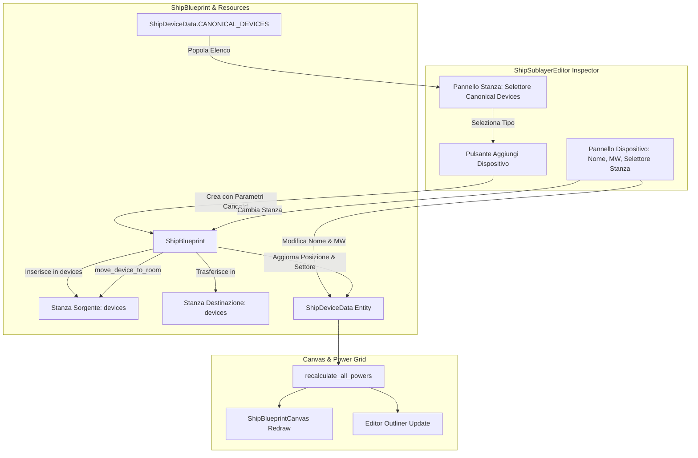

# Requirements

### Overview & Goals
Il presente progetto realizza l'aggiornamento dell'addon `@addons/ship_sublayer_editor` e dei modelli dati di supporto (`ShipDeviceData`, `ShipBlueprint`) per la gestione vincolata e flessibile dei dispositivi di bordo:
1. **Aggiunta Dispositivi Vincolata**: all'interno di una stanza dell'astronave è possibile aggiungere unicamente dispositivi definiti nella lista ufficiale canonica (`CANONICAL_DEVICES` da `docs/POWER_GRID_DEVICES.md`), eliminando la creazione incontrollata di dispositivi anonimi fittizi.
2. **Personalizzazione Flessibile**: per ciascun dispositivo aggiunto a una stanza, l'utente può personalizzarne in qualsiasi momento il **Nome diegetico**, la **Potenza in MW (`power_mw`)** sia positiva che negativa, e la **Stanza** in cui il dispositivo è fisicamente alloggiato.
3. **Trasferimento Dinamico tra Stanze**: la modifica della stanza di assegnazione sposta effettivamente l'entità tra gli array `devices` delle stanze nel blueprint, ricentrando la posizione e ricalcolando in tempo reale i carichi energetici di settore e nave.
4. **Integrazione Undo/Redo & Outliner**: tutte le operazioni di aggiunta, modifica e spostamento sono pienamente reversibili tramite la timeline di Undo/Redo dell'editor e aggiornano l'albero Outliner e il canvas.

### Scope
- **In Scope:**
  - Esposizione di `CANONICAL_DEVICES` e metodi helper in `Outside/ShipSublayer/ShipDeviceData.gd` accessibili in modalità `@tool`.
  - Aggiunta in `Outside/ShipSublayer/ship_blueprint.gd` di metodi di ricerca e trasferimento atomico (`find_room_by_device_id`, `move_device_to_room`, `get_unique_device_id`).
  - Sostituzione dell'input generico in `addons/ship_sublayer_editor/ship_sublayer_editor.gd` con un selettore `OptionButton` dei dispositivi canonici affiancato dal tasto di aggiunta.
  - Generazione del dispositivo con ID univoco, nome predefinito, classe componente corretta e potenza nominale canonica.
  - Aggiornamento dell'Inspector dispositivo in `ship_sublayer_editor.gd`:
    - Modifica del `Nome` con sincronizzazione reattiva.
    - Modifica della `Potenza (MW)` con ricalcolo immediato dei bilanci energetici di stanza e scafo (`recalculate_all_powers`).
    - Modifica della `Stanza` con selettore dinamico che invoca `move_device_to_room` e aggiorna le coordinate visive.
  - Correzione della gestione dei tipi dei dispositivi in `_populate_property_editor("room")` per evitare errori con oggetti `ShipDeviceData`.
  - Estensione dei test automatizzati per validare l'aggiunta vincolata e il trasferimento tra stanze.

- **Out of Scope:**
  - Modifiche al sistema di rendering grafico 3D esterno.
  - Modifiche ai contratti OS di `ShipHAL` (già completati e testati).
  - Aggiunta di nuovi archetipi di componenti fisici non previsti da `POWER_GRID_DEVICES.md`.

### User Stories
- **Come Ship Designer**, voglio selezionare i dispositivi da aggiungere a una stanza da un elenco dropdown ufficiale e controllato, per non rischiare di creare apparati non supportati dal software o dal bus hardware.
- **Come Ship Designer**, voglio poter calibrare il nome e la potenza in MW di qualsiasi dispositivo (es. sovralimentare un motore o depotenziare un sensore ausiliario) per definire varianti e classi navali bilanciate.
- **Come Ship Designer**, voglio poter cambiare la stanza in cui è collocato un dispositivo tramite un selettore dedicato nell'Inspector, in modo che il dispositivo venga trasferito automaticamente tra le stanze del blueprint senza doverlo ricreare.

### Functional Requirements
- **Vincolo Lista Canonica:**
  - L'interfaccia di aggiunta dispositivi all'interno di una stanza (`_populate_property_editor("room")`) deve mostrare un `OptionButton` con tutti i 20 dispositivi canonici di `CANONICAL_DEVICES` (con badge potenza e ID).
  - Alla selezione e conferma (`+ Aggiungi Dispositivo`), viene generato un `ShipDeviceData` con le proprietà canoniche, garantendo un ID univoco nella blueprint (es. `battery_01`, `battery_02`).
  - L'entità appena aggiunta viene selezionata automaticamente aprendo il suo Inspector.
- **Customizzazione di Nome e Potenza:**
  - L'Inspector del dispositivo consente la modifica libera del nome (`Nome:`) e della potenza (`Potenza (MW):`), supportando valori negativi per utenze e positivi per generatori.
  - La modifica della potenza attiva immediatamente `recalculate_all_powers()`, aggiornando la potenza della stanza, il bilancio della nave e il canvas.
- **Customizzazione della Stanza di Assegnazione:**
  - L'Inspector del dispositivo include il campo `Stanza:` con menu a tendina contenente tutte le stanze della blueprint.
  - Il cambio di stanza trasferisce il dispositivo: rimosso da `source_room.devices`, aggiunto a `target_room.devices`, `dev.sector` aggiornato al nome della stanza e `dev.pos` ricentrato in `target_room.rect.get_center()`.
  - Entrambe le stanze e la nave ricalcolano i rispettivi consumi/generazioni.
- **Integrità Dati e Undo/Redo:**
  - Ogni azione (aggiunta, modifica nome, modifica potenza, spostamento stanza) registra un'azione di Undo/Redo nominata.

### Non-Functional Requirements
- **Esecuzione @tool Affidabile:** L'accesso all'elenco dei dispositivi canonici deve funzionare perfettamente sia nell'Editor di Godot sia all'avvio in runtime/standalone senza dipendere strettamente dall'autoload `RoomDatabase`.
- **Nessuna perdita dati o stati incoerenti:** Il trasferimento tra stanze garantisce che il dispositivo non rimanga mai orfano o duplicato.

# Technical Design

### Current Implementation
Attualmente in `addons/ship_sublayer_editor/ship_sublayer_editor.gd`:
- L'aggiunta di dispositivi avviene tramite:
  ```gdscript
  var new_dev_id := "dev_%d_%d" % [Time.get_ticks_msec(), room_devs.size()]
  var new_dev := ShipDeviceData.new(new_dev_id, "Nuovo Dispositivo", room.rect.get_center())
  new_dev.category = "utility"
  new_dev.power_mw = -10.0
  ```
  Questo permette di inserire identificatori generici sconosciuti a `ShipHAL` e ai contratti di sistema.
- Nel ciclo di elenco dispositivi della stanza (`linea 1224`), `var dev: Dictionary = room_devs[i]` assume che i device siano sempre dizionari, generando possibili errori di tipizzazione quando sono istanze `ShipDeviceData`.
- Nell'Inspector del dispositivo (linea 1347), `_add_sector_selector_field("Settore:", dev.sector, ...)` si limita a impostare una stringa sul campo `dev.sector`, ma non sposta il dispositivo dall'array `room.devices` in cui è contenuto, lasciando la gerarchia del blueprint disallineata.

### Key Decisions
1. **Centralizzazione `CANONICAL_DEVICES` in `ShipDeviceData`:**
   - *Scelta:* Rendere `CANONICAL_DEVICES` una costante statica direttamente in `ShipDeviceData.gd`, sincronizzata con `RoomDatabase.CANONICAL_DEVICES`.
   - *Razionale:* Assicura disponibilità immediata in tutti gli script `@tool`, inclusi `ShipSublayerEditor` e `ShipBlueprintCanvas`, senza dipendenze circolari da nodi runtime.

2. **UI di Aggiunta con OptionButton + Pulsante Dedicato:**
   - *Scelta:* Inserire nella sezione dispositivi della stanza un selettore `OptionButton` contenente tutti i dispositivi canonici ordinati, formattati con badge di potenza (es. `[+500 MW] Reattore Tokamak Primario`), seguito dal pulsante `+ Aggiungi`.
   - *Razionale:* Interfaccia immediata, diegetica ed ergonomica che previene categoricamente l'aggiunta di tipi arbitrari.

3. **Metodo Atomico `move_device_to_room` in `ShipBlueprint`:**
   - *Scelta:* Implementare `move_device_to_room(dev_id: String, target_room_id: String) -> bool` nel modello `ShipBlueprint`.
   - *Razionale:* Incapsula la logica di estrazione dalla vecchia stanza, inserimento nella nuova, riposizionamento spaziale e ricalcolo energetico, rendendola atomica, riutilizzabile e facilmente agganciabile allo stack Undo/Redo.

### Architecture Diagram


### Components & Changes
1. **`Outside/ShipSublayer/ShipDeviceData.gd`:**
   - Esposizione di `const CANONICAL_DEVICES: Dictionary` con tutti i 20 dispositivi ufficiali (da `docs/POWER_GRID_DEVICES.md`): `core_reactor`, `battery_01`, `cooling_01`, `engine_main`, `rcs_pitch_l`, `rcs_pitch_r`, `helm_control`, `nav_computer`, `sensors_matrix`, `antenna_array`, `armory_defense`, `arm_sx_balancer`, `arm_dx_balancer`, `scrubber`, `heater`, `serra_idroponica`, `cargo_handling`, `dronestation`, `recharge_dock`, `server_rack`, `cam_array`.
   - Metodo statico `get_canonical_def(key: String) -> Dictionary`.

2. **`Outside/ShipSublayer/ship_blueprint.gd`:**
   - Metodo `find_room_by_device_id(dev_id: String) -> ShipRoomData`: rintraccia la stanza che ospita il dispositivo.
   - Metodo `get_unique_device_id(base_id: String) -> String`: assicura ID univoci incrementando suffissi numerici (es. `battery_01` $\to$ `battery_02`).
   - Metodo `move_device_to_room(dev_id: String, target_room_id: String) -> bool`: sposta fisicamente il device tra gli array `devices`, aggiorna `sector` e `pos`, ricalcolando le potenze.

3. **`addons/ship_sublayer_editor/ship_sublayer_editor.gd`:**
   - Modifica di `_populate_property_editor("room")`:
     - Normalizzazione di `dev` come `ShipDeviceData` o `Dictionary`.
     - Inserimento di `OptionButton` per scegliere tra i dispositivi canonici e pulsante `+ Aggiungi`.
     - Creazione con ID univoco, nome, categoria, MW e classe canonica.
   - Modifica di `_populate_property_editor("device")`:
     - Personalizzazione `Nome` (`_add_string_field`).
     - Personalizzazione `Potenza (MW)` (`_add_float_field`) con chiamata a `recalculate_all_powers()`.
     - Sostituzione di `_add_sector_selector_field` con selettore dinamico `Stanza` che richiama `current_blueprint.move_device_to_room` e registra l'Undo state.

### File Structure
- `Outside/ShipSublayer/ShipDeviceData.gd` (costante `CANONICAL_DEVICES` e helper).
- `Outside/ShipSublayer/ship_blueprint.gd` (`move_device_to_room`, `find_room_by_device_id`, `get_unique_device_id`).
- `addons/ship_sublayer_editor/ship_sublayer_editor.gd` (UI aggiunta vincolata, inspector dispositivo e gestione spostamento stanza).
- `tests/test_power_grid_devices_effects.gd` e `tests/gut/test_ship_sublayer_editor_devices.gd` (suite test).

### Risks & Mitigations
- **Rischio: Spostamento in stanze con coordinate distanti che fa sparire visivamente il dispositivo dal viewport.**  
  *Mitigazione:* La funzione di spostamento posiziona automaticamente il dispositivo al centro del rettangolo della nuova stanza (`target_room.rect.get_center()`).
- **Rischio: Duplicazione o orfanotrofio di dispositivi durante Undo/Redo.**  
  *Mitigazione:* L'uso del sistema di serializzazione dello stato del blueprint (`to_dict` / `from_dict`) già presente in `save_undo_state` garantisce la perfetta reversibilità dell'intero albero di stanze e dispositivi.

# Testing

### Validation Approach
La verifica della corretta implementazione comprenderà:
1. **Test Headless Automatizzati:** Verifica tramite script headless del vincolo di catalogo canonico, della corretta instanziazione delle classi fisiche, della personalizzazione di nome e potenza MW e del corretto funzionamento di `move_device_to_room`.
2. **Test Unitari GUT:** Test su `test_ship_sublayer_editor_devices.gd` per verificare isolatamente:
   - Che l'aggiunta di un dispositivo predefinito assegni i valori corretti da `CANONICAL_DEVICES`.
   - Che la modifica di `power_mw` aggiorni sia la stanza sorgente sia il totale del blueprint.
   - Che il cambio stanza sposti il riferimento da `room_A.devices` a `room_B.devices` aggiornando le potenze di entrambe.
3. **Smoke Test Editor:** Apertura della scena dell'editor `ShipSublayerEditor.tscn` per validare che non vi siano eccezioni in console.

### Key Scenarios
- **Scenario 1: Aggiunta Dispositivo da Catalogo Canonico:**
  - *Azione:* Selezione di `matrice_sensori` e aggiunta di `sensors_matrix` tramite dropdown.
  - *Risultato Atteso:* Viene creato un device con nome "Matrice Sensori Phased Array", potenza -25.0 MW, categoria `sensors` e classe `SensorsMatrixComponent`.
- **Scenario 2: Personalizzazione Nome e MW:**
  - *Azione:* Modifica del nome in "Sensore Ausiliario Plancia" e potenza a -35.0 MW.
  - *Risultato Atteso:* Le proprietà del dispositivo riflettono i nuovi valori e `room.power_mw` si aggiorna all'istante.
- **Scenario 3: Spostamento Dispositivo tra Stanze:**
  - *Azione:* Cambio del selettore stanza da `matrice_sensori` a `ponte_comando`.
  - *Risultato Atteso:* Il dispositivo viene rimosso da `matrice_sensori.devices` e aggiunto a `ponte_comando.devices`, con `dev.sector` aggiornato e potenza ricalcolata.

### Test Changes
- Aggiornamento di `tests/test_power_grid_devices_effects.gd` per validare l'integrità del catalogo canonico e del trasferimento tra stanze.
- Creazione del nuovo test suite GUT `tests/gut/test_ship_sublayer_editor_devices.gd`.

# Execution Steps

### ✓ Step 1: Centralizzazione CANONICAL_DEVICES ed helper in ShipDeviceData
### ✓ Step 2: Metodi di ricerca, ID univoco e trasferimento atomico in ShipBlueprint
### ✓ Step 3: Aggiunta dispositivi vincolata da catalogo canonico in ShipSublayerEditor
### ✓ Step 4: Inspector dispositivo (Nome, Potenza MW e Selettore Stanza dinamico) in ShipSublayerEditor
### ✓ Step 5: Suite di test automatizzati (GUT e Headless) e verifica completa