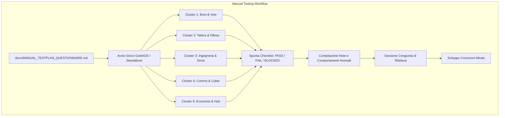

# Requirements

### Overview & Goals
Con il completamento architetturale e funzionale di tutti i sistemi di simulazione, fisici ed economici di *Dark Nova: Rogue Squadron* (Fasi A-L), il progetto dispone di 22 applicazioni operative su desktop GodotOS e di oltre 400 test automatizzati GUT convalidati al 100% in modalità headless.

L'obiettivo di questo piano è definire la creazione di un **Test Plan Manuale Strutturato e Questionario di Collaudo** (`docs/MANUAL_TESTPLAN_QUESTIONNAIRE.md`). Tale documento fungerà da guida operativa passo-passo che l'utente potrà seguire direttamente durante le sessioni di gioco manuali per verificare ogni singola applicazione, registrare l'esito di ciascuna verifica tramite checklist (`[ ] PASS / [ ] FAIL / [ ] BLOCKED`) e annotare osservazioni, bug o attriti di usabilità/game design. Al termine del collaudo, il questionario compilato verrà riletto insieme per pianificare ed eseguire gli interventi mirati di correzione e rifinitura.

### Scope
- **In Scope**:
  - Creazione del documento esaustivo `docs/MANUAL_TESTPLAN_QUESTIONNAIRE.md`.
  - Copertura modulare indipendente di tutte le **22 applicazioni** e finestre del sistema:
    1. *Lobby & Selezione Sistema/Nave* (`Applications/Lobby/`)
    2. *Impostazioni & Controlli/Periferiche* (`Scenes/Window/Settings Window/`)
    3. *Flight Control & Cruise Drive* (`Applications/FlightControl/`)
    4. *Weapons & HUD Traiettoria Balistica* (`Applications/Weapons/`)
    5. *Shield Matrix & Deflettori* (`Applications/ShieldMatrix/`)
    6. *Sensors 3D & Meteo Alert* (`Applications/Sensors/`)
    7. *Cams & Feed Ottici Esterni* (`Applications/Cams/`)
    8. *Power Grid & Reattore* (`Applications/PowerGrid/`)
    9. *Life Support & Sopravvivenza* (`Applications/LifeSupport/`)
    10. *Comms & Telecomunicazioni* (`Applications/Comms/`)
    11. *Diagnostics & Log Danni/Cyber* (`Applications/Diagnostics/`)
    12. *Duct Drone & Riparazioni Interne* (`Applications/DuctDrone/`)
    13. *Service Drone & Recupero Cargo/Minerali* (`Applications/ServiceDrone/`)
    14. *Cargo Bay & Stiva Merci* (`Applications/CargoBay/`)
    15. *Flux Wallet & Rating Creditizio* (`Applications/FluxWallet/`)
    16. *Station Hub & Servizi Portuali X4* (`Applications/StationHub/`)
    17. *Hack Exploits & EW Remota* (`Applications/HackExploits/`)
    18. *Terminal CLI & Scripting .DAT* (`Applications/Terminal/`)
    19. *Logbook & Registro Missioni* (`Applications/Logbook/`)
    20. *System Map & Visuale Orbitale* (`Applications/SystemMap/`)
    21. *System Discover & Generazione Procedurale* (`Applications/SystemDiscover/`)
    22. *Ship Builder & Progettazione Scafo* (`Applications/ShipBuilder/`)
    23. *Pod Info, Allarme Condition Red & Feedback Sensoriali* (`Applications/PodInfo/`)
  - Istruzioni di riproduzione chiare, sequenziali e univoche per ciascuna funzionalità.
  - Criteri di accettazione espliciti (comportamento visivo, acustico o telemetrico atteso).
  - Formato compilativo a checklist con campi note e motivazioni di blocco.
  - Cruscotto riassuntivo iniziale e linee guida per la revisione congiunta post-collaudo.
- **Out of Scope**:
  - Modifica del codice sorgente di gioco durante la fase di redazione del questionario (le modifiche e correzioni avverranno nello sprint successivo sulla base del questionario compilato dall'utente).
  - Rimpiazzo delle suite di test automatici GUT esistenti (il testplan manuale è complementare e focalizzato su feeling di gioco, UX, rendering e interazione umana).

### User Stories
- **Come Tester / Giocatore**, voglio avere una guida passo-passo che mi indichi esattamente cosa cliccare, quale tasto premere o quale comando digitare per testare ogni singola app del gioco, senza dover indovinare le condizioni di riproduzione.
- **Come Tester**, voglio poter segnare con un semplice clic o spunta l'esito di ogni test (`PASS`, `FAIL`, `BLOCKED`) e descrivere anomalie riscontrate nel campo note sottostante.
- **Come Team di Sviluppo**, vogliamo un documento standardizzato e univoco per raccogliere il feedback del collaudo manuale, identificare bug prioritari e procedere a correzioni rapide ed efficaci.

### Functional Requirements
- **FR-TP1 (Completezza del Perimetro)**: Il documento deve coprire al 100% tutte le 22 applicazioni di bordo e le componenti di sistema diegetiche (inclusi i recenti meccanismi di conio/debito FLUX, balistica newtoniana, corrieri dati S-Net, proximity drop a -5.8G, coni d'ombra per tempeste solari e protocollo Condition Red).
- **FR-TP2 (Istruzioni di Riproduzione Riproducibili)**: Ogni test case deve specificare:
  - *Prerequisito / Contesto di avvio* (es. nave attraccata, spazio aperto, nave danneggiata).
  - *Passaggi operativi esatti* (es. aprire finestra, trascinare slider a 1920.0 MHz, orientare antenna a 180°, premere Engage).
  - *Risultato atteso verificabile* (es. SNR sale a 95%, icona lucchetto si chiude, feed telecamera mostra distorsione statica).
- **FR-TP3 (Formato Questionario Compilabile)**: Ogni punto di verifica deve includere il blocco:
  ```markdown
  - [ ] PASS  - [ ] FAIL  - [ ] BLOCKED
  **Note / Anomalie Riscontrate**: 
  ```
- **FR-TP4 (Organizzazione Modulare per Cluster)**: Le applicazioni devono essere raggruppate in cluster logici per facilitare sessioni di test tematiche:
  - Cluster 1: Avvio, Lobby, Impostazioni e Volo
  - Cluster 2: Tattica, Balistica, Scudi e Monitoraggio Spaziale
  - Cluster 3: Ingegneria, Supporto Vitale e Droni di Manutenzione/Estrazione
  - Cluster 4: Telecomunicazioni, Guerra Elettronica, Terminale e Log
  - Cluster 5: Economia a Baratto, Servizi Portuali e Strumenti Creativi
- **FR-TP5 (Protocollo di Rilettura e Correzione)**: Definire nel documento la procedura di triage: classificazione anomalie (Critico/Bloccante, Funzionale, Minore/UX) e assegnazione ai successivi task di correzione.

### Non-Functional Requirements
- **Semplicità e Chiarezza Diegetica**: Linguaggio operativo accessibile, comprensibile senza dover consultare il codice sorgente GDScript.
- **Autonomia Esecutiva**: Il test plan deve poter essere eseguito da chiunque avviando il gioco da Godot o da build standalone.

# Technical Design

### Current Implementation
- Il progetto dispone di un'architettura modulare basata su `GodotOS` (`Scenes/Window/`), dove ogni app estende `BaseApp` o implementa una finestra nativa con contratti disaccoppiati verso manager singleton (`SpaceWorldManager`, `ShipDriveManager`, `CargoManager`, `MissionManager`, `FluxEconomyManager`, ecc.).
- La roadmap operativa in `docs/GAME_SESSION_SCENARIO_AND_ROADMAP.md` descrive il gameplay loop generale, ma non fornisce una guida di test granulare applicazione per applicazione con campi compilativi.

### Key Decisions
1. **Organizzazione Modulare per Applicazione**:
   - *Scelta*: Ciascuna delle 22 applicazioni possiede una propria scheda autonoma con ID progressivo univoco (`TC-APP-XX-01`, ecc.).
   - *Motivazione*: Permette al tester di collaudare le app in ordine libero o in blocchi dedicati (es. oggi solo Comms e HackExploits, domani solo FlightControl e Weapons) senza dover necessariamente rigiocare l'intera sessione sequenziale.
2. **Formato Checklist con Campi Note Dedicati**:
   - *Scelta*: Utilizzo di caselle Markdown con triplo stato (`PASS`, `FAIL`, `BLOCKED`) e casella testuale aperta per registrare comportamenti inattesi o dettagli del framerate/UI.
   - *Motivazione*: Rispetta esattamente la preferenza espressa dall'utente, garantendo velocità di compilazione e facile comparazione in fase di diff/rilettura.
3. **Inclusione dei Casi Limite e delle Meccaniche Hard Sci-Fi Avanzate**:
   - *Scelta*: Includere verifiche esplicite sui comportamenti di punta (es. aborto warmup Cruise per calo reattore, disinfezione file `.dat` prima dell'esplosione, mitigazione deflettori contro tempesta solare, conversione blocchi di ghiaccio in ossigeno).
   - *Motivazione*: Assicura che le peculiarità hardcore del gioco vengano effettivamente collaudate a mano e non solo verificate dai test headless GUT.

### Proposed Changes
Creazione del documento programmatico:
- `docs/MANUAL_TESTPLAN_QUESTIONNAIRE.md`:
  - Sezione 1: **Istruzioni Operative & Cruscotto Riepilogativo** (matrice di avanzamento delle 22 app).
  - Sezione 2: **Cluster 1 — Boot, Impostazioni & Navigazione** (Lobby, Settings, FlightControl, SystemMap, PodInfo & Alert Condition).
  - Sezione 3: **Cluster 2 — Sistemi Tattici, Armeria & Difesa** (Weapons & HUD, ShieldMatrix, Sensors 3D, Cams).
  - Sezione 4: **Cluster 3 — Ingegneria, Risorse & Droni** (PowerGrid, LifeSupport, Diagnostics, DuctDrone, ServiceDrone).
  - Sezione 5: **Cluster 4 — Telecomunicazioni, Cyber-Guerra & Console** (Comms, HackExploits, Terminal, Logbook).
  - Sezione 6: **Cluster 5 — Economia, Commercio & Generatori** (FluxWallet, CargoBay, StationHub, SystemDiscover, ShipBuilder).
  - Sezione 7: **Guida al Triage e Protocollo di Correzione Congiunta**.

### Architecture Diagram



### File Structure
- **Nuovo File Documentale**:
  - `docs/MANUAL_TESTPLAN_QUESTIONNAIRE.md`: documento completo con questionario interattivo Markdown.
- **File di Riferimento Consultati**:
  - `docs/GAME_SESSION_SCENARIO_AND_ROADMAP.md`
  - `docs/APP_ARCHITECTURE_STANDARD.md`
  - Tutti i descrittori delle 22 applicazioni in `Applications/` e `Scenes/Window/`.

# Testing

### Validation Approach
La validazione di questo step consiste nel verificare che il documento generato:
1. Copra integralmente tutte le 22 applicazioni presenti nel progetto senza lacune.
2. Fornisca passaggi riproducibili e coerenti con la reale configurazione dei nodi e dei comandi di input del gioco.
3. Abbia una formattazione Markdown pulita, priva di errori di rendering e pronta per essere modificata direttamente dall'utente durante il collaudo.

### Verification Checklist
- Verifica che per ogni applicazione siano presenti almeno 2-4 casi di prova specifici.
- Verifica che i recenti task avanzati (Fasi A-L) siano coperti da passaggi dedicati.
- Verifica che la struttura del questionario consenta una facile rilettura e individuazione dei fallimenti.

# Delivery Steps

### ✓ Step 1: Struttura del documento, cruscotto di avanzamento e redazione Cluster 1 (Boot & Navigazione) e Cluster 2 (Tattica & Difesa)
- Creare `docs/MANUAL_TESTPLAN_QUESTIONNAIRE.md`.
- Inserire l'introduzione, le istruzioni operative e la matrice/cruscotto riassuntivo delle 22 applicazioni con contatore progressivo.
- Redigere le schede di collaudo con istruzioni step-by-step e checklist con note per:
  - Cluster 1: Lobby (`Applications/Lobby/`), Impostazioni (`Scenes/Window/Settings Window/`), Flight Control (`Applications/FlightControl/`), System Map (`Applications/SystemMap/`), Pod Info & Allarme Condition Red (`Applications/PodInfo/`).
  - Cluster 2: Weapons & HUD Traiettoria Balistica (`Applications/Weapons/`), Shield Matrix & Deflettori (`Applications/ShieldMatrix/`), Sensors 3D & Meteo Alert (`Applications/Sensors/`), Cams & Feed Ottici (`Applications/Cams/`).

### ✓ Step 2: Redazione Cluster 3 (Ingegneria & Droni), Cluster 4 (Comms & Cyber) e Cluster 5 (Economia & Hub) con Protocollo di Triage
- Redigere le schede di collaudo con istruzioni step-by-step e checklist con note per:
  - Cluster 3: Power Grid & Reattore (`Applications/PowerGrid/`), Life Support & Sopravvivenza (`Applications/LifeSupport/`), Diagnostics & Log Danni (`Applications/Diagnostics/`), Duct Drone & Riparazioni Interne (`Applications/DuctDrone/`), Service Drone & Recupero Cargo/Minerali (`Applications/ServiceDrone/`).
  - Cluster 4: Comms & Telecomunicazioni (`Applications/Comms/`), Hack Exploits & EW Remota (`Applications/HackExploits/`), Terminal CLI & Scripting (`Applications/Terminal/`), Logbook & Missioni (`Applications/Logbook/`).
  - Cluster 5: Flux Wallet & Debito (`Applications/FluxWallet/`), Cargo Bay & Stiva (`Applications/CargoBay/`), Station Hub & Servizi Portuali X4 (`Applications/StationHub/`), System Discover & Generazione Procedurale (`Applications/SystemDiscover/`), Ship Builder & Progettazione Scafo (`Applications/ShipBuilder/`).
- Inserire la sezione finale con il Protocollo di Triage, classificazione anomalie (Bloccante, Funzionale, Minore/UX) e guida per la revisione congiunta post-collaudo.

### ✓ Step 3: Revisione incrociata e validazione della completezza di tutte le 22 applicazioni
- Verificare che tutte le 22 applicazioni siano integralmente coperte con checklist `- [ ] PASS - [ ] FAIL - [ ] BLOCKED` e campi note.
- Verificare che le meccaniche hard sci-fi avanzate introdotte (conio/debito FLUX, balistica galileiana, Proximity Drop a -5.8G, tempeste solari con coni d'ombra, corrieri S-Net e Condition Red) siano puntualmente testabili con parametri esatti.
- Validare la formattazione Markdown del documento.