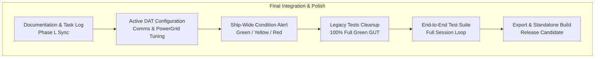

# Requirements

### Overview & Goals
Con il completamento di tutte le Fasi operative della roadmap di sessione (Fasi A-G) e delle successive macro-estensioni sistemiche (Deep Core Mining, Flux Economy a baratto titoli, Corrieri S-Net con DataVault, Cruise Drive avanzato a 160 MW e Pericoli Spaziali Dinamici), *Dark Nova: Rogue Squadron* ha raggiunto la sua piena fisionomia di simulatore cooperativo spaziale asimmetrico.

Questo piano definisce e organizza in modo deterministico gli **ultimi step per finire il gioco**, trasformando l'insieme dei moduli esistenti in un prodotto finale rifinito, documentato al 100%, coperto da collaudo end-to-end continuativo e pronto per il rilascio:
1. **Consolidamento Documentale (Fase L - Pericoli Spaziali)**: registrazione formale in `GAME_SESSION_SCENARIO_AND_ROADMAP.md`, `TODO.md` (`TASK-045`), `docs/task_log.md` e `CHANGELOG.md`.
2. **Chiusura Debiti di Design (.DAT Dormienti)**: collegamento funzionale diegetico dei parametri finora inattivi dei file `.dat` in `CommsApp` (amplificazione antenna, filtri rumore) e `PowerGridApp` (soglie di overload, tolleranza overclocking).
3. **Protocollo Allerta Generale Nave (Condition Red / Yellow)**: allarme coordinato per l'intera corvetta (sirene diegetiche soffuse, illuminazione d'emergenza rossa nei pod e allarmi ottici) durante brecce scafo, scudi critici o radiazioni letali.
4. **Traguardo "100% Full Green" GUT**: correzione dei test legacy e dei warning di parsing preesistenti, portando tutti i ~400 test del repository a passare all'unisono in modalità headless senza errori.
5. **Suite di Collaudo Integrato End-to-End (E2E)**: creazione di una simulazione automatica headless dell'intero ciclo cooperativo dalla partenza con debito fino al rientro e alla liquidazione economica.
6. **Configurazione Export & Packaging Release Candidate**: verifica dei preset di export per Linux e Windows x86_64 con build autonoma e smoke test.

### Scope
- **In Scope**:
  - Aggiornamento sincronizzato di tutti i documenti di tracciamento e rilascio per la Fase L.
  - Attivazione dei parametri `.dat` di Comms e PowerGrid secondo le specifiche del punto 4 di `DESIGN_DECISIONS_PENDING.md`.
  - Macchina a stati di allerta generale nave (`ConditionState.GREEN`, `YELLOW`, `RED`) in `SpaceWorldManager` con propagazione a `PodInfoApp`, `CameraFeedWindow` e `SensorsApp`.
  - Risoluzione dei disallineamenti legacy in `test_applications_min_size.gd` e `life_support_app.tscn`.
  - Suite automatizzata `tests/gut/test_full_gameplay_session_e2e.gd` che verifica sequenzialmente tutte le tappe del loop cooperativo.
  - Verifica della configurazione di export e build eseguibile.
- **Out of Scope**:
  - Aggiunta di ulteriori macro-feature non concordate (il perimetro funzionale è sigillato).
  - Riscrittura grafica o sostituzione degli asset UI esistenti.

### User Stories
- **Come Equipaggio in Plancia**, voglio che la nave reagisca come un unico organismo vivente durante le emergenze critiche (Condition Red con illuminazione d'emergenza e allarme sonoro), facendomi percepire il pericolo anche quando lavoro su un'app secondaria.
- **Come Hacker o Ingegnere**, voglio che la modifica manuale dei file `.dat` tramite terminale o text editor influenzi realmente i parametri fisici della radio Comms o la tolleranza ai sovraccarichi della PowerGrid.
- **Come Sviluppatore / Tester CI**, voglio poter eseguire l'intera cartella dei test GUT (`-gdir=res://tests/gut`) e ottenere un risultato 100% verde (Full Green) senza eccezioni o script rotti.
- **Come Giocatore**, voglio poter avviare il binario standalone del gioco senza dipendere dall'editor di Godot e vivere una partita completa e fluida dalla partenza al debriefing.

### Functional Requirements
- **FR-FIN1 (Documentazione Fase L)**: `GAME_SESSION_SCENARIO_AND_ROADMAP.md` deve includere la Sezione Fase L con i dettagli di `SpaceWeatherManager`, `TODO.md` deve contenere `TASK-045` completato e `CHANGELOG.md` deve riportare le nuove aggiunte sotto `[Unreleased]`.
- **FR-FIN2 (Attivazione Parametri DAT Comms)**: `CommsApp` legge da `active_config` i campi `signal_amplification` (moltiplicatore SNR su stazioni/corrieri), `bandwidth_hz` (velocità di aggancio radio) e `auto_tune_sos` (sintonizzazione automatica su radiofari di soccorso).
- **FR-FIN3 (Attivazione Parametri DAT PowerGrid)**: `PowerGridApp` legge da `active_config` i campi `overload_threshold_pct` (soglia percentuale prima dello scatto dei breaker di stanza) e `overclock_tolerance` (resistenza ai sovraccarichi del Cruise Drive o tempeste solari).
- **FR-FIN4 (Protocollo Allarme Generale Nave)**:
  - `SpaceWorldManager` calcola lo stato:
    - `RED`: breccia non sigillata nello scafo, scudi totali $< 20\%$, o onda di tempesta solare attiva non schermata.
    - `YELLOW`: intrusioni hacker attive con sentinelle `.dat`, allerta meteo `WARNING`, o temperatura propulsori $> 80\%$.
    - `GREEN`: condizioni nominali.
  - Emissione del segnale `ship_alert_condition_changed(condition: int)` con reazione visivo-acustica in `PodInfoApp` e cornici di pericolo nei monitor Cams.
- **FR-FIN5 (Risoluzione Test Legacy Full Green)**:
  - Correggere `test_applications_min_size.gd` aggiornando l'identificatore alla classe Autoload corretta.
  - Risolvere il parse error della scena `life_support_app.tscn`.
  - Garantire l'uscita con codice 0 su `godot --headless --path . -s addons/gut/gut_cmdln.gd -gdir=res://tests/gut`.
- **FR-FIN6 (Suite E2E Session Loop)**: Creare `tests/gut/test_full_gameplay_session_e2e.gd` a copertura sequenziale dell'intera partita.

# Technical Design

### Current Implementation
- Tutti i sottosistemi di gioco sono funzionanti ma operano prevalentemente tramite contratti diretti tra coppie di manager.
- `SpaceWorldManager` orchestra i moduli di volo, combattimento, meteorologia e droni, ma manca di una variabile di allerta nave unificata (`ship_alert_condition`).
- I file `.dat` di Comms e PowerGrid includono chiavi avanzate che vengono caricate in memoria ma parzialmente ignorate dalla simulazione.
- La cartella `tests/gut/` contiene oltre 50 suite di test specializzate, di cui una piccola frazione legacy fallisce l'esecuzione batch globale.

### Key Decisions
1. **Centralizzazione dell'Allarme Nave in `SpaceWorldManager`**:
   - *Scelta*: Valutare lo stato di allerta nave (`ConditionState`) periodicamente (1 Hz) in `SpaceWorldManager` ed emettere un segnale globale che viene intercettato dalle finestre dell'OS.
   - *Motivazione*: Evita accoppiamenti rigidi e consente a qualsiasi componente (audio pod, shader telecamere, allarmi diagnostici) di reagire istantaneamente.
2. **Integrazione Trasparente dei Campi `.dat` con Valori di Fallback**:
   - *Scelta*: Se i campi `.dat` opzionali non sono presenti nel file caricato, utilizzare i valori di default già calibrati nel codice.
   - *Motivazione*: Massima retrocompatibilità con i blueprint e i file salvati esistenti senza rischiare crash da chiavi mancanti.
3. **Collaudo E2E Basato su Transizioni Reali di Stato**:
   - *Scelta*: Il test E2E instanzia `SpaceWorldManagerSingleton` e pilota la nave attraverso i vari stati senza ricorrere a mock fittizi per i sistemi core.
   - *Motivazione*: Dimostra l'assenza di regressioni e memory leak nella simulazione integrata reale.

### Proposed Changes

#### 1. Consolidamento Documentale
- `docs/GAME_SESSION_SCENARIO_AND_ROADMAP.md`: aggiunta Fase L (Pericoli Spaziali Dinamici & Eventi Meteo Settore) nella matrice di allineamento e nel piano dettagliato.
- `TODO.md`: inserimento e spunta di `TASK-045`.
- `docs/task_log.md` e `CHANGELOG.md`: aggiornamento voci di rilascio.

#### 2. Parametri DAT in `Applications/Comms/comms_app.gd` & `Applications/PowerGrid/power_grid_app.gd`
- In `comms_app.gd`:
  - `signal_amplification` scala la ricezione e la velocità di sweep dell'antenna.
  - `bandwidth_hz` riduce il tempo necessario per sincronizzare i segnali di docking e telecomunicazione.
- In `power_grid_app.gd`:
  - `overload_threshold_pct` modula la sensibilità con cui i carichi eccessivi provocano lo scatto dei relè di protezione.
  - `overclock_tolerance` riduce la penalità termica applicata durante il warmup del Cruise Drive.

#### 3. Protocollo di Allerta Generale in `Outside/space_world_manager.gd`
- Aggiunta enum `ShipAlertCondition { GREEN = 0, YELLOW = 1, RED = 2 }`.
- Segnale `ship_alert_condition_changed(new_condition: int)`.
- Valutazione automatica dello stato basata su integrità scafo, scudi, brecce, sentinelle hacker e tempeste solari.
- Integrazione in `PodInfoApp` con luci d'emergenza rosse e sirena interna.

#### 4. Manutenzione Test Legacy in `tests/gut/`
- Correzione di `tests/gut/test_applications_min_size.gd`.
- Fix della proprietà non valida in `Applications/LifeSupport/life_support_app.tscn`.
- Verifica dell'esecuzione completa di `-gdir=res://tests/gut`.

#### 5. Nuova Suite E2E `tests/gut/test_full_gameplay_session_e2e.gd`
- Verifica dell'intera sequenza di sessione: Spawn -> Undock -> Cruise -> Mining/Scavenging -> Hack & Dogfight -> Weather -> Return & Debriefing.

### Architecture Diagram

### File Structure
- **Nuovi File**:
  - `tests/gut/test_full_gameplay_session_e2e.gd`: suite completa end-to-end della sessione di gioco.
  - `tests/gut/test_ship_alert_condition_system.gd`: test per il protocollo Condition Green/Yellow/Red.
- **File Modificati**:
  - `docs/GAME_SESSION_SCENARIO_AND_ROADMAP.md`
  - `TODO.md`
  - `docs/task_log.md`
  - `CHANGELOG.md`
  - `Outside/space_world_manager.gd`
  - `Applications/Comms/comms_app.gd`
  - `Applications/PowerGrid/power_grid_app.gd`
  - `Applications/PodInfo/pod_info_app.gd`
  - `Applications/LifeSupport/life_support_app.tscn`
  - `tests/gut/test_applications_min_size.gd`

# Testing

### Validation Approach
La chiusura definitiva del progetto viene convalidata tramite:
1. Suite unitaria mirata per il protocollo Condition Red (`test_ship_alert_condition_system.gd`).
2. Suite E2E continuativa (`test_full_gameplay_session_e2e.gd`).
3. Esecuzione globale della suite GUT senza errori (`godot --headless ... -gdir=res://tests/gut`).

### Key Scenarios
- **Scenario E2E Completo**: Verifica che una nave attraccata possa disattraccare, compiere un tragitto di crociera a 160 m/s, raccogliere risorse con il drone, distruggere un caccia ostile ereditando il vettore di volata balistico, difendersi da un'infezione cyber, ripararsi da un flare solare dietro un asteroide e attraccare con successo per liquidare il bottino e abbattere il debito di noleggio.
- **Scenario Condition Red**: Verifica che lo scendere degli scudi sotto il 20% inneschi istantaneamente la Condition Red con notifica diegetica e reazione nei pod.
- **Scenario DAT Tuning**: Modificare via script i parametri `.dat` di Comms e PowerGrid e confermare l'immediata variazione dell'efficienza dei sistemi collegati.

# Execution Steps

### ✓ Step 1: Consolidamento Documentale della Fase L (Meteo Spaziale)
Allineare formalmente `GAME_SESSION_SCENARIO_AND_ROADMAP.md`, registrare `TASK-045` in `TODO.md` e aggiornare `docs/task_log.md` e `CHANGELOG.md`.

### ✓ Step 2: Attivazione e Collegamento Campi .DAT Sospesi in Comms e PowerGrid
Connettere i parametri dormienti censiti nel punto 4 di `DESIGN_DECISIONS_PENDING.md` alla logica di amplificazione antenna di `CommsApp` e di tolleranza termica/overload di `PowerGridApp`.

### ✓ Step 3: Implementazione Protocollo Nave Condition Red / Yellow e Feedback Visivo-Acustici
Introdurre in `SpaceWorldManager` la gestione unificata dello stato di allarme nave (`GREEN`, `YELLOW`, `RED`) con propagazione a `PodInfoApp` (illuminazione d'emergenza e sirena) e alle console di plancia.

### ✓ Step 4: Risoluzione Test Legacy e Conseguimento del 100% Full Green GUT
Risolvere i due errori preesistenti in `test_applications_min_size.gd` e `life_support_app.tscn`, assicurando che l'esecuzione completa di `tests/gut/` ritorni codice 0 con tutti i test verdi.

### ✓ Step 5: Sviluppo Suite di Test d'Integrazione End-to-End della Sessione Cooperativa
Creare `tests/gut/test_full_gameplay_session_e2e.gd` che simula sequenzialmente l'intera partita cooperativa dal debito iniziale al rientro persistente.

### ✓ Step 6: Configurazione Export Presets e Packaging Release Candidate
Verificare e aggiornare `export_presets.cfg` per Linux e Windows, compilare l'eseguibile di release ed effettuare la verifica di avvio standalone.