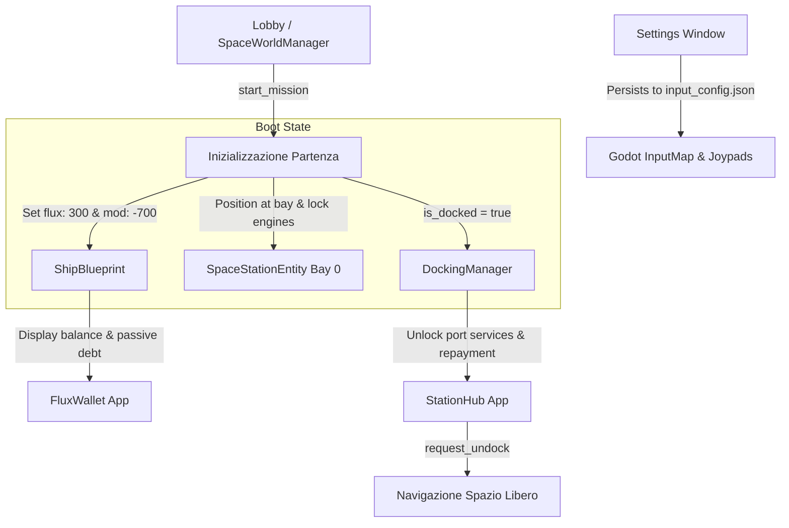

# Requirements

### Overview & Goals
In accordo con la visione delineata in `docs/GAME_SESSION_SCENARIO_AND_ROADMAP.md` e con le decisioni di design per il modello Freemium-punk e il Game Session Loop, questo piano sviluppa la **Fase A (Fondamenta Controlli, Economia e Partenza Stazione)**.

L'obiettivo è garantire un'esperienza di avvio sessione solida, diegetica e priva di attriti operativi:
1. **Configurazione Periferiche & Controlli**: Consentire a ciascun giocatore di rimappare i comandi tastiera/mouse e calibrare controller/joystick/cloche (assi analogici, sensibilità, deadzone) direttamente dalla finestra `Settings` prima o durante la sessione, con persistenza locale.
2. **Conio FLUX & Condizione Economica "Freemium Debt"**: Inizializzare la corvetta con `300 FLUX` disponibili di conio base e un modificatore passivo vincolato di `-700 FLUX` contrassegnato come `"Ship Rent Service"`, visualizzato in `FluxWallet` e riscattabile su `StationHub`.
3. **Spawn Iniziale Attraccato**: La nave inizia obbligatoriamente ancorata alla baia magnetica della stazione orbitale di partenza (`is_docked = true`), con motori vincolati e accesso immediato ai servizi portuali di `StationHub` fino al decollo (disattracco).

### Scope
- **In Scope**:
  - Estensione della finestra `Settings` con pannello `Controlli & Periferiche` per gamepad/joystick e tastiera/mouse, con salvataggio su `user://input_config.json`.
  - Configurazione del conio FLUX iniziale in `ShipBlueprint` (`flux = 300` e modificatore `ShipFluxModifier` con valore `-700`, owner `"Ship Rent Service"`).
  - Visualizzazione e gestione del debito di noleggio in `FluxWallet` e interfaccia di ripianamento canone in `StationHub`.
  - Riposizionamento dello spawn iniziale in `SpaceWorldManager.configure_initial_station_spawn()`: la nave si genera agganciata alla stazione (`DockingState.DOCKED`), vincolata dal blocco propulsori fino all'undock.
  - Suite di test automatizzata in `tests/gut/test_phase_a_controls_economy_docking.gd`.
- **Out of Scope (fasi successive della roadmap)**:
  - Applicazione `System Discover` e generazione procedurale di sistemi stellari completi (Fase B).
  - Contratti dinamici del Fixer, borsa merci X4 e rumors del Bar (Fase C).
  - Scavenging relitti con Service Drone e caricamento dinamico quadranti (Fase D).
  - Iniezione exploit IA nemica e cyber-difesa (Fase F).

### User Stories
- **Come Giocatore**, voglio poter calibrare la cloche/gamepad e rimappare i comandi da `Settings` prima del lancio, per manovrare la nave o puntare le torrette con precisione.
- **Come Equipaggio**, vogliamo iniziare la partita attraccati in sicurezza alla stazione con la consapevolezza di non possedere la nave, vedendo sul wallet i `300 FLUX` liquidi e il debito di `-700 FLUX` per il noleggio dello scafo.
- **Como Pilota**, voglio salpare dalla stazione eseguendo la procedura di disattracco diegetico solo quando l'equipaggio ha completato le operazioni portuali preliminari.

### Functional Requirements
- **FR-A1 (Rimappatura Comandi & Calibrazione Controller)**: `Settings Window` deve esporre una scheda dedicata ai controlli che elenchi i gamepad/joystick connessi (`Input.get_connected_joypads()`), permetta la calibrazione di deadzone/sensibilità per gli assi principali di volo/torretta e salvi le preferenze su `user://input_config.json`.
- **FR-A2 (Conio FLUX Iniziale & Modificatore Debito)**: La blueprint della nave deve iniziare con `flux = 300` e un'istanza di `ShipFluxModifier` (`value = -700`, `owner = "Ship Rent Service"`, `reason = "Canone noleggio scafo"`).
- **FR-A3 (Visualizzazione Debito su Flux Wallet)**: `FluxWallet` deve visualizzare il saldo positivo di 300 FLUX e la riga in rosso del modificatore passivo `-700 FLUX` con il proprietario e la causale del noleggio.
- **FR-A4 (Rimborso Debito Noleggio in StationHub)**: `StationHub` deve riconoscere la passività del noleggio scafo e consentire il pagamento/estinzione delle quote di noleggio quando la nave dispone di liquidità sufficiente.
- **FR-A5 (Spawn Iniziale Attraccato)**: `SpaceWorldManager.configure_initial_station_spawn()` e `start_mission()` devono posizionare la nave alla baia magnetica della stazione primaria con stato `is_docked = true` e blocco propulsori attivo fino alla richiesta di `request_undock()`.

### Non-Functional Requirements
- **Persistenza e Retrocompatibilità**: La configurazione degli input deve integrarsi in modo non distruttivo con l'`InputMap` di Godot e ricaricarsi all'avvio.
- **Integrità Blueprint**: Le modifiche ai valori economici e ai modificatori devono preservare il formato resource `.tres` di `ShipBlueprint`.

# Technical Design

### Current Implementation
- **Settings Window (`Scenes/Window/Settings Window/settings_window.tscn`)**:
  - Gestisce attualmente solo scaling UI, max FPS, colori di sfondo e wallpaper. Non dispone di schede per periferiche o binding controller.
- **Conio FLUX e Blueprint (`Outside/ShipSublayer/ship_blueprint.gd` & `ShipFluxModifier.gd`)**:
  - `ShipBlueprint` possiede già `@export var flux: int = 100` e `@export var flux_modifiers: Array = []`.
  - `ShipFluxModifier` è una risorsa con `value: int`, `owner: String`, `reason: String`.
  - `FluxWallet` visualizza la tabella dei modificatori ma non offre interazioni di pagamento/ripianamento debito.
- **Spawn e Attracco (`Outside/space_world_manager.gd` & `Outside/Stations/docking_manager.gd`)**:
  - `configure_initial_station_spawn()` posiziona la stazione a $1800\,\text{m}$ dalla nave nel vuoto (`station_3d_pos = Vector3(0, 0, -1800)`), lasciando la nave nello spazio profondo con motori accesi e `is_docked = false`.

### Key Decisions
1. **Configurazione Input Modulare con Fallback Automatico**:
   - *Scelta*: Creare un componente modulare `InputSettingsTab` istanziato all'interno di `Settings Window`, che interroga l'`InputMap` di Godot e salva i mapping serializzati in `user://input_config.json`.
   - *Motivazione*: Mantiene snella la scena principale di `settings_window.tscn` ed evita hardcoding, supportando sia tastiera/mouse che joystick generici o cloche HOTAS.
2. **Definizione dello Stato Iniziale del Blueprint**:
   - *Scelta*: Impostare il template di avvio della nave in `SpaceWorldManager` e `ShipBlueprint` con `flux = 300` e un modificatore attivo `-700` "Ship Rent Service".
   - *Motivazione*: Allinea perfettamente il gioco alle specifiche Freemium-punk documentate nel Game Session Loop.
3. **Attracco Diretto al Boot della Missione**:
   - *Scelta*: In `configure_initial_station_spawn()`, ancorare la nave alla baia 0 della stazione primaria (`docking_manager.force_complete_docking()`), allineare la trasformata 3D alla baia e impostare `lock_ship_movement(true)`.
   - *Motivazione*: I giocatori partono in un ambiente protetto, interagiscono con `StationHub` per preparare la spedizione e salpano deliberatamente solo premendo "Salpa" / "Undock".

### Architecture Diagram

### File Structure
- **Modificati**:
  - `Scenes/Window/Settings Window/settings_window.tscn`: aggiunta TabContainer o sezione controlli.
  - `Outside/ShipSublayer/ship_blueprint.gd`: default `flux = 300` e factory/helper per modificatore debito noleggio.
  - `Outside/space_world_manager.gd`: inizializzazione attraccata in `configure_initial_station_spawn()` e helper debito iniziale.
  - `Applications/StationHub/station_hub_app.gd`: visualizzazione canone noleggio nel tab Cantiere/Market con opzione di rimborso parziale/totale.
- **Creati**:
  - `Scenes/Window/Settings Window/input_settings_tab.gd` (e `.tscn` se necessario): controller calibrazione joypad e binding comandi.
  - `tests/gut/test_phase_a_controls_economy_docking.gd`: suite completa di test GUT per la Fase A.

### Risks
- **Conflitti di Assegnazione Assi su Gamepad Diversi**: Dispositivi D-Input vs X-Input possono avere indici di asse differenti.
  - *Mitigazione*: Implementare rilevamento deadzone configurabile per asse e indicatore visivo live dell'inclinazione stick nell'interfaccia di calibrazione.
- **Disallineamento Fisico all'Attracco**: Il nodo `Spaceship` potrebbe subire collisioni o spin all'avvio se posizionato all'interno della mesh di stazione.
  - *Mitigazione*: Posizionamento esatto sul `bay_transform` della stazione e azzeramento immediato di `linear_velocity` e `angular_velocity` con `lock_ship_movement(true)`.

# Testing

### Validation Approach
La validazione di Fase A viene eseguita tramite test automatici GUT in headless mode (`tests/gut/test_phase_a_controls_economy_docking.gd`), combinata con la verifica del caricamento e persistenza dei file di configurazione (`user://input_config.json`).

### Key Scenarios
1. **Calibrazione e Persistenza Controlli**:
   - Salvataggio configurazione assi e deadzone; ricaricamento e applicazione corretta alle azioni dell'`InputMap`.
2. **Conio FLUX e Modificatore di Debito**:
   - Verifica di `bp.flux == 300` e presenza del modificatore `value == -700` con causale e proprietario.
   - Verifica rendering corretto in `FluxWallet` (300 FLUX verde/bianco, riga `-700` in rosso).
3. **Pagamento Quote Noleggio in StationHub**:
   - Con saldo disponibile, pagamento di una quota del debito noleggio; riduzione proporzionale del modificatore passivo e del debito residuo.
4. **Spawn Iniziale Attraccato e Undock**:
   - Chiamata a `start_mission()` o `configure_initial_station_spawn()`.
   - Verifica che `is_docked == true`, nave ferma al pontile della stazione primaria e propulsori vincolati.
   - Chiamata a `request_undock()`: transizione a `is_docked == false`, propulsori sbloccati.

### Test Changes
- **Nuovo File**: `tests/gut/test_phase_a_controls_economy_docking.gd` contenente:
  - `test_input_settings_persistence_and_deadzones()`
  - `test_flux_initial_minting_and_rent_debt_modifier()`
  - `test_station_hub_debt_repayment()`
  - `test_initial_station_docked_spawn_and_undocking()`

# Delivery Steps

###  Step 1: Gestione Controlli e Calibrazione Periferiche in Settings Window
Aggiungere a GodotOS l'interfaccia di rimappatura tastiera/mouse e calibrazione assi controller/joystick con persistenza su file.
- Creare il modulo `input_settings_tab.gd` integrato in `Scenes/Window/Settings Window/settings_window.tscn`.
- Implementare il rilevamento periferiche con `Input.get_connected_joypads()`, calibrazione deadzone per asse di volo e torretta, e binding azioni.
- Gestire il salvataggio e caricamento da `user://input_config.json` con applicazione all'`InputMap` a runtime.

###  Step 2: Conio FLUX Iniziale e Modificatore di Debito Noleggio Nave
Configurare la nave per riflettere la condizione economica Freemium-punk di partenza con saldo liquido e debito vincolato.
- Impostare in `ShipBlueprint` il conio di default a `flux = 300` e generare il modificatore passivo `-700 FLUX` (`ShipFluxModifier` con proprietario `"Ship Rent Service"` e causale `"Canone noleggio scafo"`).
- Verificare che `FluxWallet` visualizzi chiaramente il saldo di 300 FLUX e la riga di debito in rosso.
- Aggiungere su `StationHub` l'interfaccia per visualizzare il debito di noleggio e ripianare quote di debito scalando dal saldo liquido.

###  Step 3: Spawn Iniziale Attraccato alla Stazione Orbitale
Posizionare la corvetta direttamente ancorata alla stazione di partenza all'avvio della sessione.
- Modificare `configure_initial_station_spawn()` in `Outside/space_world_manager.gd`: posizionare la nave alla baia 0 di `primary_station_instance` anziché a 1800m nello spazio aperto.
- Forzare lo stato di attracco iniziale (`DockingState.DOCKED`, `is_docked = true`) e attivare il blocco propulsori con `lock_ship_movement(true)`.
- Allineare `StationHub` e `Comms` per rilevare la condizione di docking immediata, rendendo disponibili i servizi portuali al primo click.
- Assicurare che la procedura di decollo (`request_undock()`) rilasci i vincoli magnetici e avvii la navigazione libera.

###  Step 4: Suite di Test GUT e Validazione di Fase A
Validare l'intero flusso di avvio, controlli, economia a debito e attracco tramite test automatizzati.
- Creare la suite di test GUT `tests/gut/test_phase_a_controls_economy_docking.gd`.
- Verificare persistenza input, saldo e modificatori FLUX, pagamento quote su StationHub, e sequenza spawn attraccato / undock.
- Eseguire la suite in modalità headless garantendo l'assenza di regressioni sui test esistenti.
