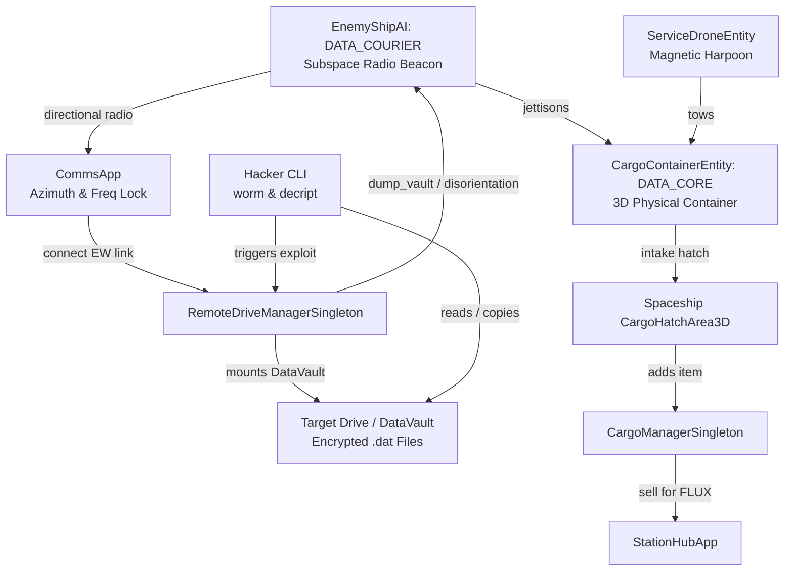

# Requirements

### Overview & Goals
Nel contesto della roadmap di sviluppo di *Dark Nova: Rogue Squadron*, i dati e le informazioni tattiche non viaggiano a velocità superluminale senza infrastrutture dedicate o corrieri fisici. Questa feature introduce i **Corrieri Dati S-Net (S-Net Data Couriers)**: convogli e navi trasporto mercantili/corporative che trasferiscono banche dati crittografate, registri contabili neri, mappe stellari riservate ed algoritmi di exploit attraverso i settori.

L'equipaggio della corvetta può intercettare questi trasporti:
1. **Rilevamento e Tracking Comms**: Sintonizzazione della radio su frequenze S-Net dedicate (es. 1920.0 MHz) e puntamento manuale/automatico dell'antenna direzionale per agganciare il radiofaro del convoglio con SNR sufficiente.
2. **Intrusione EW e Target Drive**: Stabilimento del link dati radio EW abilitando il tasto "Connect" in `CommsApp`, con montaggio del filesystem remoto `Target Drive` arricchito con la cartella blindata `DataVault/`.
3. **Decifrazione e Trafugamento Digitale**: Utilizzo degli strumenti CLI diegetici (`worm`, `decript`, `datread`) per estrarre chiavi di cifratura e scaricare i file `.dat` riservati direttamente nello `Ship Drive`.
4. **Interdizione e Recupero Fisico Hard Disk**: Forzatura dell'espulsione fisica di container di hard disk crittografati (`DATA_CORE`) tramite exploit hacker (`dump_vault`, `8loops`, `gout`) o disabilitazione motori, recuperabili nello spazio dal `Service Drone` tramite arpione magnetico e stivati nel portello cargo nave (`CargoHatchArea3D`).
5. **Monetizzazione e Ricompense**: Vendita dei dischi al mercato nero di `StationHub` per elevati introiti FLUX o consegna al Fixer per chiudere contratti di spionaggio.

### Scope
- **In Scope**:
  - Aggiunta della tipologia nave `DATA_COURIER` in `EnemyShipAI` con parametri da cargo corazzato, beacon radio continuo e logica di fuga/evasione.
  - Sintonizzazione e tracking direzionale in `CommsApp` per i radiofari dei corrieri dati.
  - Montaggio dinamico del caveau riservato `Target Drive/DataVault/` in `RemoteDriveManager` con file `.dat` crittografati e manifesti.
  - Meccanica di espulsione del container fisico `CargoContainerEntity` tipo `DATA_CORE` a seguito di violazione EW o disabilitazione.
  - Recupero del container dati tramite Service Drone magnetico e stivaggio nel cargo hatch della corvetta.
  - Valorizzazione commerciale e contrattuale dei dati in `CargoManager` e `StationHub`.
  - Suite di collaudo automatizzata `tests/gut/test_snet_data_courier_hacking.gd`.
- **Out of Scope**:
  - Simulazione procedurale di rotte interplanetarie di convogli civili passanti tra quadranti non caricati (affrontata in futuro con la simulazione galattica di background).

### Functional Requirements
- **FR-SNET1 (Archetipo Corriere Dati)**: `EnemyShipAI` supporta `ShipType.DATA_COURIER` con beacon radio identificabile, frequenza subspaziale dedicata e profilo evasivo.
- **FR-SNET2 (Intercettazione e Connessione Comms)**: `CommsApp` permette di localizzare il segnale del corriere tramite azimut dell'antenna direzionale e, se allineata entro il cono e a distanza ravvicinata, attiva il link EW "Connect".
- **FR-SNET3 (Caveau Dati Remoto)**: `RemoteDriveManager` popola `Target Drive/DataVault/` con archivi protetti da password (`corporate_ledger.dat`, `sector_jump_charts.dat`, `exploit_payload.dat`).
- **FR-SNET4 (Espulsione Hard Disk Fisico)**: Quando il corriere subisce l'esecuzione di exploit informatici (`dump_vault`, `8loops`, `gout`) o viene disabilitato/danneggiato gravemente, espelle un container fisico `DATA_CORE` nello spazio.
- **FR-SNET5 (Recupero e Stivaggio)**: Il container hard disk può essere trainato dall'arpione magnetico del Service Drone fino all'area `CargoHatchArea3D`, stivandosi in `CargoManager` con valore base in unità FLUX.
- **FR-SNET6 (Integrazione Economica)**: I dischi dati e i file trafugati sono liquidabili presso `StationHub` o conteggiati nei contratti Fixer di retrieval/spionaggio.

# Technical Design

### Architecture Diagram

### File Structure
- **Modificati**:
  - `Outside/Combat/enemy_ship_ai.gd`: aggiunto `ShipType.DATA_COURIER`, gestione beacon radio, reazione a intrusioni ed espulsione cargo hard-disk `jettison_data_vault()`.
  - `Applications/Comms/comms_app.gd`: frequenza beacon corriere S-Net sintonizzabile, tracking dell'antenna e connessione EW verso il corriere.
  - `Scenes/Autoloads/ShipDrive/remote_drive_manager.gd`: generazione struttura cartella `DataVault/` con file `.dat` crittografati, password e supporto all'exploit `dump_vault`.
  - `Economy/CargoItemData.gd` & `Economy/cargo_manager.gd`: registrazione del template risorsa `snet_quantum_core` (categoria `DATA_CORE`, alto valore FLUX).
- **Creati**:
  - `tests/gut/test_snet_data_courier_hacking.gd`: suite automatizzata di test per la sequenza completa di intercettazione, hacking, espulsione e stivaggio.

# Delivery Steps

### ✓ Step 1: Entità Corriere Dati e Radiofaro Subspaziale su CommsApp
Estendere `Outside/Combat/enemy_ship_ai.gd` con la tipologia di nave `DATA_COURIER` (parametri cargo, beacon radio, logica di evasione ed espulsione dati) e integrare su `Applications/Comms/comms_app.gd` la trasmissione del radiofaro S-Net tracciabile con antenna direzionale e aggancio EW.

### ✓ Step 2: Architettura Target Drive con Caveau Dati (`DataVault`) ed Exploit di Estrazione
In `Scenes/Autoloads/ShipDrive/remote_drive_manager.gd`, implementare la generazione dinamica della cartella `DataVault/` con archivi `.dat` protetti da password (`corporate_ledger.dat`, `sector_jump_charts.dat`, `exploit_payload.dat`), abilitando il supporto all'esfiltrazione file e all'exploit `dump_vault`.

### ✓ Step 3: Espulsione e Recupero Container Hard Disk Fisici nello Spazio
Collegare l'interdizione informatica o cinetica del corriere con l'espulsione fisica del container `DATA_CORE` nello spazio, abilitando il traino con l'arpione magnetico del Service Drone e lo stivaggio automatico nel portello cargo nave (`CargoHatchArea3D`) registrato in `CargoManager`.

### ✓ Step 4: Suite di Test GUT e Validazione del Ciclo Corrieri S-Net
Creare `tests/gut/test_snet_data_courier_hacking.gd` per convalidare radiofaro, connessione EW, montaggio `DataVault`, espulsione container, traino drone e stivaggio in stiva con valorizzazione FLUX, verificando l'assenza di regressioni su tutti i test del progetto.
