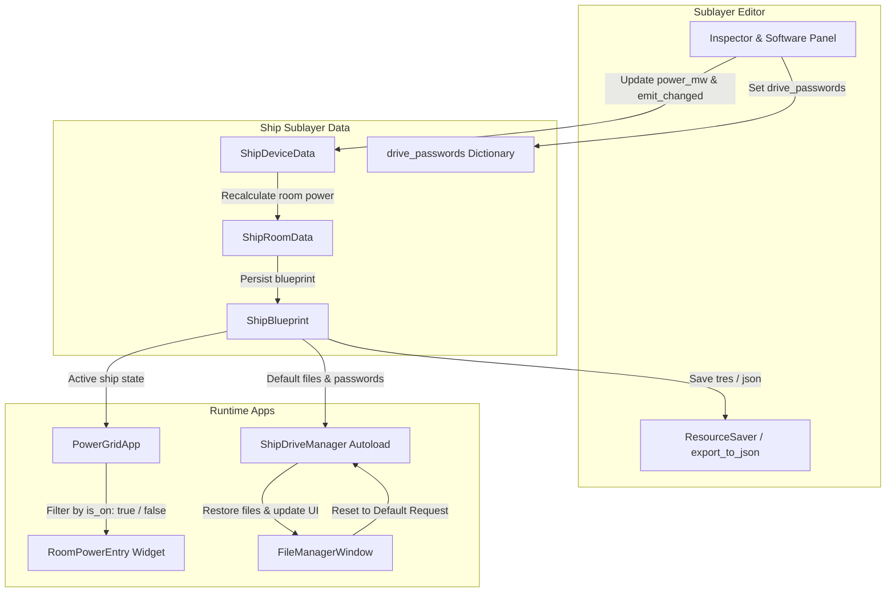

# Requirements

### Overview & Goals
Il documento `docs/MANUAL_TESTS.md` tiene traccia dello stato dei test manuali e automatici per le componenti di gioco e gli strumenti dell'editor.
Dalla revisione dei risultati e delle note, emergono 4 test falliti con relative problematiche diegetiche e di tool:
1. **MT-ED-04 (Sublayer Editor)**: Modificando la potenza di un dispositivo (es. reattore da 500 a 650 MW, o un propulsore), il nuovo valore non viene persistito nel file blueprint (`.tres` / `.json`).
2. **MT-HAL-03 (PowerGrid App)**: Con il reattore offline (`is_on == false`), l'interfaccia dell'applicazione mostra ancora la stanza del reattore come se stesse producendo 1000 MW, pur calcolando correttamente il bilancio globale a 0 MW.
3. **MT-HAL-07 (Ship Drive)**: Non esiste un pulsante o azione "Reset to Default" accessibile dall'interfaccia utente (FileManager / DriveApp) per ripristinare il file system originale dei firmware `.dat` e file `.txt` da blueprint.
4. **MT-HAL-08 (Sublayer Editor)**: Non è possibile visualizzare e modificare in modo persistente le password delle cartelle protette di `Ship Drive` nel pannello del Sublayer Editor (le modifiche venivano sovrascritte al refresh e non salvate nella risorsa).

### Scope
- **In Scope**:
  - Correzione della sincronizzazione e del salvataggio di `power_mw` in `ShipDeviceData`, `ShipBlueprint` e `ship_sublayer_editor.gd`.
  - Aggiornamento della logica di visualizzazione della potenza per stanza e nell'ispettore di `power_grid_app.gd` per riflettere lo stato `is_on == false`.
  - Implementazione dell'azione "Reset to Default" in `ship_drive_manager.gd` e integrazione UI in `file_manager_window.gd`/`.tscn`.
  - Correzione e rifinitura del pannello gestione password cartelle in `ship_sublayer_editor.gd`.
  - Esecuzione/estensione test GUT e aggiornamento di `docs/MANUAL_TESTS.md`.
- **Out of Scope**:
  - Riprogettazione dell'architettura generale di GodotOS o di altre applicazioni non coinvolte nelle note di test.
  - Modifiche ai sistemi 3D o di volo non impattati dai valori di configurazione.

# Technical Design

### Current Implementation & Root Causes

1. **MT-ED-04 (Persistenza Potenza Dispositivi)**:
   - In `Outside/ShipSublayer/ShipDeviceData.gd`, `power_mw` è una proprietà senza setter reattivo. Inoltre `create_physical_component()` sovrascriveva `power_mw` con i vecchi valori memorizzati in `custom_properties` (`power_output_nominal` o `power_draw_nominal`).
   - In `addons/ship_sublayer_editor/ship_sublayer_editor.gd`, la modifica del valore tramite SpinBox non invocava `dev.emit_changed()`, per cui Godot considerava la sotto-risorsa non modificata durante `ResourceSaver.save()`.

2. **MT-HAL-03 (Reattore Offline in PowerGrid)**:
   - In `Applications/PowerGrid/power_grid_app.gd`:
     - La logica di calcolo del bilancio globale `_refresh_power_logic()` controlla correttamente `if room_on: total_gen_mw += p`.
     - Tuttavia, il ciclo di aggiornamento dei widget grafici delle stanze (`_update_ui_telemetry()`) e dell'ispettore (`_update_inspector()`) sommava `dev.get("power_mw")` a prescindere da `room.get("is_on")`. Di conseguenza, con il reattore spento, la tessera mostrava ancora `+1000.0 MW` e "GENERAZIONE ATTIVA".

3. **MT-HAL-07 (Reset to Default per Ship Drive)**:
   - `Scenes/Autoloads/ShipDrive/ship_drive_manager.gd` possiede solo un metodo interno `_populate_default_ship_drive_files()` che esce prematuramente se i file esistono già (`if FileAccess.file_exists(...): return`). Non esisteva una funzione pubblica per forzare il ripristino pulito.
   - La finestra `Scenes/Window/File Manager/file_manager_window.tscn` non offriva alcun pulsante o opzione di reset quando l'utente esplorava l'unità `Ship Drive`.

4. **MT-HAL-08 (Gestione Password Cartelle Sublayer Editor)**:
   - In `addons/ship_sublayer_editor/ship_sublayer_editor.gd`, `_refresh_software_panel()` assegnava `edit_pwd.text = app_res.default_password` sovrascrivendo quanto presente in `current_blueprint.drive_passwords`.
   - L'evento di salvataggio era agganciato solo a `text_submitted` e non a `focus_exited`, causando la perdita di modifiche se l'utente non premeva esplicitamente Invio.

### Architecture & Data Flow

### Proposed Changes

#### 1. `Outside/ShipSublayer/ShipDeviceData.gd` & `ship_blueprint.gd`
- In `ShipDeviceData.gd`:
  - Aggiungere setter a `power_mw` che esegua `emit_changed()`.
  - Allineare `custom_properties["power_output_nominal"]` e `custom_properties["power_draw_nominal"]` quando `power_mw` viene modificato.
- In `addons/ship_sublayer_editor/ship_sublayer_editor.gd`:
  - Nel callback di `_add_float_field` per la potenza, assicurarsi che vengano chiamati `dev.emit_changed()`, `current_blueprint.recalculate_all_powers()`, e `current_blueprint.emit_changed()`.

#### 2. `Applications/PowerGrid/power_grid_app.gd` & `room_power_entry.gd`
- In `power_grid_app.gd`:
  - In `_update_ui_telemetry()`, verificare `is_on = bool(room.get("is_on", false))`. Se `not is_on`, passare `0.0` (oppure contrassegnare offline) al widget della stanza.
  - In `_update_inspector()`, se la stanza è spenta, impostare `room_p = 0.0`, visualizzando `Carico: 0.0 MW (OFFLINE)` e regime `STANDBY / DISCONNESSO`.

#### 3. `Scenes/Autoloads/ShipDrive/ship_drive_manager.gd` & `file_manager_window.gd`
- In `ship_drive_manager.gd`:
  - Aggiungere il metodo pubblico `reset_ship_drive_to_default()`: elimina e ricrea i contenuti di `user://files/Ship Drive`, riscrive i file `.dat` e `.txt` dalla blueprint attiva (o fallback), reimposta le password di `FolderPasswordManager` e invia i segnali `drive_synced` e `_refresh_desktop()`.
- In `Scenes/Window/File Manager/`:
  - Aggiungere in `Top Bar` di `file_manager_window.tscn` un pulsante `Reset Default` (visibile se `file_path == "Ship Drive"` o sottocartella).
  - Collegare la pressione del pulsante a una richiesta di conferma che invoca `ShipDriveManager.reset_ship_drive_to_default()` e ricarica la finestra.

#### 4. `addons/ship_sublayer_editor/ship_sublayer_editor.gd`
- In `_refresh_software_panel()`:
  - Leggere la password da `current_blueprint.drive_passwords.get(pwd_key, (app_res.default_password if app_res else ""))`, dando priorità assoluta alla blueprint.
  - Connettere anche `focus_exited` sui campi password per salvare le modifiche.
  - Esporre la lista completa delle cartelle di sistema e applicative con controlli di modifica password e feedback visivo.

# Testing

### Validation Approach
La verifica della corretta implementazione dei fix avverrà tramite una combinazione di test automatizzati (GUT) e scenari di verifica manuale/diegetica.

### Key Scenarios

1. **Persistenza Potenza Dispositivi (MT-ED-04)**:
   - Modificare `power_mw` su un generatore e su un consumatore nel Sublayer Editor.
   - Salvare la blueprint su file temporaneo `.tres` o `.json`.
   - Ricaricare il file salvato e verificare tramite asserzioni che `dev.power_mw` e le proprietà nominali del componente fisico corrispondente corrispondano esattamente ai nuovi valori impostati.

2. **Reattore Offline in PowerGrid (MT-HAL-03)**:
   - Avviare una sessione di gioco con la stanza reattore attiva.
   - Spegnere la stanza reattore tramite l'interruttore in `PowerGridApp`.
   - Verificare che il badge e il testo della stanza reattore mostrino `0.0 MW / OFFLINE` e che l'ispettore non indichi produzione attiva, pur mantenendo coerente il bilancio complessivo.
   - Riaccendere la stanza e verificare che il valore nominale (es. 1000.0 MW) torni visibile.

3. **Reset to Default Ship Drive (MT-HAL-07)**:
   - Avviare missione e verificare il popolamento iniziale di `user://files/Ship Drive`.
   - Modificare o cancellare un file essenziale (es. `weapons_config.dat` o `Flight Log.txt`).
   - Aprire `FileManagerWindow` su `Ship Drive`, premere il pulsante "Reset to Default" e confermare.
   - Verificare che il file cancellato venga ricreato con il contenuto originario previsto dalla blueprint.

4. **Gestione Password nel Sublayer Editor (MT-HAL-08)**:
   - Nel Sublayer Editor, modificare la password di una cartella applicativa o di sistema (es. da `FLIGHT-7815` a `CUSTOM-9999`).
   - Effettuare refresh o salvataggio/riapertura della blueprint.
   - Verificare che la nuova password rimanga memorizzata in `drive_passwords` e venga visualizzata correttamente nell'editor senza tornare al valore predefinito della risorsa.

### Test Changes
- Eseguire i test esistenti:
  - `tests/gut/test_power_grid_node.gd`
  - `tests/gut/test_ship_drive_node.gd`
  - `tests/gut/test_file_manager_navigation.gd`
- Aggiornare `docs/MANUAL_TESTS.md` impostando l'esito dei 4 test su `Passato` e documentando i dettagli di risoluzione.

# Delivery Steps

### ✓ Step 1: Correzione persistenza potenza dispositivi nel Sublayer Editor (MT-ED-04)
Risolvere il mancato salvataggio della potenza dei dispositivi (`power_mw`) e la disconnessione tra le proprietà custom e nominali:
- In `Outside/ShipSublayer/ShipDeviceData.gd`, aggiungere setter con `emit_changed()` alla proprietà `power_mw` e sincronizzare dinamicamente le chiavi di `custom_properties` come `power_output_nominal` e `power_draw_nominal`.
- In `addons/ship_sublayer_editor/ship_sublayer_editor.gd`, correggere il callback di modifica potenza (`_add_float_field`) affinché chiami `dev.emit_changed()` e notifichi la stanza genitore e la blueprint, garantendo che `ResourceSaver.save()` persista correttamente i cambiamenti nei file `.tres` e `.json`.
- In `Outside/ShipSublayer/ship_blueprint.gd`, verificare e perfezionare `get_device_by_id()` per evitare la restituzione di istanze duplicate o disconnesse quando i dispositivi sono memorizzati come dizionari.

### ✓ Step 2: Correzione visualizzazione stanza reattore offline in PowerGrid (MT-HAL-03)
Correggere la telemetria visiva dei widget stanza e dell'ispettore quando una stanza è offline o il reattore è spento:
- In `Applications/PowerGrid/power_grid_app.gd`, aggiornare il loop di refresh (`_update_ui_telemetry` e `_update_inspector`) verificando il flag `is_on` della stanza: se `is_on == false`, la potenza effettiva erogata/assorbita dalla stanza deve essere considerata 0.0 MW anziché mostrare il nominale a regime.
- In `Applications/PowerGrid/Components/room_power_entry.gd`, gestire graficamente lo stato OFFLINE (0.0 MW) quando la stanza non è alimentata, garantendo coerenza tra il bilancio totale di produzione (già corretto) e il badge della singola stanza del reattore.

### ✓ Step 3: Implementazione Reset to Default per Ship Drive in FileManagerWindow (MT-HAL-07)
Aggiungere la funzionalità e il controllo UI per il ripristino di fabbrica del file system di Ship Drive:
- In `Scenes/Autoloads/ShipDrive/ship_drive_manager.gd`, implementare la funzione pubblica `restore_default_ship_drive_files(force: bool = true)` (o `reset_ship_drive_to_default()`) per ricreare l'albero di directory e riscrivere tutti i file `.dat` e `.txt` originali dalla blueprint o dai template di fabbrica, reimpostando contestualmente le password predefinite in `FolderPasswordManager`.
- In `Scenes/Window/File Manager/file_manager_window.tscn` e `file_manager_window.gd`, aggiungere un pulsante dedicato "Reset to Default" (visibile quando ci si trova all'interno di `Ship Drive`) corredato da finestra di conferma, che invoca il ripristino ed effettua il reload immediato della cartella.

### ✓ Step 4: Gestione e modifica password cartelle protette nel Sublayer Editor (MT-HAL-08)
Risolvere la visualizzazione e modifica delle password delle cartelle protette di Ship Drive nell'editor del sublayer:
- In `addons/ship_sublayer_editor/ship_sublayer_editor.gd`, correggere la logica in `_refresh_software_panel()`: visualizzare prioritariamente la password memorizzata in `current_blueprint.drive_passwords[pwd_key]` rispetto al default hardcoded di `AppResource`, evitando che il refresh sovrascriva quanto digitato dall'utente.
- Connettere anche l'evento `focus_exited` (oltre a `text_submitted`) sui campi `LineEdit` delle password per garantire il salvataggio automatico quando l'utente cambia campo o clicca altrove.
- Esporre un elenco chiaro di tutte le cartelle protette (sia delle app sia di sistema come `Ship Drive/systems`) con possibilità di aggiunta, rimozione e modifica, invocando `current_blueprint.set_drive_password()` e `current_blueprint.emit_changed()`.

### ✓ Step 5: Validazione test GUT e aggiornamento documentazione MANUAL_TESTS.md
Validare le correzioni tramite test automatizzati e aggiornare la documentazione:
- Eseguire i test GUT esistenti (`test_power_grid_node.gd`, `test_ship_drive_node.gd`, `test_file_manager_navigation.gd`) e aggiungere nuovi scenari per la persistenza della potenza modificata e il reset di Ship Drive.
- Aggiornare `docs/MANUAL_TESTS.md` impostando l'esito dei test MT-ED-04, MT-HAL-03, MT-HAL-07 e MT-HAL-08 su [X] Passato, documentando nelle note la risoluzione tecnica applicata.