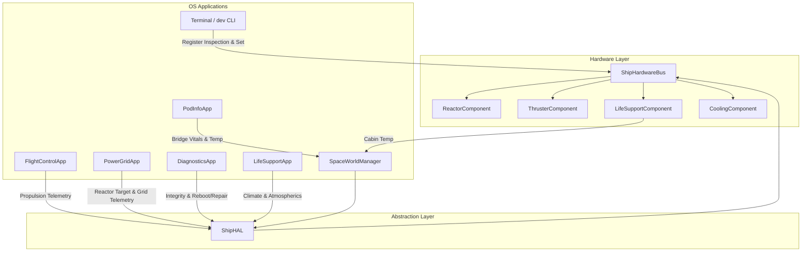

# Requirements

### Overview & Goals
The manual testing of the Hardware Abstraction Layer (HAL) documented in `docs/MANUAL_TESTPLAN_HAL.md` uncovered several discrepancies, edge-case bugs, and missing UI/telemetry integrations across multiple ship subsystems (`FlightControl`, `PowerGrid`, `Diagnostics`, `LifeSupport`, `PodInfo`, and `Terminal`).

The goal of this initiative is to address all issues noted by testers in `docs/MANUAL_TESTPLAN_HAL.md`:
1. Prevent false connected state in Terminal when no ship is connected (`TC-HAL-INIT-02`).
2. Fix input swallowing where `R` and `F` keys are captured by `FlightControlApp`, blocking typing in the Terminal (`TC-HAL-PROP-01`).
3. Make `health` and `temp` configurable/injectable for testing, and dynamically reflect thruster flight telemetry (`TC-HAL-PROP-02`, `TC-HAL-PROP-03`, `TC-HAL-THRM-02`).
4. Support setting reactor target via GUI and enforce safety limits/notifications when exceeding 100% (`TC-HAL-PWR-02`).
5. Connect `DiagnosticsApp` to `ShipHAL` contracts for integrity monitoring, damaged component lists, reboot, and repair (`TC-HAL-DIAG-01`, `02`, `03`).
6. Propagate temperature changes from `LifeSupportComponent` to `LifeSupportApp` and `PodInfoApp` (`TC-HAL-LS-02`).
7. Correct propulsion degradation calculations and badge text formatting (`TC-HAL-EDGE-01`).
8. Update `docs/MANUAL_TESTPLAN_HAL.md` with resolved comments and verified test results.

### Scope
- **In Scope:**
  - `dev_command.gd` & `virtual_sysfs_driver.gd`: Ship connection state verification.
  - `flight_control_app.gd`: Proper unhandled input processing for `R`/`F` keys and weighted propulsion badge formatting.
  - `ship_physical_component.gd`: Relax read-only restrictions on `health` and `temp` for testing and diagnostic simulations.
  - `thruster_component.gd` & `spaceship.gd`: Register exposure for `throttle` and `thrust_output`, plus live update during ship flight.
  - `reactor_component.gd` & `power_grid_app.gd`: Overdrive notification/clamping and reactor power target slider in GUI.
  - `diagnostics_app.gd`: Full binding with `ShipHAL` methods for integrity, fault lists, reboot, and repair.
  - `life_support_component.gd`, `life_support_app.gd`, `space_world_manager.gd`, & `pod_info_app.gd`: Temperature propagation and synchronization.
  - `docs/MANUAL_TESTPLAN_HAL.md`: Updating the test plan document with the revised notes and outcomes.
- **Out of Scope:**
  - Complete overhaul of ship flight physics or StarSystem navigation.
  - Changing network RPC protocol or multiplayer sync rules outside HAL telemetry.

### User Stories
- **As a Flight Pilot / Terminal User**, I want to type commands containing the letters 'R' and 'F' into the terminal without FlightControl swallowing the keystrokes.
- **As an Engineer / Systems Tester**, I want to simulate component wear and thermal spikes using `dev set <comp> health/temp <val>` so I can validate ship emergency responses.
- **As a Power Operator**, I want to control the reactor target directly from the Power Grid GUI and receive clear warnings if the reactor is pushed into overdrive.
- **As a Diagnostics Officer**, I want `DiagnosticsApp` to accurately display degraded hardware from `ShipHAL` and allow remote rebooting and repairs.
- **As a Life Support Officer**, I want changes to target temperatures to propagate smoothly to cabin sensors and crew vitals in `PodInfoApp`.

### Functional Requirements
- **FR-01 (Connection Check):** Terminal commands `dev list` and `dev status` must check if `SpaceWorldManager.is_ship_connected()` is true. If false, display `"Errore: Hardware Bus non disponibile o nave non inizializzata"`.
- **FR-02 (Key Handling):** `FlightControlApp` must only consume `KEY_R` and `KEY_F` via `_unhandled_key_input()` when no text input field has focus and the window is actively focused.
- **FR-03 (Register Mutability for QA/Dev):** `health` and `temp` registers in `ShipPhysicalComponent` must be writable via `write_register()` / `dev set` with value validation.
- **FR-04 (Thruster Telemetry):** `ThrusterComponent` must expose `throttle` (0.0..1.0) and `thrust_output` (kN), updated dynamically in `dev status` when flying.
- **FR-05 (Propulsion Degradation Accuracy):** Propulsion efficiency must be weighted by maximum thrust capacity, and the FlightControl badge must display remaining thrust (e.g. `PROPULSORI DEGRADATI (63% - 50 kN)`).
- **FR-06 (Reactor Target Control & Overdrive):** Add target slider to `PowerGridApp`. If target > 1.0 (100%), notify user and clamp to safe limits unless overdrive confirmation is supplied.
- **FR-07 (Diagnostics HAL Binding):** `DiagnosticsApp` must display overall integrity via `ShipHAL.get_overall_system_integrity()`, list damaged items via `get_damaged_components()`, and execute reboot/repair via HAL.
- **FR-08 (Life Support Climate Propagation):** Changes to `target_temp` in `LifeSupportComponent` must transition `cabin_temp`, update `LifeSupportApp` room cards, and feed into `SpaceWorldManager.get_bridge_atmo_state()` for `PodInfoApp`.
- **FR-09 (Test Plan Synchronization):** Update `docs/MANUAL_TESTPLAN_HAL.md` with the new behaviors and validated test steps.

# Technical Design

### Current Implementation
- `ShipHAL` (`Outside/ShipSystems/HAL/ship_hal.gd`) provides contracts for propulsion, power, thermal, diagnostics, and life support.
- `ShipPhysicalComponent` hardcodes `health` and `temp` in `readonly_registers`, which blocked testers from simulating failures in `TC-HAL-PROP-02`, `TC-HAL-THRM-02`, and `TC-HAL-DIAG-01/02/03`.
- `FlightControlApp` captures keys in `_input(event)` before UI controls receive them, breaking text entry in `Terminal`.
- `dev_command.gd` accesses `SpaceWorldManager.get_hardware_bus()`, which lazily initializes a dummy bus even before connecting to a ship.
- `DiagnosticsApp` was using mock or incomplete bindings rather than querying `ShipHAL`.
- `LifeSupportComponent.target_temp` updates were isolated to the component without linking to `LifeSupportApp` room data or `PodInfoApp`.

### Key Decisions
1. **Input Handling Strategy**: Use `_unhandled_key_input()` and verify that no focused `LineEdit` or `TextEdit` exists before processing `KEY_R` and `KEY_F` in `FlightControlApp`.
2. **Register Mutability**: Remove `health` and `temp` from strict `readonly_registers`. Add validation clamps in `_on_register_written`:
   - `health`: clamped to `[0.0, 100.0]`, updating `status_string` (FAULT if < 25%, ONLINE if healthy).
   - `temp`: clamped to `[-50.0, 1000.0]`, triggering overheat alerts if > `heat_max`.
3. **Propulsion Efficiency Calculation**:
   - Calculate efficiency weighted by `max_thrust`: `total_available_thrust / total_nominal_thrust`.
   - Update FlightControl badge to show both percentage and available kN.
4. **Reactor Overdrive Guard**: Default target to `1.0`. Allow up to `2.0` only when explicit overdrive is flagged, spawning a notification: `"ATTENZIONE: Sovraccarico reattore impostato (>100%)"`.
5. **Diagnostics-to-HAL Architecture**: Bind `DiagnosticsApp` directly to `ShipHAL` signals and contract methods, refreshing cards on `hardware_bus.telemetry_received`.
6. **Life Support Bridge Sync**: `SpaceWorldManager.get_bridge_atmo_state()` will query `ShipHAL.get_life_support_metrics()` when life support app rooms are not manually overridden.

### Architecture Diagram

### File Structure
- `Outside/ShipSystems/Components/ship_physical_component.gd`: Register mutability (`health`, `temp`).
- `Outside/ShipSystems/Components/thruster_component.gd`: Registers for `throttle` and `thrust_output`.
- `Outside/ShipSystems/Components/reactor_component.gd`: Overdrive bounds, warning signal.
- `Outside/ShipSystems/Components/life_support_component.gd`: Temperature convergence and telemetry.
- `Outside/ShipSystems/HardwareBus/ship_hardware_bus.gd`: Weighted propulsion efficiency.
- `Outside/ShipSystems/HAL/ship_hal.gd`: Life support metrics bridge & diagnostics contract pass-through.
- `Outside/space_world_manager.gd`: Disconnection detection and bridge atmosphere provider.
- `Outside/spaceship.gd`: Forward thrust to `ShipHAL.apply_thrust_input()`.
- `Applications/Terminal/Commands/dev_command.gd`: Disconnected state error check.
- `Applications/FlightControl/flight_control_app.gd`: Unhandled key processing and badge formatting.
- `Applications/PowerGrid/power_grid_app.gd`: Reactor power target UI slider.
- `Applications/Diagnostics/diagnostics_app.gd`: HAL contract integration.
- `Applications/LifeSupport/life_support_app.gd`: Target temp sync.
- `Applications/PodInfo/pod_info_app.gd`: Live telemetry display.
- `docs/MANUAL_TESTPLAN_HAL.md`: Updated manual test plan document.

# Testing

### Validation Approach
Automated tests and manual test procedures will be used to verify each resolution.

### Key Scenarios
1. **Disconnected Ship Terminal Check (TC-HAL-INIT-02):**
   - Launch application without connecting to ship in Lobby.
   - Run `dev list` and `dev status` in Terminal.
   - Verify output: `"Errore: Hardware Bus non disponibile o nave non inizializzata"`.
2. **Terminal Keystroke Isolation (TC-HAL-PROP-01):**
   - Open FlightControl and Terminal.
   - Focus Terminal LineEdit and type words containing 'r' and 'f' (e.g. `clear`, `free`, `reactor`).
   - Verify keys are typed into Terminal without altering FlightControl speed multiplier.
3. **Register Modification & Propulsion Telemetry (TC-HAL-PROP-02 & PROP-03):**
   - Run `dev set thruster_01 health 40`. Verify health changes and status shifts if critical.
   - Fly ship forward; run `dev status thruster_01`. Verify `throttle` and `thrust_output` are non-zero.
4. **Thermal Overheat Test (TC-HAL-THRM-02):**
   - Run `dev set reactor_01 temp 275`.
   - Verify overheat alert triggers and thermal grid alarms fire.
5. **Power Grid Reactor Controls (TC-HAL-PWR-02):**
   - Adjust reactor target slider in PowerGrid GUI or run `dev set reactor_01 power_target 1.5`.
   - Verify overdrive notification appears and UI updates.
6. **Diagnostics Monitoring & Repair (TC-HAL-DIAG-01/02/03):**
   - Lower component health via CLI.
   - Open Diagnostics; verify overall integrity dropped and damaged component is listed.
   - Trigger repair and reboot; verify component recovers to 100% ONLINE.
7. **Life Support & PodInfo Climate Sync (TC-HAL-LS-02):**
   - Run `dev set life_support_01 target_temp 24.5`.
   - Verify cabin temperature transitions and displays 24.5°C in LifeSupportApp and PodInfoApp.
8. **Edge Case Propulsion Degradation (TC-HAL-EDGE-01):**
   - Disable secondary thruster: `dev set thruster_02 is_online false`.
   - Verify FlightControl badge displays `PROPULSORI DEGRADATI (63% - 50 kN)`.

### Test Suite Execution
- Run `gut` unit tests for ship HAL:
  `cmd.exe /c "C:\Users\User\Downloads\Godot_v4.3-stable_win64.exe\Godot_v4.3-stable_win64.exe --path . -s addons/gut/gut_cmdln.gd -gtest=res://tests/ship_systems/test_ship_hal.gd"`

# Delivery Steps

### ✓ Step 1: Fix Bus Connection State Detection & Keyboard Input Isolation
Hardware bus commands and Terminal correctly detect disconnection, and FlightControl no longer intercepts keyboard keys meant for the Terminal.
- Update `dev_command.gd` to verify `SpaceWorldManager.is_ship_connected()` before accessing the hardware bus, outputting the canonical error message `"Errore: Hardware Bus non disponibile o nave non inizializzata"` if disconnected.
- Update `VirtualSysfsDriver` and `TerminalDriveManager` to prevent mounting or exposing virtual sysfs nodes when the ship is not connected.
- In `Applications/FlightControl/flight_control_app.gd`, replace global `_input()` key interception for `KEY_R` and `KEY_F` with `_unhandled_key_input()` and verify that no GUI control (such as `LineEdit` in Terminal) currently has input focus before consuming keys.

### ✓ Step 2: Enable Component Register Testing & Thruster Flight Telemetry
Component registers allow testing overrides, and thruster flight physics accurately reflect on bus telemetry and status badges.
- In `Outside/ShipSystems/Components/ship_physical_component.gd`, remove `health` and `temp` from hardcoded `readonly_registers` to permit diagnostic and test modifications via `write_register()`, clamping `health` between `0.0` and `100.0` and updating `status_string` (e.g. `FAULT` if health < 25%).
- In `Outside/ShipSystems/Components/thruster_component.gd`, add `throttle` and `thrust_output` to readable registers, and ensure `dev status <thruster>` prints throttle percentage and current thrust in kN.
- In `Outside/spaceship.gd`, ensure flight thrust input is forwarded to `ShipHAL.apply_thrust_input()` so thruster components dynamically update `power_draw_current` and `thrust_output` during flight.
- In `Outside/ShipSystems/HardwareBus/ship_hardware_bus.gd` and `Applications/FlightControl/flight_control_app.gd`, update propulsion efficiency calculation to be weighted by each thruster's `max_thrust`, and update `thrusters_badge` to display available thrust in kN alongside efficiency percentage (e.g., `PROPULSORI DEGRADATI (63% - 50 kN)`).

### ✓ Step 3: Implement PowerGrid Reactor Controls & Overdrive Limiting
PowerGrid GUI provides reactor target controls and enforces safe power target boundaries with feedback.
- In `Outside/ShipSystems/Components/reactor_component.gd`, clamp nominal `power_target` to `1.0` (100%) by default; if a target up to `2.0` (200% overdrive) is requested via CLI or GUI, dispatch an alert/notification and require confirmation or log an overdrive warning.
- In `Applications/PowerGrid/power_grid_app.gd`, add interactive UI controls (slider or spin box) allowing the player to set the reactor power target directly from the GUI, synchronizing with `ShipHAL.set_reactor_power_target()`.
- Refine battery discharge rate or add clear UI warnings before battery exhaustion during reactor shutdown tests in `Applications/PowerGrid/power_grid_app.gd`.

### ✓ Step 4: Integrate DiagnosticsApp with ShipHAL Contracts
DiagnosticsApp fully synchronizes with ShipHAL for real-time ship integrity, damaged component detection, and hardware reboot/repair.
- In `Applications/Diagnostics/diagnostics_app.gd`, wire data polling and event subscriptions to `ShipHAL.get_overall_system_integrity()` and `ShipHAL.get_damaged_components()`.
- Implement CLI and GUI execution of component reboot (`ShipHAL.reboot_device()`) and repair (`ShipHAL.repair_device()`), updating component health and status in real-time.
- Update UI lists, progress bars, and alert badges in `DiagnosticsApp` to reflect actual component states from `ShipHardwareBus`.

### * Step 5: Synchronize Life Support Temperature with PodInfo
Setting target temperature updates the life support simulation and reflects in both LifeSupportApp and PodInfoApp.
- In `Outside/ShipSystems/Components/life_support_component.gd`, ensure `target_temp` adjustments gradually converge `cabin_temp` and emit telemetry updates.
- In `Outside/ShipSystems/HAL/ship_hal.gd` and `Outside/space_world_manager.gd`, ensure `get_bridge_atmo_state()` reads the live temperature and atmospheric values from `LifeSupportComponent` / `LifeSupportApp`.
- In `Applications/LifeSupport/life_support_app.gd`, display the target and ambient temperatures per room, and synchronize with HAL.
- In `Applications/PodInfo/pod_info_app.gd`, verify that biometric and cabin temperature displays update dynamically as the life support climate shifts.

###   Step 6: Update Manual Test Plan Documentation & Run Validation Suite
The manual test plan is updated to reflect all fixes, verify regression tests, and mark updated test outcomes.
- Update `docs/MANUAL_TESTPLAN_HAL.md` with revised test steps, updated expected results (e.g. weighted propulsion degradation badges and reactor overdrive warnings), and clear test results.
- Run automated GUT tests (including `tests/ship_systems/test_ship_hal.gd`) to verify that all HAL contracts and component registrations pass without regressions.