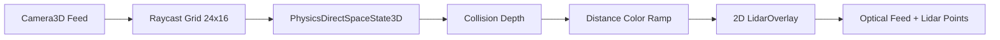

# Requirements

### Overview & Goals
Sostituire il precedente shader di post-processing Lidar in `camera_feed_window.gd` con un vero sistema di telerilevamento Lidar basato su raycast 3D. Quando la modalita' Lidar e' attiva sul feed telecamera, il sistema proietta una matrice di raggi dalla viewport nello spazio circostante, rileva le collisioni con corpi celesti o relitti e visualizza i punti di contatto disegnandoli sopra il feed ottico normale, con un gradiente termocromatico che passa dal rosso (caldo/vicino) al blu (freddo/lontano).

### Scope
- **In Scope:**
  - Rimozione dell'integrazione di `lidar.gdshader` in `camera_feed_window.gd` e dismissione dello shader.
  - Creazione di un nodo overlay 2D (`LidarOverlay`) in `camera_feed_window.tscn` per la renderizzazione grafica dei punti di impatto.
  - Generazione di un reticolo di raycast regolari tramite `FeedCamera3D.project_ray_origin()` e `project_ray_normal()`.
  - Interrogazione del motore fisico 3D (`PhysicsDirectSpaceState3D.intersect_ray()`) a frequenza fissa (25 Hz).
  - Esclusione automatica del collider della nave del giocatore (`Spaceship`) per prevenire falsi positivi sullo scafo.
  - Gradiente cromatico da rosso (distanza minima) a blu (distanza massima).
  - Mantenimento del feed ottico naturale visibile sotto i punti Lidar.
  - Aggiornamento della telemetria HUD per mostrare i contatti rilevati.
  - Suite di test automatizzati GUT per la nuova modalita' Lidar e l'isolamento multi-finestra.

- **Out of Scope:**
  - Modifiche alla modalita' Termica (`thermal.gdshader`), che rimane pienamente funzionante.
  - Modifiche al sistema di fari o zoom delle telecamere.
  - Creazione di nodi mesh 3D permanenti nel `World3D` condiviso (si adotta l'overlay 2D confermato dall'utente).

### User Stories
- **Come pilota**, voglio poter attivare la modalita' Lidar su qualsiasi feed telecamera per visualizzare una nuvola di punti in tempo reale sovrapposta al feed visivo normale, facilitando la navigazione tra asteroidi e relitti al buio.
- **Come pilota**, voglio che i punti Lidar siano codificati a colori (dal rosso se vicini al blu se lontani) per percepire istantaneamente la profondita' e il pericolo di collisione.
- **Come operatore**, voglio poter aprire contemporaneamente piu' telecamere con Lidar attivo (es. Frontale e Posteriore) senza che interferiscano tra loro ne' degradino le prestazioni fisiche.

### Functional Requirements
1. **Ciclo Filtri Ottici**:
   - `0 (Normale)`: Solo feed ottico 3D standard.
   - `1 (Termico)`: `FilterColorRect` attivo con `thermal.gdshader` (effetto FLIR).
   - `2 (Lidar)`: Feed ottico normale visibile, `FilterColorRect` nascosto, `LidarOverlay` attivo con rendering dei punti raycast.
2. **Reticolo Raycast**:
   - Griglia uniforme di raggi (es. 24 colonne x 16 righe) proiettati dalla viewport.
   - Portata massima Lidar: 200 metri.
   - Frequenza di campionamento: 25 Hz (costante e leggera sulla CPU/fisica).
   - I raggi non devono mai collidere con la nave su cui sono montate le telecamere.
3. **Mappatura Cromatica Profondita'**:
   - Distanza <= 15m: Rosso pieno (pericolo imminente).
   - Distanza intermedia (30-80m): Giallo / Verde.
   - Distanza >= 150m: Blu / Ciano freddo.
4. **Isolamento Finestre**:
   - Ogni finestra `CameraFeedWindow` calcola e visualizza solo i propri punti Lidar relativi al proprio campo visivo e orientamento.

# Technical Design

### Current Implementation
- `Applications/Cams/CameraFeed/camera_feed_window.gd` gestisce tre modalita' filtro (`_filter_mode` da 0 a 2) attraverso il pulsante `FilterCycleBtn` e il rettangolo `FilterColorRect`.
- La modalita' 2 applicava `lidar.gdshader`, uno shader 2D post-process che simulava un bordo sintetico sullo schermo.
- Tutte le telecamere condividono lo stesso `World3D` fornito da `SpaceWorldManager.get_world_3d()`.

### Key Decisions
- **Decisione 1: Rendering su Overlay 2D Canvas (Scelto e confermato dall'utente)**
  - *Razionale*: Garantisce totale indipendenza tra finestre di feed multiple (zero rischio di "vedere" punti 3D generati da un'altra camera), punti di dimensione fissa e pulita a schermo, ed evita di istanziare oggetti mesh nel `World3D` globale.
- **Decisione 2: Scansione a Frequenza Fissa (25 Hz) (Scelto e confermato dall'utente)**
  - *Razionale*: Un rate di 25 Hz offre una risposta visiva immediata e continua per il pilota, riducendo al minimo l'overhead delle query fisiche rispetto a una scansione ad ogni frame (60+ Hz).
- **Decisione 3: Esclusione Collisore Nave Madre**
  - *Razionale*: Configurare `PhysicsRayQueryParameters3D.exclude = [ship.get_rid()]` impedisce ai raggi che partono dai punti di montaggio (es. `CamTop`, `CamBottom`) di impattare accidentalmente sullo scafo dell'astronave stessa.

### Proposed Changes
1. **Scene Layout (`camera_feed_window.tscn`)**:
   - Aggiungere `LidarOverlay` (`Control`) come figlio di `ViewportContainerWrapper`, con `mouse_filter = MOUSE_FILTER_IGNORE`.
2. **Script Logic (`camera_feed_window.gd`)**:
   - Rimuovere `LIDAR_SHADER` e `_lidar_mat`.
   - Aggiungere variabili per la frequenza e stato del Lidar (`_lidar_timer`, `_lidar_points: Array[Dictionary]`, `_lidar_active: bool`).
   - Implementare `_update_lidar_scan()`:
     - Calcola la griglia di coordinate 2D sul viewport (`feed_viewport.size`).
     - Converte ogni punto 2D in raggio 3D (`project_ray_origin`, `project_ray_normal`).
     - Esegue `intersect_ray` sullo spazio fisico del viewport.
     - Calcola la distanza e determina il colore interpolato (Rosso -> Giallo -> Ciano -> Blu).
     - Richiede il ridisegno (`queue_redraw()`) di `LidarOverlay`.
   - Implementare il callback `_on_lidar_overlay_draw()` per tracciare i cerchietti dei punti Lidar.
   - Aggiornare `_apply_filter_mode()` per attivare/disattivare l'overlay e azzerare i punti quando non in modalita' Lidar.

### Architecture Diagram

### File Structure
- `Applications/Cams/CameraFeed/camera_feed_window.gd`: Modifica logica filtro, aggiunta raycast engine e overlay drawing.
- `Applications/Cams/CameraFeed/camera_feed_window.tscn`: Aggiunta nodo `LidarOverlay`.
- `Applications/Cams/CameraFeed/Shaders/lidar.gdshader`: Rimozione o deprecazione.
- `tests/gut/test_cams_system.gd`: Aggiornamento e nuovi test Lidar.

# Testing

### Validation Approach
La validazione avverra' tramite review statica dell'architettura e tramite la suite di test automatizzati GUT (`tests/gut/test_cams_system.gd`) eseguita headless con l'eseguibile di Godot.

### Key Scenarios
1. **Ciclo Completo dei Filtri**:
   - Verificare che cliccando `FilterCycleBtn` si passi da Normale (0) -> Termico (1) -> Lidar (2) -> Normale (0).
   - In Normale: `filter_rect.visible == false`, `lidar_overlay.visible == false`.
   - In Termico: `filter_rect.visible == true`, `filter_rect.material != null`, `lidar_overlay.visible == false`.
   - In Lidar: `filter_rect.visible == false`, `lidar_overlay.visible == true`.
2. **Rilevamento Raycast & Ostacoli**:
   - Avviare missione di test con asteroidi noti di fronte alla camera frontale.
   - Attivare il Lidar e verificare che vengano generati punti di collisione con coordinate e distanze valide.
3. **Gradiente Cromatico**:
   - Verificare che un punto a distanza ravvicinata (< 20m) abbia colore dominante rosso (`color.r > color.b`).
   - Verificare che un punto a distanza elevata (> 120m) abbia colore dominante blu (`color.b > color.r`).
4. **Indipendenza Multi-Finestra**:
   - Aprire contemporaneamente `front` e `rear` con Lidar attivo.
   - Verificare che le due finestre mantengano array di punti indipendenti calcolati sui rispettivi coni di visuale senza alcuna sovrapposizione.
5. **Chiusura e Pulizia Risorse**:
   - Verificare che alla chiusura della finestra del feed la scansione raycast si arresti e non permangano timer o query attive.

# Delivery Steps

### ✓ Step 1: Implement LidarOverlay and raycasting engine in CameraFeedWindow
La finestra di feed della telecamera dispone del nodo overlay 2D e della logica di raycast volumetrico.

- Rimuovere il riferimento a `LIDAR_SHADER` e `_lidar_mat` da `camera_feed_window.gd`.
- Aggiungere il nodo `LidarOverlay` (`Control`) all'interno di `camera_feed_window.tscn` come overlay trasparente posizionato sopra `SubViewportContainer`.
- Implementare in `camera_feed_window.gd` la griglia di campionamento raycast (es. 24x16 raggi) utilizzando `camera_3d.project_ray_origin()` e `camera_3d.project_ray_normal()`.
- Configurare la query `PhysicsRayQueryParameters3D` con esclusione del RID della nave giocatore (`Spaceship`) per evitare collisioni interne con lo scafo.
- Collegare la funzione di disegno `_draw` di `LidarOverlay` per eseguire il rendering dei punti rilevati.

### ✓ Step 2: Integrate Lidar filter cycling, depth gradient and telemetry
Il cambio filtro attiva la modalita' Lidar con feed ottico sottostante, gradiente termico di profondita' e telemetria.

- Aggiornare `_apply_filter_mode()`: in modalita' 2 (Lidar), mantenere `filter_rect` nascosto (feed ottico normale visibile sotto), attivare `lidar_overlay` e avviare il timer di scansione a 25 Hz.
- Implementare la funzione di mappatura colore distanza: vicino (<= 15m) -> Rosso vivo, distanza media (50-80m) -> Giallo/Verde, lontano (>= 150m) -> Blu freddo.
- Disegnare ciascun punto di contatto come marcatore circolare con gradiente di profondita' e leggera modulazione radar.
- Aggiornare la label di telemetria durante il Lidar attivo per indicare il numero di punti agganciati e la distanza del contatto piu' vicino.
- Assicurare che alla disattivazione del Lidar o alla chiusura della finestra tutti i punti vengano azzerati e il timer fermato.

### ✓ Step 3: Update and expand GUT tests for Raycast Lidar system
La suite di test GUT convalida il corretto funzionamento del nuovo Lidar e l'indipendenza multi-finestra.

- Aggiornare in `tests/gut/test_cams_system.gd` il test `test_camera_filter_cycle_normal_thermal_lidar` per riflettere la nuova modalita' Lidar senza shader su `filter_rect`.
- Aggiungere nuovi test GUT per verificare:
  - Generazione dei punti Lidar in presenza di corpi fisici nel `World3D` (es. asteroidi).
  - Esclusione corretta dello scafo della nave del giocatore.
  - Calcolo corretto del gradiente cromatico in base alla distanza (rosso vicino, blu lontano).
  - Indipendenza di finestre multiple aperte contemporaneamente in modalita' Lidar.
- Eseguire i test con Godot in modalita' headless e verificare 0 errori e 100% test superati.