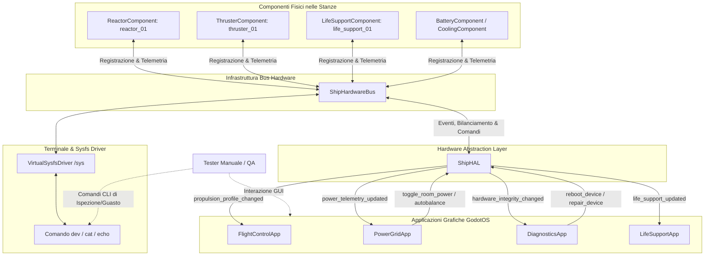

# Requirements

### Overview & Goals
Il presente documento definisce i requisiti per la creazione e l'esecuzione di una **Manual Test List** completa per l'**Hardware Abstraction Layer (HAL)** (`ShipHAL` in `Outside/ShipSystems/HAL/ship_hal.gd`) di *Dark Nova: Rogue Squadron*.

L'HAL è il ponte architetturale fondamentale tra l'hardware simulato a basso livello (`ShipHardwareBus`, `ShipPhysicalComponent` e relative specializzazioni) e i livelli a monte:
1. **Applicazioni GUI GodotOS**: `FlightControlApp`, `PowerGridApp`, `DiagnosticsApp`, `LifeSupportApp`.
2. **Sistema Operativo e Console CLI**: `VirtualSysfsDriver` (`/sys/rooms/...`, `/sys/devices/...`) e comando `dev` nel Terminale.
3. **Simulazione di Volo Newtoniana**: `Spaceship.gd` e `SpaceWorldManager.gd`.

L'obiettivo è fornire ai tester e agli sviluppatori una lista operativa step-by-step per collaudare manualmente tutte le funzionalità dell'HAL, verificando la correttezza dei contratti, la propagazione reattiva dei segnali, la robustezza in caso di guasti e l'assenza di disallineamenti tra stato fisico e rappresentazione grafica.

---

### Scope
- **In Scope:**
  - Verifica manuale dei contratti e segnali di dominio: **Inizializzazione/Binding**, **Propulsione**, **Energia & Rete**, **Griglia Termica**, **Diagnostica & Integrità**, **Supporto Vitale**.
  - Verifica della sincronizzazione bidirezionale tra **Terminale CLI (`dev`, sysfs)** e interfacce grafiche mediate dall'HAL.
  - Verifica del comportamento di fallback (graceful degradation) in assenza di bus hardware o con nave disconnessa.
  - Formato test plan standard conforme a `docs/MANUAL_TESTPLAN_QUESTIONNAIRE.md`.

- **Out of Scope:**
  - Test unitari automatizzati GUT (già presenti in `tests/gut/test_hal_applications_flow.gd`).
  - Rimodellazione delle mesh 3D esterne o delle stanze fisiche.
  - Test delle logiche di rete multiplayer (trattate nei test plan specifici di sincronizzazione RPC).

---

### User Stories
- **Come QA Tester / Pilota di Collaudo**, voglio disporre di una procedura chiara e riproducibile per verificare che ogni azione sui dispositivi di bordo o tramite riga di comando si rifletta fedelmente nelle app di volo e ingegneria.
- **Come Sviluppatore Core**, voglio una matrice di collaudo manuale che certifichi l'integrità dei contratti dell'HAL prima di ogni release o merge significativo sul branch principale.
- **Come Ingegnere di Bordo (Gameplay)**, voglio sperimentare una simulazione diegetica coerente in cui un propulsore danneggiato o una stanza spenta modifichi immediatamente la reattività della nave senza ritardi o incongruenze.

---

### Functional & Operational Requirements
1. **Rappresentazione di Dominio Esaustiva**: La test list deve coprire ciascuno dei 6 domini gestiti da `ShipHAL`:
   - *Lifecycle & Bus Binding* (`set_hardware_bus`, `_refresh_all_domains`, fallback default).
   - *Propulsione* (`get_propulsion_efficiency`, `get_total_available_thrust`, `refresh_propulsion_profile`, `apply_thrust_input`).
   - *Energia* (`get_power_telemetry`, `set_reactor_power_target`, `toggle_room_power`, `autobalance_grid`).
   - *Termica* (`get_thermal_telemetry`, propagazione `thermal_telemetry_updated`).
   - *Diagnostica* (`get_overall_system_integrity`, `get_damaged_components`, `reboot_device`, `repair_device`).
   - *Supporto Vitale* (`get_life_support_metrics`, `set_target_temperature`).
2. **Integrazione Cross-Layer OS**: Ogni test deve indicare con precisione l'interazione tra interfaccia grafica e terminale CLI (`dev list`, `dev status`, `dev set`, `dev online`, `dev reboot`).
3. **Formato Standardizzato**: Ogni test case deve riportare: ID univoco, Prerequisiti, Passi Operativi numerati, Risultato Atteso, checkbox `[ ] PASS / [ ] FAIL / [ ] BLOCKED` e campo Note/Anomalie.

# Technical Design

### Current Implementation
L'Hardware Abstraction Layer (`ShipHAL` in `res://Outside/ShipSystems/HAL/ship_hal.gd`) funge da mediatore tra:
- **Livello Fisico (`ShipHardwareBus`)**: raccoglie i nodi `ShipPhysicalComponent` (`ReactorComponent`, `ThrusterComponent`, `BatteryComponent`, `CoolingComponent`, `LifeSupportComponent`) istanziati dallo `ShipBlueprint`.
- **Livello OS / Sysfs (`VirtualSysfsDriver`)**: espone registri e attuatori nel filesystem virtuale `/sys` e al comando CLI `dev`.
- **Livello UI / Applicativo**: `FlightControlApp`, `PowerGridApp`, `DiagnosticsApp`, `LifeSupportApp`.

I segnali di dominio emessi dall'HAL sono:
- `propulsion_profile_changed(efficiency: float, max_thrust: float, available_thrust: float)`
- `power_telemetry_updated(generated_mw: float, demanded_mw: float, ratio: float, is_blackout: bool)`
- `thermal_telemetry_updated(total_heat: float, avg_temp: float)`
- `hardware_integrity_changed(device_id: String, health: float, status: String)`
- `system_alert_emitted(alert_type: String, message: String)`
- `life_support_updated(o2: float, co2: float, cabin_temp: float)`

---

### Architecture Diagram

---

### Metodologia di Collaudo Operativo
Per condurre i test manuali sull'HAL:
1. **Avvio Ambiente**: Avviare il gioco da Godot (`F5`) o aprire la scena di collaudo.
2. **Accesso GodotOS**: Accedere alla nave tramite `LobbyApp` in modalità `Solo Mode` (blueprint standard con reattore, propulsori e supporto vitale).
3. **Pannello Strumenti di Test**:
   - Aprire il **Terminale** per iniettare comandi a basso livello (`dev set`, `dev online 0`, `echo`, ecc.) o per leggere lo stato reale dei registri.
   - Aprire contemporaneamente le finestre GUI affette (`FlightControl`, `PowerGrid`, `Diagnostics`, `LifeSupport`).
4. **Ispezione Reattiva**: Verificare che l'azione applicata (es. spegnimento stanza o danno al motore) si rifletta immediatamente sia nella risposta dell'HAL che negli elementi visivi (badge, progress bar, alert) senza necessità di ricaricare le app.

# Manual Test List

### 1. Cruscotto Riassuntivo di Avanzamento
| ID Test | Ambito / Dominio | Titolo Sintetico | Esito | Note |
|---|---|---|:---:|---|
| TC-HAL-INIT-01 | Lifecycle | Binding Automatico e Inizializzazione Bus | `[ ] PASS / [ ] FAIL` | |
| TC-HAL-INIT-02 | Lifecycle | Resilienza e Valori Fallback (Bus Nullo) | `[ ] PASS / [ ] FAIL` | |
| TC-HAL-PROP-01 | Propulsione | Profilo Nominale e Spinta Disponibile | `[ ] PASS / [ ] FAIL` | |
| TC-HAL-PROP-02 | Propulsione | Degrado Dinamico del Profilo su Danno Propulsore | `[ ] PASS / [ ] FAIL` | |
| TC-HAL-PROP-03 | Propulsione | Inoltro Input di Manetta (Throttle) ai Propulsori | `[ ] PASS / [ ] FAIL` | |
| TC-HAL-PWR-01 | Energia | Telemetria Rete Elettrica e Rapporto di Carico | `[ ] PASS / [ ] FAIL` | |
| TC-HAL-PWR-02 | Energia | Variazione Target Reattore via HAL | `[ ] PASS / [ ] FAIL` | |
| TC-HAL-PWR-03 | Energia | Spegnimento/Riaccensione Selettiva Stanze | `[ ] PASS / [ ] FAIL` | |
| TC-HAL-PWR-04 | Energia | Bilanciamento Automatico della Rete (`autobalance`) | `[ ] PASS / [ ] FAIL` | |
| TC-HAL-THRM-01 | Termica | Telemetria Griglia Termica e Calore Dissipato | `[ ] PASS / [ ] FAIL` | |
| TC-HAL-THRM-02 | Termica | Propagazione Surriscaldamento ed Eventi Alert | `[ ] PASS / [ ] FAIL` | |
| TC-HAL-DIAG-01 | Diagnostica | Calcolo Integrità Globale Media dello Scafo | `[ ] PASS / [ ] FAIL` | |
| TC-HAL-DIAG-02 | Diagnostica | Rilevamento Componenti Danneggiati (`threshold`) | `[ ] PASS / [ ] FAIL` | |
| TC-HAL-DIAG-03 | Diagnostica | Reboot e Riparazione Hardware via HAL | `[ ] PASS / [ ] FAIL` | |
| TC-HAL-LS-01 | Supporto Vitale | Monitoraggio Telemetria Atmosferica Cabina | `[ ] PASS / [ ] FAIL` | |
| TC-HAL-LS-02 | Supporto Vitale | Impostazione Temperatura Target Compartimenti | `[ ] PASS / [ ] FAIL` | |
| TC-HAL-CLI-01 | OS & Sysfs | Ispezione e Modifica Registri tramite `dev` | `[ ] PASS / [ ] FAIL` | |
| TC-HAL-CLI-02 | OS & Sysfs | Modifica a Caldo tramite `/sys` Virtual File System | `[ ] PASS / [ ] FAIL` | |
| TC-HAL-EDGE-01 | Resilienza | Rimozione a Caldo Dispositivi dal Bus | `[ ] PASS / [ ] FAIL` | |
| TC-HAL-EDGE-02 | Resilienza | Ricaricamento Blueprint e Riavvip Connessione Nave | `[ ] PASS / [ ] FAIL` | |

---

### 2. Schede di Collaudo Operativo Dettagliate

#### 2.1 Dominio Inizializzazione & Binding (Lifecycle)

##### TC-HAL-INIT-01: Binding Automatico e Inizializzazione Bus
- **Prerequisiti**: Gioco avviato, nave inizializzata in `Solo Mode`.
- **Passi Operativi**:
  1. Aprire l'applicazione `Terminal`.
  2. Digitare il comando `dev list`.
  3. Verificare che l'istanza `ShipHAL` (recuperabile tramite `SpaceWorldManager.get_ship_hal()`) sia correttamente collegata a `ShipHardwareBus`.
- **Risultato Atteso**: Il bus hardware è instanziato e popolato con tutti i dispositivi del blueprint attivo. L'HAL riceve i componenti e notifica lo stato iniziale senza errori in console.
- [ ] PASS  - [ ] FAIL  - [ ] BLOCKED  
**Note / Anomalie Riscontrate**:

##### TC-HAL-INIT-02: Resilienza e Valori Fallback (Bus Nullo)
- **Prerequisiti**: Gioco avviato sul desktop prima di connettersi alla nave (o ambiente isolato senza bus attivo).
- **Passi Operativi**:
  1. Istanziare o interrogare `ShipHAL` senza associare un bus hardware (`set_hardware_bus(null)`).
  2. Aprire `FlightControlApp`, `PowerGridApp` e `DiagnosticsApp`.
  3. Verificare che le chiamate `get_propulsion_efficiency()`, `get_power_telemetry()`, `get_overall_system_integrity()` e `get_life_support_metrics()` non causino crash o eccezioni nulle.
- **Risultato Atteso**: L'HAL restituisce valori nominali di fallback di sicurezza (es. efficienza 1.0, spinta 35.0 kN, integrità 100.0%, O2 100%). Nessun crash dell'engine Godot.
- [ ] PASS  - [ ] FAIL  - [ ] BLOCKED  
**Note / Anomalie Riscontrate**:

---

#### 2.2 Dominio Propulsione (Propulsion Domain)

##### TC-HAL-PROP-01: Profilo Nominale e Spinta Disponibile
- **Prerequisiti**: Nave attiva con tutti i propulsori integri al 100%.
- **Passi Operativi**:
  1. Aprire l'applicazione `FlightControl`.
  2. Osservare il badge dei propulsori (`thrusters_badge`).
  3. Verificare i valori numerici di spinta disponibili e il testo dell'etichetta.
- **Risultato Atteso**: L'efficienza calcolata da `ShipHAL.get_propulsion_efficiency()` è 1.0 (100%). La spinta totale corrisponde alla somma dei nodi `ThrusterComponent` attivi. Il badge visualizza `"PROPULSORI PRONTI (xx kN)"` in colore verde (`#66ff99`).
- [ ] PASS  - [ ] FAIL  - [ ] BLOCKED  
**Note / Anomalie Riscontrate**:

##### TC-HAL-PROP-02: Degrado Dinamico del Profilo su Danno Propulsore
- **Prerequisiti**: Nave attiva, `FlightControlApp` aperta e visibile.
- **Passi Operativi**:
  1. Aprire il `Terminal` a fianco di `FlightControlApp`.
  2. Identificare l'ID del propulsore primario con `dev list` (es. `thruster_01`).
  3. Modificare l'efficienza o salute del propulsore (es. impostando salute a 40% o target di spinta ridotto tramite comando `dev set thruster_01 health 40`).
  4. Osservare la reazione immediata di `FlightControlApp`.
- **Risultato Atteso**: L'HAL riceve la telemetria dal bus ed emette il segnale `propulsion_profile_changed`. `FlightControlApp` aggiorna il badge in tempo reale passando a `"PROPULSORI DEGRADATI (40%)"` con colore giallo/arancio (`#ffcc33`). Se l'efficienza scende sotto il 20%, il badge diventa rosso con dicitura `"OFFLINE - NO POWER"`.
- [ ] PASS  - [ ] FAIL  - [ ] BLOCKED  
**Note / Anomalie Riscontrate**:

##### TC-HAL-PROP-03: Inoltro Input di Manetta (Throttle) ai Propulsori
- **Prerequisiti**: Nave in volo con propulsori attivi.
- **Passi Operativi**:
  1. Tramite controlli di volo o chiamata di test, invocare `ShipHAL.apply_thrust_input(0.75)`.
  2. Nel Terminale, digitare `dev status <thruster_id>`.
  3. Verificare il campo `throttle_target` e `thrust_output`.
- **Risultato Atteso**: L'HAL itera su tutti i `ThrusterComponent` registrati nella categoria `propulsion` impostando la manetta al 75%. La spinta erogata sale proporzionalmente.
- [ ] PASS  - [ ] FAIL  - [ ] BLOCKED  
**Note / Anomalie Riscontrate**:

---

#### 2.3 Dominio Energia & Rete (Power & Grid Domain)

##### TC-HAL-PWR-01: Telemetria Rete Elettrica e Rapporto di Carico
- **Prerequisiti**: Nave attiva con reattore e utenze online.
- **Passi Operativi**:
  1. Aprire l'applicazione `PowerGrid`.
  2. Nel Terminale, eseguire `dev status <reactor_id>`.
  3. Confrontare i valori di generazione e carico mostrati in `PowerGridApp` con la telemetria restituita da `ShipHAL.get_power_telemetry()`.
- **Risultato Atteso**: I valori di `generated_mw`, `demanded_mw` e `power_ratio` coincidono esattamente. Il segnale `power_telemetry_updated` si aggiorna con frequenza regolare.
- [ ] PASS  - [ ] FAIL  - [ ] BLOCKED  
**Note / Anomalie Riscontrate**:

##### TC-HAL-PWR-02: Variazione Target Reattore via HAL
- **Prerequisiti**: Reattore online con target nominale 1.0 (100%).
- **Passi Operativi**:
  1. Da interfaccia di debug o via Terminale, invocare `ShipHAL.set_reactor_power_target(0.60)`.
  2. Digitare nel Terminale: `dev get <reactor_id> power_target`.
  3. Verificare la variazione di erogazione MW in `PowerGridApp`.
- **Risultato Atteso**: Il registro `power_target` del reattore viene aggiornato a `0.6`. La potenza generata erogata si adegua gradualmente al 60% della potenza nominale. `ShipHAL.set_reactor_power_target` ritorna `true`.
- [ ] PASS  - [ ] FAIL  - [ ] BLOCKED  
**Note / Anomalie Riscontrate**:

##### TC-HAL-PWR-03: Spegnimento/Riaccensione Selettiva Stanze
- **Prerequisiti**: `PowerGridApp` aperta, stanza motori o sala sensori attiva.
- **Passi Operativi**:
  1. In `PowerGridApp`, cliccare sul toggle di alimentazione per la stanza `engines` (o invocare `ShipHAL.toggle_room_power("engines", false)`).
  2. Nel Terminale digitare: `dev list`.
  3. Verificare lo stato `is_online` di tutti i componenti presenti in quella stanza.
  4. Riattivare l'alimentazione con `ShipHAL.toggle_room_power("engines", true)`.
- **Risultato Atteso**: Tutti i componenti della stanza passano a stato `OFFLINE` e il loro assorbimento MW si azzera, riducendo il carico totale sul bus. Alla riaccensione, tornano in stato `ONLINE` ripristinando il carico nominale.
- [ ] PASS  - [ ] FAIL  - [ ] BLOCKED  
**Note / Anomalie Riscontrate**:

##### TC-HAL-PWR-04: Bilanciamento Automatico della Rete (`autobalance`)
- **Prerequisiti**: Utenze ad alto carico attivate (armi, scudi, propulsione), rete in deficit energetico o squilibrata.
- **Passi Operativi**:
  1. In `PowerGridApp`, premere il pulsante `Autobilanciamento Rete` (che invoca `ShipHAL.autobalance_grid()`).
  2. Nel Terminale, controllare il valore `power_target` del reattore (`dev get <reactor_id> power_target`).
- **Risultato Atteso**: L'HAL calcola il target ottimale con un margine di riserva del 15% rispetto alla domanda totale (`(demand * 1.15) / power_output_nominal`, vincolato tra 0.2 e 1.5) e riscrive il registro del reattore, riallineando la rete a un ratio stabile >= 1.0.
- [ ] PASS  - [ ] FAIL  - [ ] BLOCKED  
**Note / Anomalie Riscontrate**:

---

#### 2.4 Dominio Termica & Raffreddamento (Thermal Domain)

##### TC-HAL-THRM-01: Telemetria Griglia Termica e Calore Dissipato
- **Prerequisiti**: Nave attiva con reattore funzionante a pieno carico.
- **Passi Operativi**:
  1. Interrogare la telemetria termica tramite `ShipHAL.get_thermal_telemetry()`.
  2. Nel Terminale, verificare la temperatura dei dispositivi con `dev list`.
- **Risultato Atteso**: Il dizionario restituito contiene `total_heat` e `avg_temp`. Il valore di temperatura media calcolato dall'HAL riflette la media ponderata del calore dei componenti collegati al bus.
- [ ] PASS  - [ ] FAIL  - [ ] BLOCKED  
**Note / Anomalie Riscontrate**:

##### TC-HAL-THRM-02: Propagazione Surriscaldamento ed Eventi Alert
- **Prerequisiti**: Terminale aperto, visualizzazione notifiche attiva.
- **Passi Operativi**:
  1. Sovraccaricare un dispositivo (es. forzare la temperatura del reattore oltre la soglia massima con `dev set <reactor_id> temp 130`).
  2. Verificare l'emissione del segnale `thermal_telemetry_updated` da parte di `ShipHAL`.
- **Risultato Atteso**: L'HAL emette la telemetria aggiornata e intercetta lo stato di allarme emettendo `system_alert_emitted("OVERHEAT", ...)`. Le applicazioni che monitorano l'integrità notificano visivamente la condizione termica critica.
- [ ] PASS  - [ ] FAIL  - [ ] BLOCKED  
**Note / Anomalie Riscontrate**:

---

#### 2.5 Dominio Diagnostica & Integrità (Diagnostics Domain)

##### TC-HAL-DIAG-01: Calcolo Integrità Globale Media dello Scafo
- **Prerequisiti**: Tutti i componenti al 100% di integrità.
- **Passi Operativi**:
  1. Aprire l'applicazione `Diagnostics`.
  2. Verificare l'indice di integrità globale mostrato (`system_integrity_score`).
  3. Nel Terminale, ridurre la salute di un singolo componente al 50% (es. `dev set <dev_id> health 50`).
  4. Osservare l'indice risultante.
- **Risultato Atteso**: Con tutti i dispositivi sani, `ShipHAL.get_overall_system_integrity()` restituisce 100.0%. Danneggiando un componente, l'integrità globale cala istantaneamente in maniera proporzionale al numero complessivo di componenti registrati. Il segnale `hardware_integrity_changed` aggiorna la UI di `DiagnosticsApp`.
- [ ] PASS  - [ ] FAIL  - [ ] BLOCKED  
**Note / Anomalie Riscontrate**:

##### TC-HAL-DIAG-02: Rilevamento Componenti Danneggiati (`threshold`)
- **Prerequisiti**: Almeno un componente integro e almeno uno con salute degradata (< 80%).
- **Passi Operativi**:
  1. Invocare `ShipHAL.get_damaged_components(85.0)` o aprire la scheda guasti in `DiagnosticsApp`.
- **Risultato Atteso**: L'HAL restituisce un array contenente esclusivamente la telemetria dei componenti con `health_percent < 85.0` o con `status_string == "FAULT"`. I componenti sani non compaiono nell'elenco.
- [ ] PASS  - [ ] FAIL  - [ ] BLOCKED  
**Note / Anomalie Riscontrate**:

##### TC-HAL-DIAG-03: Reboot e Riparazione Hardware via HAL
- **Prerequisiti**: Un componente con stato di guasto o salute ridotta al 40%.
- **Passi Operativi**:
  1. Invocare `ShipHAL.repair_device("<device_id>", 60.0)` (oppure cliccare sul pulsante di riparazione in `DiagnosticsApp`).
  2. Nel Terminale, digitare `dev status <device_id>`.
  3. Invocare `ShipHAL.reboot_device("<device_id>")`.
- **Risultato Atteso**: La riparazione ripristina la salute al 100% e reimposta lo stato a `ONLINE`. Il comando reboot invia il comando di riavvio al bus hardware, reimpostando temporaneamente lo stato su `REBOOTING` e tornando `ONLINE` con registri riallineati.
- [ ] PASS  - [ ] FAIL  - [ ] BLOCKED  
**Note / Anomalie Riscontrate**:

---

#### 2.6 Dominio Supporto Vitale (Life Support Domain)

##### TC-HAL-LS-01: Monitoraggio Telemetria Atmosferica Cabina
- **Prerequisiti**: Nave attiva con componente `LifeSupportComponent` registrato sul bus.
- **Passi Operativi**:
  1. Aprire l'applicazione `LifeSupport`.
  2. Interrogare la telemetria via `ShipHAL.get_life_support_metrics()`.
  3. Verificare i valori di O2, CO2 e temperatura cabina.
- **Risultato Atteso**: I valori restituiti dall'HAL corrispondono ai registri fisici del dispositivo `life_support` (`o2 >= 95.0%`, `co2 <= 0.05%`, `temp ~21.0 C`).
- [ ] PASS  - [ ] FAIL  - [ ] BLOCKED  
**Note / Anomalie Riscontrate**:

##### TC-HAL-LS-02: Impostazione Temperatura Target Compartimenti
- **Prerequisiti**: `LifeSupportComponent` presente e responsivo sul bus.
- **Passi Operativi**:
  1. Invocare `ShipHAL.set_target_temperature(24.5)`.
  2. Nel Terminale, controllare il registro del dispositivo con: `dev get <life_support_id> target_temp`.
- **Risultato Atteso**: L'HAL localizza tutti i dispositivi con categoria `life_support` e scrive il valore `24.5` sul registro `target_temp`. Il segnale `life_support_updated` riflette la nuova impostazione.
- [ ] PASS  - [ ] FAIL  - [ ] BLOCKED  
**Note / Anomalie Riscontrate**:

---

#### 2.7 Dominio OS & Terminal Sysfs (CLI Integration)

##### TC-HAL-CLI-01: Ispezione e Modifica Registri tramite `dev`
- **Prerequisiti**: Terminale di bordo aperto in finestra attiva su GodotOS.
- **Passi Operativi**:
  1. Digitare `dev list` e prendere nota di un ID dispositivo (es. `reactor_01`).
  2. Digitare `dev status reactor_01` e verificare la scheda diagnostica stampata a schermo.
  3. Digitare `dev set reactor_01 power_target 0.8`.
  4. Digitare `dev get reactor_01 power_target`.
- **Risultato Atteso**: La modifica del registro tramite CLI genera un evento `register_changed` sul bus, intercettato dall'HAL, che aggiorna all'istante la telemetria di `PowerGridApp` senza riavviare l'applicazione.
- [ ] PASS  - [ ] FAIL  - [ ] BLOCKED  
**Note / Anomalie Riscontrate**:

##### TC-HAL-CLI-02: Modifica a Caldo tramite `/sys` Virtual File System
- **Prerequisiti**: Terminale di bordo aperto.
- **Passi Operativi**:
  1. Digitare `ls /sys/rooms/`.
  2. Digitare `cat /sys/rooms/engine_room/reactor_01/status`.
  3. Digitare `echo 0 > /sys/rooms/engine_room/reactor_01/is_online`.
  4. Verificare in `PowerGridApp` e `DiagnosticsApp` lo stato del reattore.
- **Risultato Atteso**: Il file virtuale `/sys` mappa il comando `echo` su `VirtualSysfsDriver.write_file()`. Il reattore passa a `OFFLINE`, l'HAL propaga `hardware_integrity_changed` e la potenza generata cala a zero.
- [ ] PASS  - [ ] FAIL  - [ ] BLOCKED  
**Note / Anomalie Riscontrate**:

---

#### 2.8 Resilienza, Hot-Unplug & Edge Cases

##### TC-HAL-EDGE-01: Rimozione a Caldo Dispositivi dal Bus
- **Prerequisiti**: Nave attiva con propulsori e reattori registrati.
- **Passi Operativi**:
  1. Rimuovere un componente dal bus (`bus.unregister_component("thruster_01")`).
  2. Invocare `ShipHAL.refresh_propulsion_profile()`.
  3. Osservare `FlightControlApp`.
- **Risultato Atteso**: L'HAL gestisce l'assenza del componente senza lanciare errori di puntatore nullo o array out of bounds, ricalcolando la spinta totale disponibile sulla base dei propulsori rimanenti.
- [ ] PASS  - [ ] FAIL  - [ ] BLOCKED  
**Note / Anomalie Riscontrate**:

##### TC-HAL-EDGE-02: Ricaricamento Blueprint e Riavvio Connessione Nave
- **Prerequisiti**: Sessione in corso.
- **Passi Operativi**:
  1. Cambiare blueprint della nave tramite `LobbyApp` o riconfigurare la sessione (`SpaceWorldManager.set_ship_blueprint(new_bp)`).
  2. Verificare che `ShipHAL.set_hardware_bus()` riagganci i segnali del nuovo bus senza perdite di memoria (memory leak) né segnali duplicati.
- **Risultato Atteso**: I segnali del precedente bus vengono disconnessi, il nuovo bus viene collegato, `_refresh_all_domains()` viene invocato e tutte le applicazioni riflettono la nuova configurazione hardware.
- [ ] PASS  - [ ] FAIL  - [ ] BLOCKED  
**Note / Anomalie Riscontrate**:

# Delivery Steps

### ✓ Step 1: Stesura e formalizzazione del documento di collaudo manuale HAL
Il documento di specifica dei test manuali per l'HAL è formalizzato all'interno della documentazione di progetto, pronto per essere utilizzato dai tester.

- Creare il file documentale `docs/MANUAL_TESTPLAN_HAL.md` (o integrare la sezione dedicata in `docs/MANUAL_TESTPLAN_QUESTIONNAIRE.md`) seguendo il layout standard del progetto.
- Definire il cruscotto di riepilogo con matrice ID test, dominio hardware, stato di avanzamento e spazio per note/anomalie.
- Formalizzare le istruzioni operative di configurazione dell'ambiente di collaudo (avvio GodotOS, apertura contemporanea delle app GUI e del Terminale con comandi `dev`).

### ✓ Step 2: Validazione manuale dei flussi di Inizializzazione, Propulsione e Diagnostica
I flussi di inizializzazione bus, calcolo profilo propulsivo e monitoraggio/ripristino integrità hardware sono collaudati e conformi.

- Eseguire i test case `TC-HAL-INIT-01` e `TC-HAL-INIT-02` per validare l'aggancio di `ShipHAL` al `ShipHardwareBus` e la resilienza in assenza di bus.
- Eseguire i test case `TC-HAL-PROP-01`, `TC-HAL-PROP-02` e `TC-HAL-PROP-03` danneggiando e ripristinando propulsori e verificando il badge di stato in `FlightControlApp`.
- Eseguire i test case `TC-HAL-DIAG-01`, `TC-HAL-DIAG-02` e `TC-HAL-DIAG-03` inducendo guasti nei componenti e verificando le risposte di reboot e repair in `DiagnosticsApp`.
- Tracciare eventuali anomalie e spuntare gli esiti `PASS`/`FAIL` nel documento di test.

### ✓ Step 3: Validazione manuale dei domini Rete Elettrica, Griglia Termica e Supporto Vitale
I flussi di erogazione e bilanciamento potenza, dissipazione termica e metriche di supporto vitale rispondono coerentemente tra HAL e GUI.

- Eseguire i test case `TC-HAL-PWR-01`, `TC-HAL-PWR-02`, `TC-HAL-PWR-03` e `TC-HAL-PWR-04` per isolamento stanze (`toggle_room_power`), variazione target reattore e autobalance della rete.
- Eseguire i test case `TC-HAL-THRM-01` e `TC-HAL-THRM-02` monitorando la propagazione di calore e temperatura media a seguito di sovraccarichi.
- Eseguire i test case `TC-HAL-LS-01` e `TC-HAL-LS-02` verificando la lettura delle metriche atmosferiche O2/CO2 e la modifica del registro `target_temp` su `LifeSupportComponent`.
- Documentare i riscontri operativi e i tempi di reazione dell'interfaccia.

### ✓ Step 4: Verifica integrazione reattiva Terminale Sysfs e scenari limite di resilienza
L'interazione a basso livello tramite Terminale CLI (`/sys` e `dev`) e la stabilità in scenari di stress/edge case sono pienamente verificate.

- Eseguire i test case `TC-HAL-CLI-01`, `TC-HAL-CLI-02` e `TC-HAL-CLI-03` effettuando letture e scritture a caldo di registri con comandi `dev set` / `echo` e osservando l'aggiornamento istantaneo delle app senza polling.
- Eseguire i test case di resilienza `TC-HAL-EDGE-01`, `TC-HAL-EDGE-02` e `TC-HAL-EDGE-03` simulando disconnessioni della nave, blueprint vuoti e de-registrazioni rapide di periferiche.
- Compilare il report finale di collaudo con riepilogo anomalie e raccomandazioni per il team di sviluppo.