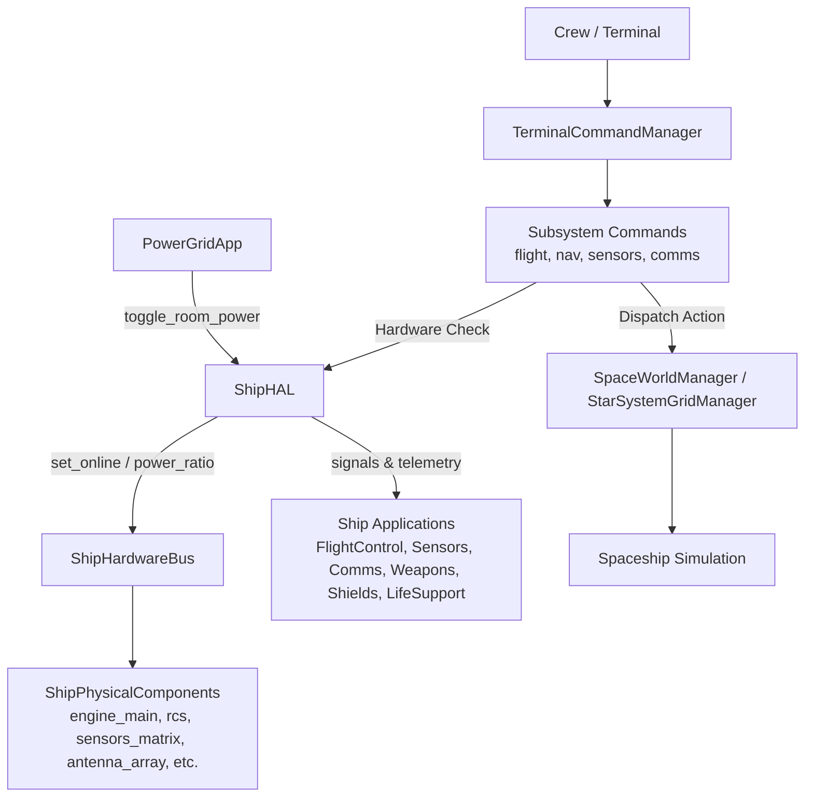

# Requirements

### Overview & Goals
L'obiettivo è rendere pienamente operativi tutti i 20 dispositivi navali documentati in `docs/POWER_GRID_DEVICES.md`, collegando la gestione energetica della **Power Grid** con i comportamenti fisici e applicativi di bordo e rendendo la nave controllabile anche da riga di comando (**CLI Terminale**) attraverso sottocomandi strutturati per sottosistema (`flight`, `nav`, `sensors`, `comms`).

Quando un compartimento o un dispositivo viene spento o perde alimentazione:
- Le relative applicazioni di bordo (`FlightControl`, `Sensors`, `Comms`, `Weapons`, `ShieldMatrix`, `LifeSupport`, `CargoBay`, `HackExploits`) subiscono un degrado diegetico immediato (comandi bloccati, radar cieco, radio muta, scudi in dissipazione, asfissia/ipotermia).
- I comandi terminale collegati al dispositivo verificano preventivamente la disponibilità di energia e rifiutano l'esecuzione segnalando l'errore hardware specifico.

### Scope
#### In Scope
- **Controllo Energetico a Stanze**: Collegamento tra gli interruttori breaker di `PowerGridApp` e lo stato `is_online`/`power_supplied` dei componenti registrati in `ShipHardwareBus` e monitorati da `ShipHAL`.
- **Degrado Diegetico Applicazioni**:
  - `FlightControl`: blocco WASD, disattivazione Cruise Drive, perdita rotazione/inerzia RCS, disconnessione consolle timone (`COMMAND CONSOLE UNPOWERED`).
  - `Sensors`: cecità radar, annullamento ping attivo a 120 MW, perdita feed sonde.
  - `Comms`: spettrogramma muto, blocco richieste docking, blocco link EW per `HackExploitsApp` (Target Drive non montabile).
  - `Weapons` & `ShieldMatrix`: condensatori laser scarichi, torretta bloccata, mancato consenso lancio missili, collasso scudi con scarica rapida (-25 HP/s), spegnimento torrette PDG e Flak.
  - `LifeSupport`: incremento tossico CO2, calo O2, caduta temperatura ambiente verso il gelo, arresto pompe serra idroponica.
  - `CargoBay`: portelloni stiva bloccati, blocco fusione ghiaccio minerario.
  - `Engineering & Drones`: assenza di ricarica per il Service Drone e il Duct Drone alle culle di ricarica.
- **Nuovi Comandi Terminale CLI**:
  - `flight`: `cruise_mode start/stop`, `toggle_inertia on/off`, `set_speed <x>`, `forward <x>`, `backward <x>`, `rotate <x> <y> <z>`, `rotate_to <x> <y> <z>`, `slide <x> <y>`.
  - `nav`: `position`, `calculate <x> <y>`.
  - `sensors`: `swipe on/off` (o `sweep`), `get_targets`, `get_probe_targets <probe_id>`.
  - `comms`: `rotate <deg>`, `scan on/off`, `get_frequency`, `lock_frequency <freq>`, `listen_frequency <freq>` (modalità streaming interattiva con uscita via tasto `q`).

#### Out of Scope
- Rimodellazione dei modelli 3D o delle texture esterne dei componenti mesh.
- Creazione di tracce audio binarie aggiuntive (si riutilizzano il bus sintetizzatore e i segnali esistenti).

### User Stories
- **Come Ingegnere di bordo**, voglio che la gestione degli interruttori in `PowerGridApp` e i deficit energetici abbiano conseguenze reali ed evidenti sul funzionamento di tutti i dispositivi della nave, così da dover bilanciare strategicamente l'energia durante l'esplorazione e il combattimento.
- **Come Pilota / Operatore tattico**, voglio ricevere un feedback chiaro e coerente sull'interfaccia quando il timone, i motori o i sensori perdono alimentazione, così da poter coordinare le contromisure d'emergenza con l'equipaggio.
- **Come Operatore di Terminale**, voglio poter controllare il volo, il calcolo delle rotte, la scansione radar e le comunicazioni radio direttamente da riga di comando tramite sottocomandi puliti, verificando che rispondano solo se i relativi dispositivi fisici sono alimentati.

### Functional Requirements
- **FR-1 (Cascata Stanza-Dispositivi)**: L'attivazione/disattivazione di una stanza in `PowerGridApp` imposta lo stato `is_online` di tutti i `ShipPhysicalComponent` appartenenti a quel `room_id`.
- **FR-2 (Blocco Propulsivo e Timone)**: Se `engine_main` è offline, la spinta longitudinale è nulla e il Cruise Drive si interrompe; se `rcs_pitch_l` o `rcs_pitch_r` sono offline, la nave perde il controllo angolare e di slide; se `helm_control` è offline, gli input utente vengono rifiutati con overlay di avviso.
- **FR-3 (Cecità Radar ed EW)**: Se `sensors_matrix` è offline, lo schermo radar si disattiva e le armi perdono la capacità di aggancio; se `antenna_array` è offline, la radio non riceve e il Target Drive non può connettersi ad alcun bersaglio.
- **FR-4 (Collasso Difensivo e Supporto Vitale)**: Con i bilanciatori scudi disattivati, l'energia degli scudi decade a -25 HP/s; con scrubber e caldaia spenti, i pod equipaggio registrano tosse, asfissia e ipotermia.
- **FR-5 (Suite CLI Navale)**: Implementazione delle classi comando `flight`, `nav`, `sensors`, `comms` all'interno di `Applications/Terminal/commands/`, registrate automaticamente da `TerminalCommandManager`.
- **FR-6 (Comando Radio Interattivo)**: Il comando `comms listen_frequency <freq>` attiva la modalità interattiva nel terminale, stampando messaggi periodici ricevuti sulla frequenza fino alla pressione del tasto `q` o comando `exit`.

### Non-Functional Requirements
- **NFR-1 (Reattività Disaccoppiata)**: Le verifiche dello stato energetico non devono causare blocchi di frame nel main loop di Godot; la comunicazione avviene tramite `ShipHAL` e segnali di dominio.
- **NFR-2 (Informatività CLI)**: Ogni comando da terminale respinto per assenza di energia deve stampare il nome del dispositivo mancante e la stanza di appartenenza (es. `[ERRORE HARDWARE] Dispositivo 'engine_main' (sala_motori) non alimentato`).

# Technical Design

### Current Implementation
- `PowerGridApp` gestisce la lista stanze (`rooms_data`) derivata dal `ShipBlueprint`. Quando una stanza viene accesa o spenta, emette `SpaceWorldManager.ship_system_power_changed(category, is_powered)`.
- `ShipHardwareBus` registra i singoli `ShipPhysicalComponent` (`ReactorComponent`, `ThrusterComponent`, `BatteryComponent`, `LifeSupportComponent`, `CoolingComponent`) e simula registri, calore e assorbimento.
- `ShipHAL` funge da intermediario tra il bus e le applicazioni GUI. Dispone già di `toggle_room_power(room_id, online)`, ma molte applicazioni si basano solo su flag locali o controlli generici invece di verificare i dispositivi fisici effettivi.
- Il terminale CLI carica dinamicamente tutti i comandi presenti in `Applications/Terminal/commands/` che estendono `TerminalCommand`. Supporta comandi interattivi tramite `terminal.active_interactive_command` (come visto in `worm_command.gd`).

### Key Decisions
- **Decisione 1: Struttura a Sottocomandi per i Comandi Terminale (`Subcommands by Subsystem`)**:
  - Come concordato, i nuovi comandi saranno raggruppati sotto il rispettivo dominio: `flight` (motori/timone/inerzia), `nav` (rotte e coordinate), `sensors` (radar e sonde) e `comms` (antenna, frequenze e ascolto radio).
  - Questo previene qualsiasi collisione di nomi tra la rotazione nave (`flight rotate x y z`) e l'azimuth dell'antenna (`comms rotate deg`). Verranno comunque predisposti comandi diretti con reindirizzamento trasparente ove univoci.
- **Decisione 2: Controllo a Stanze con Propagazione Hardware Integrale (`Exclusive Room Breakers`)**:
  - Il breaker di `PowerGridApp` controlla la stanza intera: spegnendo una stanza, tutti i dispositivi e componenti fisici in essa contenuti passano a `is_online = false`.
  - `ShipHAL` fornirà un metodo centrale per interrogare sia lo stato del dispositivo specifico (`hal.is_device_online(device_id)`), sia lo stato della categoria aggregata.
- **Decisione 3: Pre-Flight Check Hardware nei Comandi CLI**:
  - Prima di eseguire un comando operativo (es. accelerare, scansionare bersagli, calcolare rotta), la classe del comando verifica via `ShipHAL` che il rispettivo componente sia online e alimentato. In caso contrario, restituisce un errore hardware contestuale.
- **Decisione 4: Architettura Radio Streaming Interattiva**:
  - `comms listen_frequency <freq>` imposta `terminal.active_interactive_command = self`. Un timer di processo genera pacchetti radio a intervalli diegetici simulando comunicazioni di settore. L'utente esce digitando `q` o `exit`.

### Architecture Diagram

### Components & File Structure
#### File Modificati:
- `Outside/ShipSystems/HAL/ship_hal.gd`: Aggiunta di metodi di query hardware (`is_device_online`, `is_device_powered`, `get_device_status`) e propagazione eventi.
- `Applications/PowerGrid/power_grid_app.gd`: Inoltro sistematico dell'accensione/spegnimento stanza a `ShipHAL.toggle_room_power(room_id, is_on)`.
- `Applications/FlightControl/flight_control_app.gd`: Verifica hardware su `engine_main`, `rcs_pitch_l`/`rcs_pitch_r` e `helm_control`; gestione blocco comandi WASD/QE e disingaggio Cruise.
- `Applications/Sensors/sensors_app.gd`: Oscuramento radar, blocco ping e azzeramento bersagli se `sensors_matrix` è offline.
- `Applications/Comms/comms_app.gd`: Azzeramento waterfall, blocco docking e sgancio link EW se `antenna_array` è offline.
- `Applications/Weapons/weapons_app.gd`: Blocco torretta, condensatori laser e tubi lancio se `armory_defense` è offline.
- `Applications/ShieldMatrix/shield_matrix_app.gd`: Dissipazione passiva -25 HP/s e blocco PDG/Flak se i bilanciatori scudi sono offline.

#### Nuovi File Creati:
- `Applications/Terminal/commands/flight_command.gd`: Gestore CLI per manovra, spinta, inerzia, limitatore velocità e cruise.
- `Applications/Terminal/commands/nav_command.gd`: Gestore CLI per rilevamento posizione e calcolo coordinate/rotte.
- `Applications/Terminal/commands/sensors_command.gd`: Gestore CLI per sweep, lista contatti scanner e telemetria sonde.
- `Applications/Terminal/commands/comms_command.gd`: Gestore CLI per scansione frequenze, azimut antenna, frequency lock e ascolto radio interattivo.
- `tests/test_power_grid_devices_effects.gd`: Suite di test automatizzati GUT per validare la matrice dispositivi-funzionalità e i comandi CLI.

# Testing

### Validation Approach
La verifica della soluzione avverrà attraverso una combinazione di test automatizzati scritti con il framework GUT (Godot Unit Test) in modalità headless e controlli mirati sui singoli componenti e comandi CLI.

### Key Scenarios
- **Scenario 1 (Stanza Spenta -> Dispositivi Offline)**:
  - Azione: Disattivare la stanza `sala_motori` o `engine_room` tramite `PowerGridApp`.
  - Esito Atteso: `engine_main` passa a `is_online = false`. `FlightControlApp` mostra il badge `OFFLINE - NO POWER` e non applica spinta. Il comando CLI `flight forward 10` restituisce errore hardware.
- **Scenario 2 (RCS Disattivato -> Perdita Manovra 3D)**:
  - Azione: Disattivare la stanza `rcs_left` o `rcs_right`.
  - Esito Atteso: Rotazione o traslazione laterale limitata/asimmetrica. Il comando `flight rotate 10 0 0` fallisce o segnala la mancata disponibilità degli attuatori RCS.
- **Scenario 3 (Matrice Sensori Spenta -> Cecità Radar e Rifiuto CLI)**:
  - Azione: Disattivare la stanza `matrice_sensori`.
  - Esito Atteso: Lo schermo in `SensorsApp` passa a `OFFLINE (RETE ELETTRICA)`, la lista bersagli si svuota. Il comando CLI `sensors get_targets` notifica che la matrice sensori è spenta.
- **Scenario 4 (Antenna Spenta -> Muto Radio e Blocco HackExploits)**:
  - Azione: Disattivare la stanza `comunicazioni`.
  - Esito Atteso: `CommsApp` visualizza segnale perso. Il tentativo di docking con stazioni viene respinto. Il comando CLI `comms get_frequency` o `comms listen_frequency 1420` fallisce con errore dispositivo offline.
- **Scenario 5 (Esecuzione Comandi CLI a Nave Alimentata)**:
  - Azione: Con tutti i dispositivi accesi, eseguire:
    - `flight set_speed 1.5` -> velocità limite aggiornata a 1.5x.
    - `nav position` -> stampa il settore e le coordinate correnti da `StarSystemGridManager`.
    - `sensors get_targets` -> stampa la tabella con i contatti rilevati nel raggio radar.
    - `comms listen_frequency 1420.0` -> entra in modalità streaming radio interattiva; premendo `q` ritorna al prompt del terminale.

### Edge Cases
- **Brownout da Carico Eccessivo**: Se la richiesta totale supera l'erogazione del reattore in assenza di batterie cariche, la disattivazione automatica dei carichi non essenziali spegne prioritariamente armi e scudi prima del supporto vitale.
- **Input CLI Non Validi o Parametri Errati**: Verifica della robustezza del parsing di `flight rotate`, `flight set_speed` e `nav calculate` con argomenti non numerici, prevenendo crash o eccezioni runtime.
- **Interruzione Brusca Ascolto Radio**: Chiusura del terminale o digitazione di comandi errati durante una sessione di `comms listen_frequency` senza perdita di focus o blocco del gestore comandi.

### Test Changes
- Aggiunta di `tests/test_power_grid_devices_effects.gd` contenente test unitari e di integrazione per:
  - Propagazione on/off tra stanza e dispositivi in `ShipHardwareBus`.
  - Rifiuto dei comandi CLI `flight`, `nav`, `sensors`, `comms` in condizioni di blackout.
  - Verifica del funzionamento interattivo di `listen_frequency`.

# Delivery Steps

### ✓ Step 1: Core Power Grid & Room-Device Cascade Integration
Lo stato degli interruttori di stanza in `PowerGridApp` si propaga fedelmente all'Hardware Bus e a tutti i dispositivi registrati.

- Estendere `Outside/ShipSystems/HAL/ship_hal.gd` con metodi di utilità per interrogare lo stato energetico e operativo di qualsiasi dispositivo per ID (`is_device_powered(device_id)`, `is_device_online(device_id)`).
- Sincronizzare `PowerGridApp.gd` con `ShipHAL.toggle_room_power(room_id, is_on)` durante la pressione degli interruttori e durante il brownout/blackout automatico della nave.
- Assicurare che in `ShipHardwareBus` tutti i componenti fisici (`ShipPhysicalComponent` e relative sottoclassi) riflettano correttamente `is_online`, `power_supplied` e lo stato dei registri `/sys` quando la stanza padre viene disattivata.
- Verificare che il reattore tokamak (`core_reactor`) e il radiatore criogenico (`cooling_01`) generino gli allarmi di scram termico a 250°C e l'intervento delle batterie tampone (`battery_01`).

### ✓ Step 2: Application Degradation & Diegetic Power Lockouts
Tutte le applicazioni diegetiche della nave rispondono in tempo reale alla perdita di alimentazione dei rispettivi dispositivi di bordo.

- Aggiornare `flight_control_app.gd` per disattivare la risposta a WASD e comandi di traslazione se `engine_main` è offline, disconnettere i comandi pilota se `helm_control` è disattivato, bloccare le rotazioni e la stabilizzazione inerziale se `rcs_pitch_l`/`rcs_pitch_r` sono disattivati, e sganciare istantaneamente il Cruise Drive.
- Aggiornare `sensors_app.gd` per oscurare il radar (`STATO RADAR: OFFLINE`), inibire il ping attivo da 120 MW e azzerare la lista contatti e i feed telemetrici della sonda quando `sensors_matrix` è offline.
- Aggiornare `comms_app.gd` per azzerare lo spettrogramma/waterfall, rifiutare le richieste di attracco a stazioni e inibire la connessione EW Target Drive per `HackExploitsApp` quando `antenna_array` è priva di energia.
- Aggiornare `weapons_app.gd` e `shield_matrix_app.gd` per arrestare la carica dei laser, bloccare i servomotori della torretta, scaricare passivamente gli scudi a -25 HP/s e disattivare le difese automatiche PDG e Flak quando `armory_defense` o i bilanciatori scudi sono disattivati.
- Aggiornare `life_support_app.gd` e `cargo_bay_app.gd` per gestire il degrado di O2/CO2 con `scrubber` offline, il congelamento cabina/merci con `heater` offline e il blocco apertura portelloni stiva con `cargo_handling` offline.

### ✓ Step 3: Subsystem CLI Terminal Commands Implementation
I nuovi comandi CLI per il controllo navale sono operativi nel Terminale e verificano lo stato dei dispositivi hardware.

- Creare `flight_command.gd` con sottocomandi (`cruise_mode start/stop`, `toggle_inertia on/off`, `set_speed <x>`, `forward <x>`, `backward <x>`, `rotate <x> <y> <z>`, `rotate_to <x> <y> <z>`, `slide <x> <y>`), con verifica dello stato di `engine_main` e dei propulsori RCS.
- Creare `nav_command.gd` con sottocomandi (`position`, `calculate <x> <y>`), interfacciandosi con `StarSystemGridManager` e verificando lo stato di `nav_computer`.
- Creare `sensors_command.gd` con sottocomandi (`swipe on/off` o `sweep on/off`, `get_targets`, `get_probe_targets <id>`), verificando lo stato di `sensors_matrix` e formattando i bersagli rilevati in tabella CLI.
- Creare `comms_command.gd` con sottocomandi (`rotate <x>`, `scan on/off`, `get_frequency`, `lock_frequency <freq>`), verificando lo stato di `antenna_array` e interagendo con `CommsApp` e `DockingManager`.

### ✓ Step 4: Interactive Radio Listener & End-to-End GUT Verification
Il comando radio interattivo è funzionante e l'intera catena di disattivazione è validata tramite test automatizzati.

- Implementare in `comms_command.gd` il sottocomando interattivo `listen_frequency <frequency>`, catturando l'input tramite `terminal.active_interactive_command` e stampando flussi radio asincroni fino alla pressione del tasto `q` o al comando `exit`.
- Scrivere script di test GUT in `tests/test_power_grid_devices_effects.gd` per verificare la propagazione degli stati on/off tra stanza e dispositivi, la disattivazione dei comandi terminale quando i device sono spenti e la reazione diegetica delle applicazioni.
- Eseguire la suite di test GUT con Godot in modalità headless per certificare la stabilità e l'assenza di regressioni.