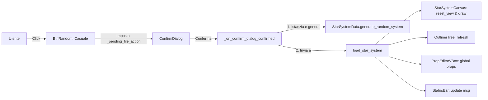

# Requirements

### Overview & Goals
L'obiettivo è consentire agli sviluppatori e designer di generare istantaneamente sistemi stellari completi e procedurali direttamente dall'interfaccia di `addons/star_system_editor`. Attualmente l'editor consente solo di creare sistemi vuoti ("Nuovo"), caricare file salvati ("Apri...") o inserire corpi celesti manualmente uno ad uno. L'aggiunta di un pulsante "Genera Casuale" velocizza la creazione di scenari di test, prototipazione e varietà galattica.

### Scope
- **In Scope:**
  - Aggiunta del pulsante `BtnRandom` nella barra strumenti superiore (`TopToolbar`) dell'editor (`star_system_editor.tscn`).
  - Gestione sicura del flusso con dialogo di conferma (`ConfirmDialog`) per evitare la perdita accidentale di modifiche non salvate sul sistema corrente.
  - Collegamento con il metodo di generazione procedurale `generate_random_system()` di `StarSystemData`.
  - Aggiornamento reattivo di tutti i componenti dell'editor: Canvas 2D, Outliner ad albero, Inspector delle proprietà e Status Bar.
  - Test unitari tramite il framework GUT in `tests/gut/test_star_system_editor_gut.gd`.
- **Out of Scope:**
  - Modifica delle regole orbitali o della fisica gravitazionale del gioco in `Gameplay/`.
  - Ristrutturazione completa del formato file `.tres` o `.json` del sistema stellare.

### User Stories
- **Come game designer o sviluppatore**, voglio cliccare un pulsante dedicato nell'editor per creare con un solo click un sistema stellare casuale coerente, in modo da poter testare layout, distanze tra settori e pericoli ambientali senza dover configurare manualmente decine di entità celesti.
- **Come utente dell'editor**, voglio essere avvisato se ho un lavoro non salvato prima che venga sovrascritto dalla generazione di un nuovo sistema casuale.

### Functional Requirements
1. **Pulsante dedicato:** La toolbar superiore deve contenere il pulsante `BtnRandom` accanto a `BtnNew` ("Nuovo").
2. **Prevenzione perdita dati:** Se premuto, il pulsante deve richiedere conferma tramite `confirm_dialog` con un messaggio chiaro ("Generare un nuovo sistema stellare casuale? Le modifiche non salvate andranno perse.").
3. **Generazione e reset:** Alla conferma:
   - Viene generata una nuova istanza di `StarSystemData` tramite `generate_random_system()`.
   - Viene invocato `load_star_system(sys, "")`.
   - La cronologia Undo/Redo viene azzerata per il nuovo sistema.
   - La camera del canvas viene centrata (`reset_view()`).
   - L'albero outliner e i parametri globali vengono popolati con i nuovi dati procedurali.
   - La status bar notifica l'avvenuta generazione con nome e ID del sistema.

# Technical Design

### Current Implementation
- `addons/star_system_editor/star_system_editor.tscn`: Definisce `MainVBox/TopToolbar` con `BtnNew`, `BtnOpen`, `BtnSave`, `BtnSaveAs`, `BtnExportJson`, `BtnImportJson` e `LblCurrentFile`.
- `addons/star_system_editor/star_system_editor.gd`:
  - Gestisce gli eventi dei pulsanti e la logica di UndoRedo.
  - `_on_btn_new_pressed()` imposta `_pending_file_action = "new"` e apre `confirm_dialog`.
  - `_on_confirm_dialog_confirmed()` esegue l'azione confermata.
  - `load_star_system(sys, path)` carica la risorsa, reimposta l'outliner, resetta il canvas e pulisce la history di UndoRedo.
- `Outside/StarSystemGrid/star_system_data.gd`:
  - Contiene già il metodo `generate_random_system(seed_str: String = "")` che genera ID, nome, stella primaria con parametri casuali (colore, raggio, massa), 3-6 pianeti con coordinate orbitali distribuite, possibili lune e una stazione orbitale di partenza obbligatoria.

### Key Decisions
1. **Collocazione del pulsante nella TopToolbar accanto a "Nuovo":**
   - *Scelta:* Inserire `BtnRandom` tra `BtnNew` e `BtnOpen`.
   - *Motivazione:* Concettualmente appartiene alle azioni a livello di intero file/documento (come "Nuovo" e "Apri"), non alla toolbar secondaria di aggiunta di singoli corpi ("Aggiungi: + Stella").
2. **Riutilizzo del flusso ConfirmDialog standard:**
   - *Scelta:* Assegnare l'azione `_pending_file_action = "random"` e riutilizzare `confirm_dialog`.
   - *Motivazione:* Coerenza con `_on_btn_new_pressed()`: garantisce uniformità UX e previene sovrascritture involontarie.
3. **Invocazione di `StarSystemData.generate_random_system()`:**
   - *Scelta:* Usare il generatore nativo della classe `StarSystemData`.
   - *Motivazione:* Centralizza le regole di generazione del sistema ed evita duplicazione di logica tra l'editor e il runtime di gioco.

### Proposed Architecture & Flow

### Affected Files
- `addons/star_system_editor/star_system_editor.tscn` (aggiunta del nodo `BtnRandom`)
- `addons/star_system_editor/star_system_editor.gd` (binding, event handler e flusso di conferma)
- `tests/gut/test_star_system_editor_gut.gd` (nuovo test GUT per la generazione)

# Testing

### Validation Approach
La validazione avverrà sia tramite test automatici GUT che tramite verifica dell'istanziazione della scena dell'editor.

### Key Scenarios
1. **Generazione di sistema stellare casuale:**
   - Esecuzione del flusso di generazione casuale.
   - Verifica che `current_system` sia diverso da null e contenga:
     - Una stella primaria valida con tipo `"STAR"` e coordinate centrali.
     - Da 3 a 6 pianeti distribuiti su coordinate valide.
     - Almeno una stazione spaziale orbitale (`find_primary_station()` != null).
     - Nome e ID sistema formattati correttamente (es. `SYS-RAND-XXXX`).
2. **Aggiornamento UI e Componenti:**
   - Verifica che `canvas.system_data` punti alla nuova istanza e non alla precedente.
   - Verifica che `outliner_tree` contenga tutti i nodi corrispondenti ai nuovi corpi celesti generati.
   - Verifica che l'etichetta `lbl_current_file` segnali che il sistema generato è un nuovo sistema non ancora salvato su disco.
3. **Flusso di annullamento (Cancel su ConfirmDialog):**
   - Apertura del dialogo e mancata conferma: il sistema corrente non deve essere modificato né azzerato.

### Test Changes
- Aggiunta in `tests/gut/test_star_system_editor_gut.gd` del test case:
  - `test_star_system_editor_generate_random_system()`

# Delivery Steps

### ✓ Step 1: Integrare il pulsante nella UI dell'editor
Aggiungere il pulsante dedicato alla generazione casuale nella toolbar principale di `star_system_editor.tscn` ed esporlo nello script.

- Aprire `addons/star_system_editor/star_system_editor.tscn`.
- Aggiungere il nodo `BtnRandom` (tipo `Button`) all'interno di `MainVBox/TopToolbar`, posizionato immediatamente dopo `BtnNew` ("Nuovo"), con `unique_name_in_owner = true`, testo "🎲 Casuale" (o "Genera Casuale") e tooltip esplicativo ("Genera un nuovo sistema stellare procedurale casuale").
- In `addons/star_system_editor/star_system_editor.gd`, dichiarare il riferimento `@onready var btn_random: Button = %BtnRandom`.

### ✓ Step 2: Implementare la logica di generazione e gestione dello stato nell'editor
Implementare il flusso di interazione, conferma contro la perdita di dati non salvati e invocazione di `generate_random_system()`.

- In `star_system_editor.gd`, connettere il segnale `pressed` di `btn_random` al metodo `_on_btn_random_pressed()` all'interno di `_connect_signals()`.
- Implementare `_on_btn_random_pressed()`: impostare `_pending_file_action = "random"`, configurare il testo del `confirm_dialog` per avvisare l'utente della perdita di eventuali modifiche non salvate ("Generare un nuovo sistema stellare casuale? Le modifiche non salvate andranno perse.") e mostrare il popup.
- Aggiornare `_on_confirm_dialog_confirmed()` per gestire l'azione `"random"`:
  - Creare una nuova istanza di `StarSystemData`.
  - Invocare `sys.generate_random_system()`.
  - Caricare il sistema tramite `load_star_system(sys, "")`.
  - Notificare l'esito nella status bar tramite `_set_status_msg()`.
- Assicurare che lo stato di `lbl_current_file` rifletta il nome del sistema casuale appena generato come non salvato.

### ✓ Step 3: Aggiungere test unitari GUT per la generazione casuale
Validare la generazione procedurale del sistema e la sua integrazione visiva nell'editor tramite test automatizzati GUT.

- Aprire `tests/gut/test_star_system_editor_gut.gd`.
- Aggiungere la funzione di test `test_star_system_editor_generate_random_system()` che:
  - Istanzia `star_system_editor.tscn` e verifica la presenza e abilitazione del pulsante `BtnRandom`.
  - Esegue la generazione del sistema casuale simulando la conferma dell'azione.
  - Verifica che `editor.current_system` sia valorizzato con un ID valido (prefisso `SYS-RAND-`), che contenga almeno una stella primaria (`STAR`), pianeti (`PLANET`) e una stazione (`STATION`).
  - Verifica che `canvas.system_data` sia sincronizzato, la vista resettata e l'outliner (`outliner_tree`) popolato correttamente.