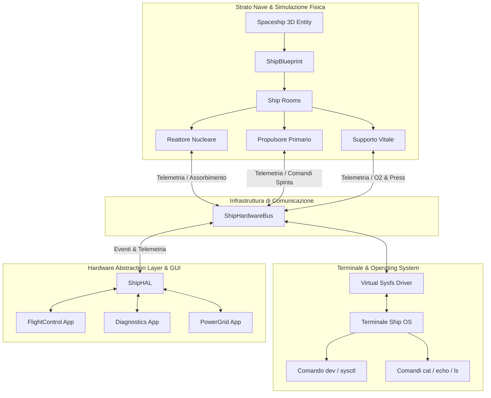

# Requirements

### Overview & Goals
Il presente piano definisce la ristrutturazione architetturale della nave spaziale in Dark Nova: Rogue Squadron, con l'obiettivo di massimizzare l'utilità complessiva del sistema in termini di profondità di gameplay, efficienza computazionale, modularità e manutenibilità del codice.

Attualmente, i dispositivi definiti all'interno dello `ShipBlueprint` sono strutture dati prevalentemente passive (`ShipDeviceData`), mentre il comportamento della nave e delle sue applicazioni è spesso gestito da manager monolitici. L'obiettivo del refactoring è convertire ogni dispositivo di ciascuna stanza in un **componente fisico autonomo simulato** che contribuisce attivamente al funzionamento della nave. Il **Terminale** assume il ruolo di **Operating System (OS) a basso livello**, offrendo osservabilità e controllo granulare su registri e attuatori fisici tramite una gerarchia virtuale `/sys` e comandi specifici. Le **Applicazioni GUI** si evolvono in interfacce utente di alto livello che aggregano i componenti attraverso un **Hardware Abstraction Layer (HAL)**, garantendo un flusso operativo coerente, reattivo ed esente da ridondanze.

### Scope
- **In Scope:**
  - Creazione e isolamento dello sviluppo sul nuovo branch dedicato `refactor/physical-components-os-bus`.
  - Definizione del modello dati e del ciclo di vita dei componenti fisici autonomi (`ShipPhysicalComponent`) all'interno delle stanze dello `ShipBlueprint`.
  - Implementazione del bus hardware disaccoppiato (`ShipHardwareBus`) per scambio messaggi, telemetria e bilanciamento carichi energetici/termici.
  - Implementazione del filesystem virtuale `/sys` nel Terminale per introspezione e modifica a caldo dei registri dei dispositivi con comandi OS standard (`cat`, `echo`, `ls`) e strumento diagnostico dedicato (`dev`).
  - Progettazione e integrazione dell'Hardware Abstraction Layer (`ShipHAL`) tra l'hardware sottostante e le applicazioni grafiche.
  - Migrazione di applicazioni pilota (`FlightControl`, `Diagnostics`, `PowerGrid`) all'architettura basata su HAL.
  - Suite di test automatizzati GUT per ciascun livello (Componenti, Bus, Sysfs, HAL).

- **Out of Scope:**
  - Rimodellazione 3D o modifiche agli asset grafici delle mesh esterne della nave.
  - Ristrutturazione completa delle economie delle stazioni o del sistema di fazioni (che mantengono le attuali interfacce).
  - Riscrittura del netcode di sincronizzazione multiplayer oltre l'adattamento delle chiamate RPC già previste per lo stato della nave.

### User Stories
- **Come Ingegnere di Bordo**, voglio interrogare direttamente lo stato del reattore e dei sistemi di supporto vitale dal terminale digitando comandi o navigando in `/sys/rooms/...`, in modo da diagnosticare guasti fisici, deviare flussi energetici e reimpostare registri hardware a basso livello in caso di emergenza.
- **Come Pilota**, voglio che la risposta dei comandi di volo e la spinta effettiva dipendano dallo stato fisico reale dei propulsori e dell'erogazione di potenza, per sperimentare un modello di simulazione dinamico, credibile e reattivo alle condizioni della nave.
- **Come Sviluppatore del Progetto**, voglio che l'aggiunta di un nuovo dispositivo a una stanza nel Blueprint richieda solo la definizione della sua logica atomica e dei suoi registri, senza dover toccare decine di manager monolitici, riducendo drasticamente il costo marginale di estensione e manutenzione.

### Functional Requirements
- **Simulazione Autonoma dei Componenti:**
  - Ciascun componente deve elaborare il proprio tick in modo indipendente, calcolando consumo/generazione di potenza, dispersione termica, integrità e usura.
  - Il mancato apporto di risorse necessarie (es. energia insufficiente o surriscaldamento critico) deve indurre una degradazione prestazionale proporzionale o lo spegnimento di sicurezza del componente.
- **Bus Hardware Disaccoppiato:**
  - Deve registrare dinamicamente tutti i componenti presenti nelle stanze attive all'avvio o alla riconfigurazione del blueprint.
  - Deve gestire la propagazione degli stati tramite segnali ed eventi asincroni, prevenendo cicli bloccanti.
- **Interfaccia OS / Terminale:**
  - La gerarchia virtuale `/sys/rooms/[room_id]/[device_id]/` deve consentire l'ispezione dei valori (`status`, `power`, `temp`, `load`) tramite `cat` e la modifica dei parametri configurabili tramite `echo [valore] > [nodo]`.
  - Deve essere fornito un comando nativo `dev` per interrogazioni rapide e diagnostica aggregata (es. `dev list`, `dev status <id>`, `dev restart <id>`).
- **Hardware Abstraction Layer (HAL):**
  - Deve raccogliere la telemetria frammentata dei componenti fisici e aggregarla in indicatori operativi unificati per la UI (es. spinta totale disponibile, riserva energetica di rete, efficienza supporto vitale).
  - Le azioni utente dalle finestre GUI devono essere tradotte in comandi atomici inviati ai componenti tramite il bus.

### Non-Functional Requirements
- **Efficienza Computazionale:** Nessuna allocazione incontrollata nella heap durante il tick di fisica; il calcolo di bilancio del bus deve avere complessità temporale massima $O(N)$ rispetto al numero di dispositivi.
- **Isolamento e Sicurezza:** Il lavoro deve risiedere integralmente su un branch separato; il fallimento o crash di un componente fisico non deve causare il crash dell'engine o del terminale.
- **Testabilità Deterministica:** Ogni componente e l'intero bus devono poter essere istanziati ed eseguiti in ambienti di test headless disconnessi dalla scena 3D.

# Technical Design

### Current Implementation
Attualmente, `ShipBlueprint` (`res://Outside/ShipSublayer/ship_blueprint.gd`) definisce le stanze (`ShipRoomData`) e i dispositivi al loro interno (`ShipDeviceData`). Tali dispositivi contengono principalmente proprietà passive (identificativo, coordinate 2D, categoria, potenza nominale). La dinamica di volo e la gestione energetica sono accentrate in `Spaceship.gd`, `SpaceWorldManager.gd` e nei singoli manager applicativi, generando forte accoppiamento e rendendo difficile simulare comportamenti emergenti o guasti localizzati a livello di singolo hardware.
Il Terminale (`TerminalCommandManager`) gestisce comandi CLI indipendenti che operano su file system (`TerminalDriveManager`) o variabili di stato, ma non dispone di un canale standardizzato per dialogare con i singoli dispositivi fisici.

### Key Decisions
1. **Architettura a Bus Hardware Disaccoppiato (`ShipHardwareBus`):**
   - *Scelta:* I componenti fisici non conoscono direttamente gli altri nodi o le interfacce GUI; pubblicano la propria telemetria e sottoscrivono pacchetti di controllo su un bus centralizzato.
   - *Razionale di utilità:* Massimizza il disaccoppiamento architetturale, elimina dipendenze circolari e consente la facile rimozione, aggiunta o guasto di singoli componenti senza intaccare la stabilità complessiva.

2. **Filesystem Virtuale Sysfs (`/sys`) & Tooling CLI:**
   - *Scelta:* Integrazione di un driver virtuale (`VirtualSysfsDriver`) in `TerminalDriveManager` che mappa i registri dei componenti registrati sul bus in percorsi gerarchici `/sys/rooms/<room_id>/<device_id>/<register>`.
   - *Razionale di utilità:* Offre all'utente una metafora OS potente e coerente, consentendo sia script shell esistenti (`cat`, `echo`, pipe) sia comandi specifici (`dev`) per intervenire sui singoli registri senza scrivere logiche ad-hoc per ogni periferica.

3. **Hardware Abstraction Layer (HAL) per Applicazioni GUI:**
   - *Scelta:* Un layer di mediazione reattivo (`ShipHAL`) interroga il bus, raggruppa le metriche correlate e fornisce contratti puliti alle applicazioni (`FlightControl`, `Diagnostics`, `PowerGrid`).
   - *Razionale di utilità:* Evita che le applicazioni debbano conoscere l'indirizzamento di decine di dispositivi fisici o che duplichino logiche di calcolo, garantendo alta reattività della UI e coerenza di stato istantanea.

### Architecture Diagram


### Data Models & Contracts
```gdscript

# res://Outside/ShipSystems/Components/ship_physical_component.gd

class_name ShipPhysicalComponent
extends Node

signal telemetry_updated(device_id: String, data: Dictionary)
signal state_changed(device_id: String, new_state: String)

@export var device_id: String = ""
@export var room_id: String = ""
@export var category: String = "utility"

var power_draw_current: float = 0.0
var power_draw_nominal: float = 10.0
var power_supplied: float = 0.0
var heat_current: float = 20.0
var heat_max: float = 120.0
var health_percent: float = 100.0
var is_online: bool = true

var registers: Dictionary = {}

func step(delta: float) -> void:
    # Logica di simulazione autonoma del componente
    pass

func read_register(reg_name: String) -> Variant:
    return registers.get(reg_name, null)

func write_register(reg_name: String, value: Variant) -> bool:
    if registers.has(reg_name):
        registers[reg_name] = value
        return true
    return false
```

```gdscript

# res://Outside/ShipSystems/HardwareBus/ship_hardware_bus.gd

class_name ShipHardwareBus
extends Node

signal device_registered(device_id: String, component: ShipPhysicalComponent)
signal power_grid_balanced(total_generated: float, total_demanded: float)

var _components: Dictionary = {} # device_id -> ShipPhysicalComponent
var _rooms_index: Dictionary = {} # room_id -> Array[ShipPhysicalComponent]

func register_component(component: ShipPhysicalComponent) -> void:
    _components[component.device_id] = component
    if not _rooms_index.has(component.room_id):
        _rooms_index[component.room_id] = []
    _rooms_index[component.room_id].append(component)
    device_registered.emit(component.device_id, component)

func dispatch_command(device_id: String, command: String, args: Array = []) -> Dictionary:
    if not _components.has(device_id):
        return {"success": false, "error": "Device not found"}
    var comp: ShipPhysicalComponent = _components[device_id]
    if comp.has_method(command):
        var res = comp.callv(command, args)
        return {"success": true, "result": res}
    return {"success": false, "error": "Unknown command"}
```

### File Structure
- **Nuove cartelle e file:**
  - `res://Outside/ShipSystems/Components/ship_physical_component.gd`: Classe base per tutti i componenti.
  - `res://Outside/ShipSystems/Components/reactor_component.gd`: Modello reattore nucleare/generatore.
  - `res://Outside/ShipSystems/Components/thruster_component.gd`: Modello propulsori di manovra e principali.
  - `res://Outside/ShipSystems/Components/life_support_component.gd`: Modello supporto vitale (O2, temperatura, filtri).
  - `res://Outside/ShipSystems/Components/cooling_component.gd`: Dissipatore e radiatori termici.
  - `res://Outside/ShipSystems/HardwareBus/ship_hardware_bus.gd`: Bus centralizzato di comunicazione ed energia.
  - `res://Outside/ShipSystems/HAL/ship_hal.gd`: Hardware Abstraction Layer per le applicazioni.
  - `res://Scenes/Autoloads/TerminalDrive/virtual_sysfs_driver.gd`: Driver `/sys` integrato nel drive del terminale.
  - `res://Applications/Terminal/commands/dev_command.gd`: Comando CLI per gestione dispositivi.
- **File esistenti modificati:**
  - `res://Outside/ShipSublayer/ship_blueprint.gd`: Istanziamento nodi fisici durante il setup della nave.
  - `res://Outside/spaceship.gd`: Interfacciamento al bus per spinta e riserve energetiche.
  - `res://Applications/FlightControl/flight_control_app.gd`: Utilizzo dei contratti HAL per la telemetria di volo.
  - `res://Applications/Diagnostics/diagnostics_app.gd`: Monitoraggio dell'integrità reale dei componenti fisici.

### Risks & Mitigations
- **Rischio Overhead di Performance nel Tick di Fisica:** La simulazione di dozzine di nodi individuali potrebbe generare micro-stuttering se non ottimizzata.
  - *Mitigazione:* Utilizzo di un tick rate modulabile per i componenti meno critici (es. aggiornamento termico o supporto vitale ogni 0.2s invece che ogni frame fisico), mantenendo a 60Hz solo propulsione e controlli reattivi.
- **Rischio Disallineamento Stato tra CLI e GUI:** Un utente che altera un registro da terminale via `echo` o `dev` potrebbe mandare in cache-invalidation l'interfaccia grafica.
  - *Mitigazione:* Il bus emette segnali di mutazione `telemetry_updated` su qualsiasi scrittura di registro, a cui l'HAL è collegato per aggiornare la UI in tempo reale.

# Testing

### Validation Approach
La verifica della soluzione deve garantire la massima affidabilità prima dell'eventuale merge del branch. L'approccio di test adotta il framework GUT (`res://addons/gut/`) già integrato nel progetto, consentendo validazione continua deterministica sia a livello di singoli componenti atomici, sia attraverso scenari di integrazione end-to-end headless.

### Key Scenarios
1. **Ciclo di Vita e Autonomia del Componente Fisico:**
   - Istanziamento di un `ReactorComponent` e di un `ThrusterComponent`.
   - Esecuzione di `step(delta)` per verificare la curva di consumo energetico e la produzione di calore.
   - Simulazione di spegnimento del reattore: verifica che il propulsore riduca progressivamente la spinta erogata per deficit energetico.

2. **Throughput e Instradamento del Bus Hardware:**
   - Registrazione di componenti appartenenti a stanze differenti (`Bridge`, `Engine Room`, `Life Support`).
   - Invio di pacchetti di controllo tramite `ShipHardwareBus.dispatch_command()` e ricezione della telemetria aggiornata tramite i segnali `telemetry_updated`.
   - Verifica dell'integrità dei dati e assenza di allocazioni spurie durante 1.000 iterazioni continuative di bus dispatching.

3. **Introspezione e Scrittura via Virtual Sysfs nel Terminale:**
   - Risoluzione del path `/sys/rooms/engine_room/reactor_01/status` e verifica dell'output con comando `cat`.
   - Esecuzione del comando `echo 0 > /sys/rooms/engine_room/reactor_01/power_target` e asserzione che il registro hardware del componente sia mutato istantaneamente a `0`.
   - Esecuzione del comando `dev status reactor_01` con parsing corretto della scheda diagnostica TUI.

4. **Reattività dell'Hardware Abstraction Layer (HAL):**
   - Interrogazione di `ShipHAL.get_total_available_thrust()` a pieno regime.
   - Iniezione di un danno o spegnimento forzato di uno dei propulsori fisici via CLI.
   - Verifica che l'HAL emetta `propulsion_profile_changed` e che `FlightControlApp` aggiorni istantaneamente la telemetria mostrata senza errori di rendering o blocco della finestra.

### Edge Cases
- **Comandi su Dispositivi Non Esistenti:** Interrogazione da terminale di `/sys/rooms/fake_room/missing_device`: il driver deve restituire `ERR_FILE_NOT_FOUND` in modo pulito senza sollevare eccezioni non gestite.
- **Scrittura di Valori Fuori Range:** Tentativo di scrittura tramite `echo "invalid_string" > /sys/.../power_target`: il componente deve rigettare la mutazione mantenendo lo stato precedente e restituendo esito negativo al driver.
- **Riconfigurazione Dinamica dello ShipBlueprint:** Sostituzione a caldo del blueprint: il bus deve disconnettere ed eliminare in sicurezza i vecchi componenti prima di istanziare i nuovi, prevenendo memory leak o registrazioni fantasma.

### Test Changes
- **Nuovi file di test da creare:**
  - `res://tests/gut/test_physical_components.gd`: Test di unità sui componenti simulati e sui registri.
  - `res://tests/gut/test_ship_hardware_bus.gd`: Test di integrazione del bus, negoziazione carichi e dispacciamento comandi.
  - `res://tests/gut/test_terminal_sysfs_hardware.gd`: Test dei percorsi virtuali `/sys` e dei comandi CLI associati.
  - `res://tests/gut/test_hal_applications_flow.gd`: Test end-to-end della catena Hardware -> Bus -> HAL -> Applicazioni.

# Delivery Steps

### ✓ Step 1: Branch Isolation & Autonomous Physical Component Foundation
Un'infrastruttura di simulazione a componenti autonomi è attiva e isolata nel nuovo branch di refactoring con test unitari superati.

- Creare e isolare il branch dedicato `refactor/physical-components-os-bus` per garantire immunità al flusso di sviluppo principale e consentire benchmarking rigoroso.
- Creare la classe base `ShipPhysicalComponent` (`res://Outside/ShipSystems/Components/ship_physical_component.gd`) estesa da `Node`, con ciclo di vita autonomo (`step(delta)`), registri interni I/O (`registers: Dictionary`), assorbimento/erogazione energetica, emissione termica e calcolo usura/integrità.
- Implementare i componenti fisici concreti iniziali in `res://Outside/ShipSystems/Components/`: `ReactorComponent`, `BatteryComponent`, `ThrusterComponent`, `LifeSupportComponent` e `CoolingComponent`.
- Estendere `ShipDeviceData` e `ShipBlueprint` (`res://Outside/ShipSublayer/ship_blueprint.gd`) per mappare i dispositivi delle stanze sulle classi fisiche concrete e istanziarli a runtime durante lo spawn della nave.
- Creare la suite di test GUT `res://tests/gut/test_physical_components.gd` per verificare determinismo, allocazione di risorse e isolamento di ciascun componente.

### ✓ Step 2: Ship Hardware Bus & Resource Distribution Network
Tutti i componenti fisici comunicano in modo efficiente e disaccoppiato attraverso il bus hardware centrale con bilanciamento risorse in tempo reale.

- Implementare il singleton/servizio `ShipHardwareBus` (`res://Outside/ShipSystems/HardwareBus/ship_hardware_bus.gd`) per la registrazione dinamica dei dispositivi, instradamento pacchetti di controllo e aggregazione asincrona della telemetria.
- Sviluppare il sottosistema di distribuzione risorse (Power Grid & Thermal Grid) all'interno del bus, consentendo ai componenti erogatori (es. reattori) e consumatori (es. propulsori, supporto vitale) di negoziare potenza ed emergenze senza accoppiamenti diretti.
- Collegare `Spaceship` (`res://Outside/spaceship.gd`) e `SpaceWorldManager` (`res://Outside/space_world_manager.gd`) al bus hardware affinché la fisica di volo e le funzioni primarie dipendano dallo stato effettivo dei componenti simulati.
- Creare i test di integrazione GUT `res://tests/gut/test_ship_hardware_bus.gd` per convalidare il throughput del bus, l'instradamento degli eventi e la gestione di blackout o sovraccarichi.

### ✓ Step 3: Terminal OS Virtual Sysfs & Low-Level CLI Engine
Il Terminale opera come OS a basso livello esponendo l'albero virtuale dei componenti (/sys) e comandi di controllo dedicati per diagnosi e manipolazione registri.

- Implementare il driver `VirtualSysfsDriver` (`res://Scenes/Autoloads/TerminalDrive/virtual_sysfs_driver.gd`) integrato in `TerminalDriveManager`, che mappa dinamicamente le stanze e i componenti fisici registrati sul bus nel percorso virtuale `/sys/rooms/[room_id]/[device_id]/`.
- Esporre per ciascun componente nodi virtuali leggibili e scrivibili per attributi e registri critici (`status`, `power_target`, `temp`, `efficiency`, `lock_state`).
- Aggiornare i comandi base del terminale (`cat`, `echo`, `ls` in `res://Applications/Terminal/commands/`) per interagire con i nodi virtuali `/sys`, consentendo ad esempio `cat /sys/rooms/engine/reactor/temp` ed `echo 1 > /sys/rooms/engine/reactor/power`.
- Aggiungere il comando CLI specializzato `dev_command.gd` (`res://Applications/Terminal/commands/dev_command.gd`) per ispezione rapida, reboot, overclock e diagnostica diretta di qualsiasi componente tramite il suo identificativo hardware.
- Scrivere i test GUT `res://tests/gut/test_terminal_sysfs_hardware.gd` per verificare la corretta lettura/scrittura dei registri fisici via CLI e la reiezione di parametri non validi.

### ✓ Step 4: Hardware Abstraction Layer (HAL) & GUI Applications Migration
Le applicazioni desktop consumano dati aggregati e inviano comandi tramite l'HAL reattivo, eliminando logiche monolitiche e garantendo coerenza totale col sistema fisico.

- Implementare il `ShipHAL` (Hardware Abstraction Layer) in `res://Outside/ShipSystems/HAL/ship_hal.gd`, che aggrega la telemetria grezza del bus hardware in domini ad alto livello (Propulsione, Energia, Sicurezza/Diagnostica, Supporto Vitale, Sensori).
- Rifattorizzare `FlightControlApp` (`res://Applications/FlightControl/flight_control_app.gd`) affinché legga l'efficienza dei propulsori e applichi la spinta tramite i contratti esposti dall'HAL anziché variabili globali rigide.
- Rifattorizzare `DiagnosticsApp` (`res://Applications/Diagnostics/diagnostics_app.gd`) e `PowerGridApp` (`res://Applications/PowerGrid/power_grid_app.gd`) per monitorare l'integrità reale dei componenti, gestire priorità di carico ed evidenziare anomalie hardware lette dal bus.
- Implementare test end-to-end GUT `res://tests/gut/test_hal_applications_flow.gd` per validare che una modifica effettuata via GUI (o via Terminale sysfs) si propaghi istantaneamente sull'intero sistema con latenza minima e senza conflitti di stato.