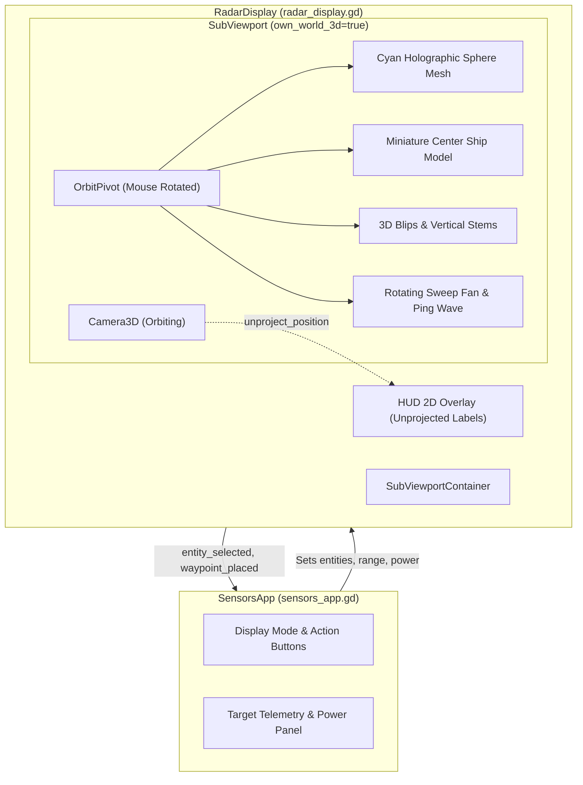

# Requirements

### Overview & Goals
The goal of this task is to transform the existing 2D radar in the `Sensors` application (`Applications/Sensors`) into an interactive 3D tactical radar sphere. The radar will be visualized as a glowing cyan holographic sphere representing the maximum scan range, with the player's spacecraft situated at the center `(0, 0, 0)`. The player will be able to orbit and inspect the 3D radar volume by clicking and dragging with the mouse.

### Scope
- **In Scope:**
  - Modernizing `Applications/Sensors/Components/radar_display.tscn` and `radar_display.gd` to render a 3D tactical radar inside a dedicated `SubViewport` with its own isolated `World3D`.
  - Creating a cyan holographic wireframe / grid sphere representing the radar boundary (`max_range`).
  - Rendering a miniature 3D spacecraft model at the origin representing the player's ship.
  - Interactive mouse drag orbiting (yaw and pitch rotation) using the left mouse button, with a movement threshold to differentiate between camera rotation and contact selection clicks.
  - Projecting contacts, asteroid obstacles, telemetry probes, and tactical waypoints into 3D positions inside the sphere, complete with vertical stems (drop lines) to the equatorial plane for clear spatial orientation.
  - 3D rotating radar sweep and active ping expansion animations.
  - Ensuring complete backward compatibility with `SensorsApp` (`Applications/Sensors/sensors_app.gd`), all signals (`entity_selected`, `waypoint_placed`), telemetry UI, power grid limits, and GUT unit tests.

- **Out of Scope:**
  - Changes to other ship applications (e.g., Weapons, Flight Control, Diagnostics).
  - Modifying the underlying physical space simulation in `Outside/space_world_manager.gd`.

### User Stories
- **As a crew member operating Sensors**, I want to view contacts in a 3D cyan sphere around my ship so that I can immediately understand relative elevations, bearings, and distances in three-dimensional space.
- **As a player**, I want to drag with the mouse to rotate the 3D radar so that I can inspect contacts from any angle (top-down, front, profile, or custom perspective).
- **As a player**, I want to click on an eco blip in the 3D sphere without accidentally rotating the camera so that I can inspect spectrometry, mass, and velocity telemetry in the side panel.

### Functional Requirements
- **3D Sphere Representation:** The radar volume must be rendered as a cyan sphere (`Color(0.1, 0.85, 1.0)`) matching the current visual style. The sphere's radius maps to the current `max_range` (1000m standard, 2000m active ping).
- **Center Ship Model:** The ship must be centered at `(0, 0, 0)` facing `-Z`, clearly indicating forward flight heading.
- **Mouse Drag Controls:**
  - Left-click drag rotates the view around the ship (horizontal movement controls azimuth/yaw, vertical movement controls elevation/pitch).
  - Pitch is clamped between -85° and +85° to prevent gimbal flipping.
  - A drag threshold (5 px) allows quick clicks to trigger entity selection.
  - Optional mouse scroll wheel zooms the camera closer or further from the sphere.
- **3D Contacts & Stems:** Contacts are positioned in 3D relative space (`rel_pos / max_range * sphere_radius`). Each contact has a vertical stem line connecting it to the horizontal equatorial disk plane, following tactical space-sim conventions (e.g. Elite Dangerous / Homeworld).
- **Mode Presets:** The existing display mode selector in `SensorsApp` provides quick camera snaps (e.g., Free Orbit, Top-Down Zenital, Frontal Elevation).
- **Diegetic Sweep & Ping:** Sweep beam rotates in 3D, and active ping triggers an expanding spherical wavefront.

### Non-Functional Requirements
- **Performance:** Rendering inside an isolated `SubViewport` with lightweight meshes (wireframe rings, simple primitives) maintains high frame rates (>60 FPS) without lagging the UI.
- **Visual Clarity:** Cyan glow and high-contrast contact markers ensure readability on ship monitors.
- **Test Compatibility:** All existing GUT test assertions in `tests/gut/test_sensors_app_node.gd` must continue to pass without error.

# Technical Design

### Current Implementation
- `Applications/Sensors/Components/radar_display.gd` currently extends `Control` and performs custom 2D canvas drawing inside `_draw()`.
- The current "ELEVATION_3D" mode is a 2D trigonometric projection approximation (`y = sin(bearing) * dist * 0.5 - sin(elev) * 0.35`).
- `SensorsApp` binds to `RadarDisplay` via properties (`entities`, `max_range`, `is_powered`, `is_sweep_active`, etc.) and signals (`entity_selected`, `waypoint_placed`).

### Key Decisions
1. **SubViewport with Isolated World3D & 2D HUD Overlay (Selected):**
   - Rationale: Embeds a `SubViewport` with `own_world_3d = true` inside `RadarDisplay`. This isolates the 3D holographic sphere and lighting from the main space environment while preserving `RadarDisplay`'s 2D `Control` interfaces and seamless embedding in `sensors_app.tscn`. 2D selection reticles and HUD text are unprojected on top for sharp text legibility.
2. **Left-Mouse Drag with Click-Threshold:**
   - Rationale: Left-click drag rotates the orbit camera. If mouse motion stays below 5 pixels during a click, it is treated as an entity selection click, providing an intuitive, unified mouse interaction. Right-click remains available for tactical waypoint placement.
3. **Equatorial Reference Plane with Vertical Stems:**
   - Rationale: In 3D space radars, contacts floating in void can cause depth ambiguity. Vertical drop-lines (stems) connected to the equatorial plane provide instant visual feedback on whether a contact is above or below the ship.

### Proposed Changes
- **Scene Structure (`radar_display.tscn`):**
  - Root: `RadarDisplay` (Control)
    - `SubViewportContainer` (Stretch = true, mouse_filter = PASS)
      - `SubViewport` (transparent_bg = true, own_world_3d = true)
        - `Camera3D` (perspective, pointing to origin)
        - `DirectionalLight3D` (soft fill light)
        - `OrbitPivot` (Node3D):
          - `CyanSphere` (MeshInstance3D with cyan wireframe / rings)
          - `EquatorialGrid` (MeshInstance3D circular concentric grid)
          - `CenterShip` (Node3D miniature ship mesh)
          - `SweepPivot` (Node3D with cyan translucent sweep fan)
          - `PingWave` (MeshInstance3D expanding sphere)
          - `BlipsContainer` (Node3D holding contact instances and stem lines)
    - `HUDOverlay` (Control for unprojected selection brackets and labels)

- **Input Handling (`radar_display.gd`):**
  - `_gui_input` tracks mouse press, motion, and release:
    - On drag: accumulates yaw and pitch on `OrbitPivot`.
    - On release without drag: converts click screen position to a 3D ray or nearest unprojected blip within 16 px hit-radius to emit `entity_selected`.

### Architecture Diagram

### File Structure
- `Applications/Sensors/Components/radar_display.tscn`: Updated with `SubViewportContainer`, `SubViewport`, 3D camera, orbit pivot, sphere mesh, and ship model.
- `Applications/Sensors/Components/radar_display.gd`: Refactored to manage the 3D viewport, orbit rotation, contact positioning with stems, and mouse drag/click discrimination.
- `Applications/Sensors/sensors_app.gd`: Adjusted display mode options to include 3D camera angles (Orbit, Top-Down, Frontal) while maintaining existing contracts.
- `tests/gut/test_sensors_app_node.gd`: Maintained and enhanced with 3D radar verification tests.

# Testing

### Validation Approach
Verification will be conducted using automated GUT test suites executed via Godot in headless mode:
- Command: `/app/bin/godot --headless --script addons/gut/gut_cmdln.gd -gtest=res://tests/gut/test_sensors_app_node.gd`

### Key Scenarios
1. **Radar Initialization & Hierarchy:**
   - Verify `RadarDisplay` instantiates with `SubViewportContainer`, `SubViewport`, `Camera3D`, and cyan sphere mesh.
   - Confirm standard range is 1000m and active ping range is 2000m.
2. **Mouse Orbit Drag:**
   - Simulate left-mouse drag inputs and verify that the orbit pivot rotates in azimuth and elevation.
   - Verify pitch remains bounded within [-85°, 85°].
3. **Contact Positioning & Stems:**
   - Supply mock entities with varying bearings, elevations, and distances.
   - Verify 3D blips are correctly positioned inside the cyan sphere with vertical stems extending to the horizontal plane.
4. **Target Selection vs Drag:**
   - Simulate click without drag (< 5 px movement) over an unprojected contact blip; verify `entity_selected` signal is emitted.
   - Simulate drag (> 5 px movement); verify view rotates and selection is not accidentally changed.
5. **Power & Damage States:**
   - Set `is_powered = false`; verify radar displays unpowered state.
   - Trigger active ping; verify 3D ping wave triggers and resets upon completion.

### Edge Cases
- Entities outside `max_range`: clamped to sphere border or hidden when out of ping/probe range.
- Occluded contacts behind asteroids: hidden unless revealed by active probe or active ping.
- High aspect ratio window resizing: `SubViewportContainer` dynamically resizes without stretching distortion.

### Test Changes
- Retain all 11 existing unit tests in `tests/gut/test_sensors_app_node.gd`.
- Add test methods in `test_sensors_app_node.gd`:
  - `test_radar_3d_viewport_and_sphere_instantiation()`
  - `test_radar_3d_orbit_rotation_drag()`
  - `test_radar_3d_contact_selection_threshold()`

# Delivery Steps

### ✓ Step 1: Implement 3D SubViewport and Cyan Sphere Scene Hierarchy
SubViewport 3D hierarchy is established inside `radar_display.tscn` and `radar_display.gd` with an isolated World3D, orbit camera, and cyan holographic sphere mesh.

- Update `Applications/Sensors/Components/radar_display.tscn` to host a `SubViewportContainer` and `SubViewport` configured with `own_world_3d = true` and transparent/dark space background.
- Configure `Camera3D` with perspective projection aimed at the coordinate origin `(0, 0, 0)` attached to an orbit pivot structure.
- Construct the 3D cyan radar sphere using a cyan holographic wireframe / latitude-longitude ring mesh (`Color(0.1, 0.85, 1.0)`) representing the radar detection horizon (`max_range`).
- Instantiate a miniature 3D ship model at the origin `(0, 0, 0)` aligned towards `-Z` matching the ship geometry aesthetic from `Outside/spaceship.tscn`.
- Preserve existing Control minimum size constraints (380x380) and export properties in `radar_display.gd`.

### ✓ Step 2: Implement Interactive Mouse Orbit Rotation and Camera Controls
The player can rotate the radar sphere in 3D by dragging with the left mouse button, with pitch clamping and drag thresholding.

- Implement mouse drag tracking in `_gui_input(event: InputEvent)` within `radar_display.gd` calculating delta movements upon left mouse drag.
- Apply yaw rotation around global Y and pitch rotation around local X on the orbit pivot, clamping pitch between -85° and +85° to prevent camera gimbal inversion.
- Add a drag threshold (e.g. 5 pixels) to cleanly distinguish between a mouse drag gesture for view rotation and a quick click gesture for target selection.
- Implement camera zoom via mouse scroll wheel (`MOUSE_BUTTON_WHEEL_UP` and `MOUSE_BUTTON_WHEEL_DOWN`) within calibrated distance boundaries.
- Add preset view orientations (Default Isometric, Zenital/Top-Down, Frontal/Elevation) linked to the display mode selector in `sensors_app.gd`.

### ✓ Step 3: Render 3D Radar Contacts, Stems, and Sweep/Ping Effects
Sensor entities, radar sweeps, and active ping waves are rendered in 3D space with stems and interactive selection.

- Compute 3D contact coordinates within the sphere scaled by relative distance (`pos = (local_rel_pos / max_range) * sphere_radius`).
- Render 3D blips with vertical stem lines (drop-lines) connected to the equatorial plane for instant spatial height and azimuth awareness.
- Color-code contact blips according to status (green/cyan for regular contacts, magenta for tactical waypoints, light-blue for telemetry probe feed).
- Implement 3D sweep fan rotation and 3D expanding ping sphere wavefront effects.
- Support contact selection via 3D raycast / screen unprojection on left-click release, preserving `entity_selected` and `waypoint_placed` signals.

### ✓ Step 4: Integrate SensorsApp and Validate with Unit Tests
`SensorsApp` UI seamlessly drives the 3D radar display while preserving all telemetry panels, RBAC rules, and existing GUT test suites.

- Update `Applications/Sensors/sensors_app.gd` to synchronize display mode options with 3D camera presets and ensure all property assignments remain fully compatible.
- Maintain 2D HUD projection for selection reticles, target labels, and scale indicators on top of the 3D viewport.
- Run the full GUT test suite `tests/gut/test_sensors_app_node.gd` to ensure 100% backward compatibility and test passes.
- Add new GUT unit tests validating 3D viewport initialization, sphere generation, mouse orbit rotations, and contact unprojection.