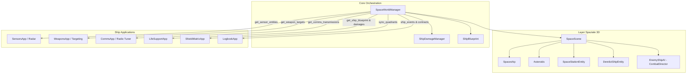

# Requirements

### Panoramica & Obiettivi
Lo scopo di questo piano è portare a compimento l'integrazione diegetica delle applicazioni di bordo di **Dark Nova: Rogue Squadron**. Attualmente, diverse applicazioni utilizzano dati mock o simulazioni interne isolate (ad es. contatti fittizi in Sensors/Scanners, frequenze e messaggi predefiniti in Comms, stanze hardcoded in LifeSupport). Il piano prevede il collegamento di tutte le applicazioni che ne hanno bisogno ai dati reali generati e gestiti dal mondo 3D (`SpaceScene`), dal gestore globale dello spazio (`SpaceWorldManager`), dalla blueprint della nave (`ShipBlueprint`) e dai sistemi di combattimento e danno (`CombatDirector`, `ShipDamageManager`).

---

### Audit Completo delle Applicazioni (Stato Attuale & Necessità)

Di seguito è riportata la valutazione dettagliata per ciascuna delle 17 applicazioni di GodotOS individuate nel repository:

| Applicazione | Stato Attuale | Richiede Aggiornamento? | Fonte Dati Reale |
| :--- | :--- | :---: | :--- |
| **SensorsApp (Scanners)** | Genera contatti simulati procedurali/fissi ("AST-ALPHA", "DRONE-HOSTILE", ecc.) | **SÌ** | Entità fisiche 3D in `SpaceScene` (asteroidi, navi nemiche `EnemyShipAI`, stazione `SpaceStationEntity`, relitto `DerelictShipEntity`, droni, sonde) |
| **CommsApp** | Array statico `available_signals` ("sos_scout", "subspace_corp", "pirate_encrypted") con distanze e bearing fissi | **SÌ** | Sorgenti di trasmissione reali in `SpaceScene` (fari SOS da relitti 3D, frequenze attracco stazioni orbitali, canali pirata da navi ostili) |
| **WeaponsApp** | `get_weapon_targets()` ricorre a contatti fake se non rileva asteroidi; non aggancia caccia da `CombatDirector` | **SÌ** | Bersagli 3D fisici in `SpaceScene` e caccia ostili gestiti da `CombatDirector` |
| **LifeSupportApp** | Array statico di 8 stanze hardcoded; simulazione atmo locale scollegata dalla nave reale | **SÌ** | Stanze e condotti reali da `ShipBlueprint` (`SpaceWorldManager.get_ship_blueprint()`); brecce e incendi da `ShipDamageManager` |
| **ShieldMatrixApp** | Torrette hardcoded; scudi quadrante gestiti localmente e non sempre allineati con i colpi al veicolo | **SÌ** (Rifinitura) | Quadranti scudi sincronizzati con `SystemicDamageHandler` e mount armi dalla blueprint |
| **LogbookApp** | Contratti mock hardcoded ("CTR-01", "CTR-02"); black box non reattiva ad eventi globali | **SÌ** | Contratti della stazione corrente (`DockingManager`/`StationHubApp`) ed eventi di bordo da `SpaceWorldManager` |
| **FlightControlApp** | Già collegato a fisica 3D di `Spaceship` (RCS, crociera, vettori di velocità) | **NO** | Già operativo con dati reali |
| **CamsApp** | Già collegato a Marker3D telecamere nave e `CameraFeedManager` | **NO** | Già operativo con dati reali |
| **PowerGridApp** | Già alimentato da `ShipBlueprint` e zone di danno reali | **NO** | Già operativo con dati reali |
| **DiagnosticsApp** | Già collegato al filesystem reale di `ShipDriveManager` e ICE Firewall | **NO** | Già operativo con dati reali |
| **DuctDroneApp** | Già collegato a `DuctDroneManager` e danni reali alla rete condotti | **NO** | Già operativo con dati reali |
| **ServiceDroneApp** | Già opera direttamente nella scena 3D riparando brecce sullo scafo | **NO** | Già operativo con dati reali |
| **SystemMapApp** | Già legge coordinate e corpi celesti da `StarSystemGridManager` | **NO** | Già operativo con dati reali |
| **StationHubApp** | Già interfacciato con `DockingManager`, `CargoManager` e `FluxEconomyManager` | **NO** | Già operativo con dati reali |
| **CargoBayApp & FluxWallet** | Già collegati alla gestione reale di inventario crediti/merci | **NO** | Già operativo con dati reali |
| **HackExploitsApp** | Già collegato a `RemoteDriveManager` su drive bersaglio | **NO** | Già operativo con dati reali |
| **PodInfoApp** | Già legge telemetria e atmosfera plancia da `SpaceWorldManager` | **NO** | Già operativo con dati reali |
| **LobbyApp & ShipBuilder** | Gestione multiplayer e CAD blueprint indipendente | **NO** | Già operativi per design |

---

### Ambito (Scope)
- **In Scope**:
  - Estensione di `Outside/space_scene.gd` e `Outside/space_world_manager.gd` per esporre una pipeline unificata di query spaziali e metadati diegetici.
  - Aggiornamento di `SensorsApp` per visualizzare e analizzare (spettrometria/deep scan) gli oggetti 3D effettivi di `SpaceScene`.
  - Aggiornamento di `CommsApp` per ricavare trasmissioni radio da stazioni, relitti e nemici reali, con guadagno e allineamento antenna calcolati sul mondo 3D.
  - Aggiornamento di `WeaponsApp` per agganciare e mirare sulle entità reali e sui caccia ostili.
  - Aggiornamento di `LifeSupportApp` per caricare stanze e condotti dalla `ShipBlueprint` di bordo e riflettere i danni di `ShipDamageManager`.
  - Sincronizzazione di `ShieldMatrixApp` e `LogbookApp` con lo stato della nave e le stazioni.
  - Preservazione della retrocompatibilità con i test GUT (gestione fallback controllati per esecuzione headless).
- **Out of Scope**:
  - Modifiche al modello fisico di volo di `spaceship.gd` (già completato e funzionante).
  - Modifiche alla pipeline di rendering delle telecamere esterne (`CamsApp`).

---

### Storie Utente
- **Come Operatore Sensori**, voglio che il radar visualizzi in tempo reale tutti i corpi celesti, le navi ostili, i detriti e le stazioni presenti in `SpaceScene`, così da disporre di informazioni tattiche accurate per la navigazione.
- **Come Ufficiale Comunicazioni**, voglio orientare l'antenna verso la stazione o il relitto presente nello spazio 3D per agganciarne il segnale radio e ricevere autorizzazioni di attracco o richieste di soccorso reali.
- **Come Artigliere Tattico**, voglio poter bloccare il sistema di puntamento sulle navi nemiche reali presenti nello spazio circostante, calcolando il lead indicator sulla velocità effettiva del bersaglio.
- **Come Ingegnere di Bordo**, voglio che il supporto vitale mostri la reale configurazione delle stanze dell'astronave equipaggiata e rifletta le brecce e gli incendi causati dai colpi subiti in combattimento.

# Technical Design

### Architettura Corrente e Punti Critici
Attualmente, `Outside/space_scene.gd` contiene solamente riferimenti basici a `Spaceship`, `SunLight` e `Asteroids`. La maggior parte delle entità (stazioni, relitti, caccia nemici di `CombatDirector`) viene istanziata dinamicamente da `SpaceWorldManager` o dai controller di combattimento, ma non esiste un'API standardizzata in `SpaceScene` per catalogare e restituire tutte le entità attive. Di conseguenza:
1. `SpaceWorldManager.get_sensor_entities()` e `get_weapon_targets()` ricorrono a liste statiche fittizie (`long_range_defaults`, `default_targets`).
2. `CommsApp` usa un array interno fisso (`available_signals`) ignorando la presenza di stazioni o nemici in `SpaceScene`.
3. `LifeSupportApp` hardcoda 8 stanze invece di leggerle dalla `ShipBlueprint` caricata a bordo.

```mermaid
graph TD
    subgraph Architettura Attuale (Problema)
        SS[SpaceScene 3D] --> Asteroids[Asteroids]
        CD[CombatDirector] --> Enemies[EnemyShipAI]
        SWM[SpaceWorldManager] --> Fallback[Dati Mock Hardcoded]
        Fallback --> AppSensors[SensorsApp]
        Fallback --> AppWeapons[WeaponsApp]
        StaticComms[available_signals Hardcoded] --> AppComms[CommsApp]
        StaticRooms[8 Stanze Hardcoded] --> AppLifeSup[LifeSupportApp]
    end
```

---

### Decisioni Chiave di Progettazione
1. **Ruolo di SpaceWorldManager come Facade Autorevole (Pattern Adapter)**:
   Le applicazioni UI non devono accedere direttamente alla struttura gerarchica dei nodi di `SpaceScene`. `SpaceWorldManager` funge da intermediario autorevole, interrogando `SpaceScene` e aggregando le entità con `CombatDirector` e `ShipDamageManager`.
2. **Standardizzazione dei Metadati delle Entità Spaziali (`SpaceEntityData`)**:
   Ogni entità 3D presente in `SpaceScene` (o nel dizionario aggregato di `SpaceWorldManager`) espone una struttura coerente:
   - `id`: identificativo univoco (es. `station_alpha`, `foe_corvette_1`).
   - `name`: etichetta leggibile a schermo.
   - `node_ref`: riferimento opzionale al `Node3D`.
   - `global_pos` e `rel_pos`: posizione assoluta e relativa all'astronave.
   - `distance`, `bearing_deg`, `elevation_deg`: coordinate polari relative alla prua nave.
   - `velocity`: vettore velocità 3D per il calcolo del puntamento.
   - `type`: `ASTEROID`, `SHIP_HOSTILE`, `SHIP_FRIENDLY`, `STATION`, `WRECK`, `BEACON`, `PROBE`, `PROJECTILE`.
   - `iff_tag`: `FRIENDLY`, `NEUTRAL`, `HOSTILE`, `HAZARD`, `UNKNOWN`.
   - `radio_frequency`: frequenza MHz di emissione (o `0.0` se muto).
   - `stealth_level` e `signature`: parametri per il filtro radar.
   - `composition` e `integrity`: parametri fisici e chimici per scansione profonda.
3. **Data-Driven LifeSupport basato su ShipBlueprint**:
   `LifeSupportApp` leggerà l'elenco stanze e condotti da `SpaceWorldManager.get_ship_blueprint()`, istanziando le schede di telemetria e il canvas blueprint in modo dinamico.
4. **Preservazione dei Fallback per Test Headless**:
   I test GUT girano spesso in modalità headless senza istanziare l'intera scena 3D. I metodi `get_sensor_entities()` e `get_weapon_targets()` manterranno fallback controllati se e solo se `_space_scene_instance` è `null`, assicurando che la test suite esistente non subisca regressioni.

---

### Diagramma Architetturale Proposto



---

### Specifiche delle Modifiche per File

#### 1. `Outside/space_scene.gd`
- Aggiungere il metodo `get_all_space_entities() -> Array[Node3D]` che raccoglie dinamicamente tutti i nodi figli rilevanti (stazione, relitto, nodi asteroidi, navi nemiche istanziate).
- Fornire helper per identificare se un'entità emette segnali radio o ha segnature termiche/elettromagnetiche.

#### 2. `Outside/space_world_manager.gd`
- Aggiornare `get_sensor_entities()`: interrogare l'albero di `_space_scene_instance` e i caccia attivi di `CombatDirector`, calcolando coordinate relative rispetto a `Spaceship.global_transform`.
- Aggiungere `get_comms_transmissions() -> Array[Dictionary]`: raccogliere tutte le sorgenti radioattive vicine (stazione orbitale, relitto con faro di emergenza, navi nemiche in combattimento).
- Aggiornare `get_weapon_targets()`: unificare asteroidi distruttibili e navi ostili di `CombatDirector`.
- Esporre segnali di evento nave (`ship_damage_taken`, `combat_engagement_started`) per la scatola nera di `LogbookApp`.

#### 3. `Applications/Sensors/sensors_app.gd`
- Eliminare la logica fittizia interna in favore delle entità fornite da `SpaceWorldManager.get_sensor_entities()`.
- Garantire che la spettrometria e la scansione approfondita riflettano la composizione reale dell'entità 3D selezionata.

#### 4. `Applications/Comms/comms_app.gd`
- Sostituire l'array statico `available_signals` con la chiamata periodica a `SpaceWorldManager.get_comms_transmissions()`.
- Calcolare l'azimuth relativo della sorgente rispetto al facing della nave, influenzando la barra di potenza del segnale e il puntamento dell'antenna.
- Collegare il pulsante `Richiedi Attracco` direttamente all'entità stazione reale presente nella scena.
- Collegare l'intrusione EW (`Connetti Drive Bersaglio`) all'entità ostile effettivamente agganciata.

#### 5. `Applications/LifeSupport/life_support_app.gd` e `.tscn`
- Caricare le stanze e i condotti a runtime dalla blueprint attiva (`SpaceWorldManager.get_ship_blueprint()`).
- Ripristinare la corretta presenza del nodo `%MapCanvas` / `%LifeSupportMapCanvas` nella gerarchia della scena `.tscn`.
- Ascoltare i danni subiti dalla nave per applicare brecce e incendi alle stanze geometricamente colpite.

#### 6. `Applications/ShieldMatrix/shield_matrix_app.gd`
- Sincronizzare la carica degli scudi su ciascun quadrante con `Spaceship` e `SystemicDamageHandler`.

#### 7. `Applications/Logbook/logbook_app.gd`
- Sincronizzare la lista dei contratti attivi con `StationHubApp` e `StarSystemGridManager`.
- Ascoltare gli eventi di missione e di combattimento per la registrazione automatica nel log della scatola nera.

# Testing

### Approccio di Validazione
L'approccio di verifica garantisce che il passaggio ai dati reali del mondo 3D avvenga senza regressioni, assicurando la piena operatività sia a runtime durante il volo nello spazio, sia nei test automatici della suite GUT.

---

### Scenari Chiave di Test

1. **Scansione e Rilevamento Radar (SensorsApp)**:
   - Verificare che all'avvio della missione in presenza di `SpaceScene`, il radar visualizzi gli asteroidi 3D reali e la stazione orbitale nelle corrette posizioni relative.
   - Spostare o ruotare la nave tramite `FlightControl` e confermare che bearing, elevazione e distanza dei contatti nel radar si aggiornino coerentemente.
   - Spawna un'ondata ostile con `CombatDirector` e verificare che i caccia nemici (`EnemyShipAI`) appaiano immediatamente nel radar con tag IFF `HOSTILE`.
   - Eseguire il Deep Scan su un asteroide o relitto e verificare che la composizione visualizzata corrisponda alle proprietà diegetiche dell'entità.

2. **Comunicazioni e Puntamento Antenna (CommsApp)**:
   - Sintonizzare la radio sulla frequenza del faro di soccorso del relitto (`DerelictShipEntity`): verificare che la potenza del segnale aumenti quando l'antenna direzionale viene puntata verso l'azimuth reale del relitto.
   - Sintonizzare la frequenza della stazione orbitale e verificare che la richiesta di autorizzazione attracco comunichi con `DockingManager`.
   - Verificare che in presenza di nemici ostili, compaia la loro frequenza tattica e che l'opzione di intrusione EW si colleghi al `RemoteDriveManager` del caccia nemico.

3. **Puntamento e Ingaggio Armi (WeaponsApp)**:
   - Verificare che il selettore dei bersagli elenchi i caccia nemici reali e gli asteroidi entro la portata.
   - Verificare che il Lead Indicator proietti il punto di anticipo basandosi sulla velocità fisica 3D del nemico.

4. **Supporto Vitale Dinamico (LifeSupportApp)**:
   - Avviare la missione con una blueprint personalizzata e verificare che `LifeSupportApp` istanzi l'elenco esatto delle stanze definite nella blueprint.
   - Simulare un danno da impatto su un quadrante e verificare che la stanza corrispondente subisca la breccia o l'incendio nel monitoraggio ambientale.

---

### Esecuzione Test Automatici (GUT)
La validazione avverrà eseguendo i test GUT specifici e verificando che passino senza fallimenti:
- `godot --headless -s addons/gut/gut_cmdln.gd -gtest=res://tests/gut/test_sensors_app_node.gd -gexit`
- `godot --headless -s addons/gut/gut_cmdln.gd -gtest=res://tests/gut/test_comms_node.gd -gexit`
- `godot --headless -s addons/gut/gut_cmdln.gd -gtest=res://tests/gut/test_life_support_app_node.gd -gexit`
- `godot --headless -s addons/gut/gut_cmdln.gd -gtest=res://tests/gut/test_shield_matrix_node.gd -gexit`
- `godot --headless -s addons/gut/gut_cmdln.gd -gtest=res://tests/gut/test_logbook_app_node.gd -gexit`

# Delivery Steps

### ✓ Step 1: Espansione del Layer Spaziale 3D in SpaceScene e SpaceWorldManager
SpaceScene e SpaceWorldManager espongono un'interfaccia unificata per interrogare tutte le entità fisiche presenti nel mondo 3D e i relativi metadati diegetici.

- Aggiornare `Outside/space_scene.gd` implementando metodi di query per le entità 3D figlie: `get_active_space_entities()`, `get_all_asteroids()`, `get_stations()`, `get_derelicts()` e `get_hostile_ships()`.
- Estendere `Outside/space_world_manager.gd` per aggregare in tempo reale le entità generate proceduralmente o caricate nella scena (asteroidi, navi ostili di `CombatDirector`, stazione orbitale `SpaceStationEntity`, relitto `DerelictShipEntity`, droni di servizio e proiettili).
- Arricchire le entità 3D con attributi diegetici standardizzati leggibili dalle app: frequenza radio di trasmissione, composizione minerale/strutturale, firma radar, livello di stealth, IFF e coordinate globali.
- Preservare i valori di fallback sintetici quando la scena 3D non è caricata nell'albero per assicurare la perfetta esecuzione dei test headless GUT.

### ✓ Step 2: Aggiornamento di SensorsApp e WeaponsApp con telemetria spaziale reale
SensorsApp e WeaponsApp rilevano, visualizzano e agganciano bersagli 3D fisici reali calcolati rispetto alla posizione e all'orientamento dell'astronave.

- Aggiornare `Applications/Sensors/sensors_app.gd` affinché lo sweep passivo e il ping attivo interroghino `SpaceWorldManager.get_sensor_entities()` popolato esclusivamente dalle entità reali di `SpaceScene`.
- Implementare il calcolo corretto di coordinate polari relative (azimuth, elevazione, distanza, velocità radiale) derivate dalla posizione globale e orientamento locale (`Spaceship.global_transform`).
- Collegare la spettrometria e la scansione approfondita (Deep Scan) alla reale composizione fisica degli asteroidi e delle navi bersaglio.
- Aggiornare `Applications/Weapons/weapons_app.gd` per puntare e agganciare bersagli reali provenienti da `SpaceScene` e `CombatDirector`, sincronizzando il Lead Indicator predittivo sul radar con la velocità e la traiettoria fisica delle entità.

### ✓ Step 3: Aggiornamento di CommsApp per trasmissioni e puntamento antenna basati su entità 3D
CommsApp intercetta frequenze radio reali calcolate sulla base delle sorgenti presenti in SpaceScene e orienta la ricezione tramite l'antenna direzionale 3D.

- Aggiornare `Applications/Comms/comms_app.gd` sostituendo i segnali statici hardcoded con una lista dinamica fornita da `SpaceWorldManager.get_comms_transmissions()`.
- Calcolare l'azimuth e la distanza delle sorgenti di trasmissione relative al vettore di prua della nave (`Spaceship`), influenzando guadagno del segnale e cono di ricezione dell'antenna direzionale in base alla geometria 3D reale.
- Sincronizzare il canale di comunicazione con la stazione orbitale reale (`SpaceStationEntity`) abilitando la richiesta di autorizzazione all'attracco collegata a `DockingManager`.
- Sincronizzare le frequenze dei caccia nemici (`EnemyShipAI`) per intercettare comunicazioni pirata e abilitare le intrusioni EW via `RemoteDriveManager` sul drive nemico effettivo.

### ✓ Step 4: Aggiornamento di LifeSupportApp e ShieldMatrixApp con Blueprint e danni reali
LifeSupportApp genera compartimenti e condotti dalla ShipBlueprint attiva e ShieldMatrixApp sincronizza gli scudi con i danni fisici della nave.

- Aggiornare `Applications/LifeSupport/life_support_app.gd` per caricare dinamicamente le stanze e i condotti dalla `ShipBlueprint` restituita da `SpaceWorldManager.get_ship_blueprint()`, abbandonando l'array statico di 8 stanze.
- Collegare lo stato di allarme, breccia di scafo e incendio ai dati diegetici forniti da `ShipDamageManager` e `SpaceWorldManager.ship_damages`, rispecchiando l'esatta collocazione spaziale dei colpi subiti.
- Risolvere la discrepanza del nodo `%MapCanvas` nel canvas del supporto vitale per ripristinare il corretto funzionamento visivo e il superamento dei test dedicati.
- Aggiornare `Applications/ShieldMatrix/shield_matrix_app.gd` per sincronizzare in tempo reale i valori di carica dei quattro quadranti difensivi con `SystemicDamageHandler` e `Spaceship`.

### ✓ Step 5: Sincronizzazione di LogbookApp e validazione regressioni con suite GUT
LogbookApp centralizza i contratti delle stazioni e registra gli eventi della nave, con validazione finale tramite suite GUT.

- Aggiornare `Applications/Logbook/logbook_app.gd` per sincronizzare i contratti attivi con quelli offerti dalla stazione orbitale (`target_station` / `StationHubApp`) e dagli obiettivi del settore in `StarSystemGridManager`.
- Collegare la scatola nera e il diario di bordo ai segnali emessi da `SpaceWorldManager` (danni subiti, ingaggio ostile, cambio settore iperspazio, completamento attracco).
- Eseguire e validare l'intera suite di test GUT (`test_sensors_app_node.gd`, `test_comms_node.gd`, `test_life_support_app_node.gd`, `test_shield_matrix_node.gd`, `test_logbook_app_node.gd`) confermando l'assenza di regressioni.