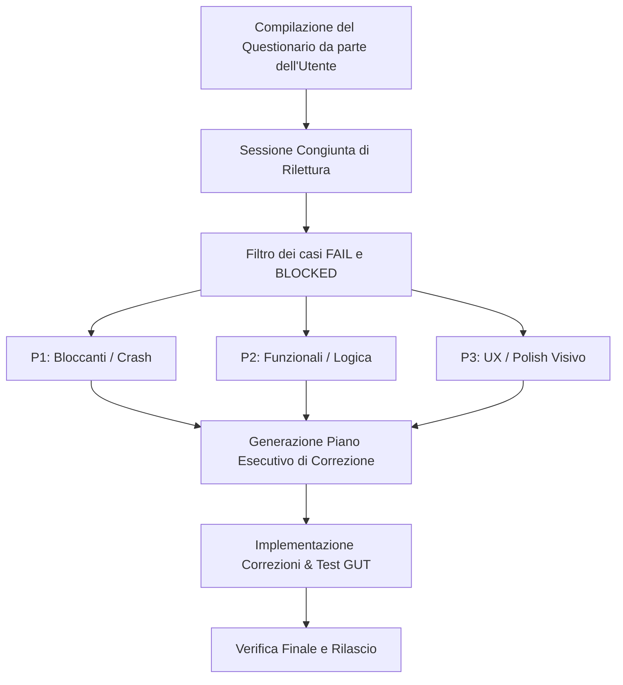

# DARK NOVA: ROGUE SQUADRON
## Manual Test Plan & Questionario di Collaudo Operativo
**Documento di Valutazione e Collaudo Funzionale Step-by-Step**  
*File di Lavoro per il Tester / Pilota di Collaudo*

---

### Indice Generale
1. [Istruzioni Operative & Cruscotto Riassuntivo](#1-istruzioni-operative--cruscotto-riassuntivo)
2. [Cluster 1 — Boot, Impostazioni & Navigazione](#2-cluster-1--boot-impostazioni--navigazione)
   - 2.1 [Lobby & Selezione Sistema/Nave (LobbyApp)](#21-lobby--selezione-sistemanave-lobbyapp)
   - 2.2 [Impostazioni & Controlli/Periferiche (Settings Window)](#22-impostazioni--controlliperiferiche-settings-window)
   - 2.3 [Flight Control & Cruise Drive (FlightControlApp)](#23-flight-control--cruise-drive-flightcontrolapp)
   - 2.4 [System Map & Visuale Orbitale (SystemMapApp)](#24-system-map--visuale-orbitale-systemmapapp)
   - 2.5 [Pod Info, Allarme Condition Red & Feedback Sensoriali (PodInfoApp)](#25-pod-info-allarme-condition-red--feedback-sensoriali-podinfoapp)
3. [Cluster 2 — Sistemi Tattici, Armeria & Difesa](#3-cluster-2--sistemi-tattici-armeria--difesa)
   - 3.1 [Weapons & HUD Traiettoria Balistica (WeaponsApp)](#31-weapons--hud-traiettoria-balistica-weaponsapp)
   - 3.2 [Shield Matrix & Deflettori (ShieldMatrixApp)](#32-shield-matrix--deflettori-shieldmatrixapp)
   - 3.3 [Sensors 3D & Meteo Alert (SensorsApp)](#33-sensors-3d--meteo-alert-sensorsapp)
   - 3.4 [Cams & Feed Ottici Esterni (CamsApp)](#34-cams--feed-ottici-esterni-camsapp)
4. [Cluster 3 — Ingegneria, Risorse & Droni](#4-cluster-3--ingegneria-risorse--droni)
   - 4.1 [Power Grid & Reattore (PowerGridApp)](#41-power-grid--reattore-powergridapp)
   - 4.2 [Life Support & Sopravvivenza (LifeSupportApp)](#42-life-support--sopravvivenza-lifesupportapp)
   - 4.3 [Diagnostics & Log Danni/Cyber (DiagnosticsApp)](#43-diagnostics--log-dannicyber-diagnosticsapp)
   - 4.4 [Duct Drone & Riparazioni Interne (DuctDroneApp)](#44-duct-drone--riparazioni-interne-ductdroneapp)
   - 4.5 [Service Drone & Recupero Cargo/Minerali (ServiceDroneApp)](#45-service-drone--recupero-cargominerali-servicedroneapp)
5. [Cluster 4 — Telecomunicazioni, Cyber-Guerra & Console](#5-cluster-4--telecomunicazioni-cyber-guerra--console)
   - 5.1 [Comms & Telecomunicazioni (CommsApp)](#51-comms--telecomunicazioni-commsapp)
   - 5.2 [Hack Exploits & EW Remota (HackExploitsApp)](#52-hack-exploits--ew-remota-hackexploitsapp)
   - 5.3 [Terminal CLI & Scripting .DAT (TerminalApp)](#53-terminal-cli--scripting-dat-terminalapp)
   - 5.4 [Logbook & Registro Missioni (LogbookApp)](#54-logbook--registro-missioni-logbookapp)
6. [Cluster 5 — Economia, Commercio & Generatori](#6-cluster-5--economia-commercio--generatori)
   - 6.1 [Flux Wallet & Rating Creditizio (FluxWalletApp)](#61-flux-wallet--rating-creditizio-fluxwalletapp)
   - 6.2 [Cargo Bay & Stiva Merci (CargoBayApp)](#62-cargo-bay--stiva-merci-cargobayapp)
   - 6.3 [Station Hub & Servizi Portuali X4 (StationHubApp)](#63-station-hub--servizi-portuali-x4-stationhubapp)
   - 6.4 [System Discover & Generazione Procedurale (SystemDiscoverApp)](#64-system-discover--generazione-procedurale-systemdiscoverapp)
   - 6.5 [Ship Builder & Progettazione Scafo (ShipBuilderApp)](#65-ship-builder--progettazione-scafo-shipbuilderapp)
7. [Protocollo di Triage & Revisione Congiunta](#7-protocollo-di-triage--revisione-congiunta)

---

## 1. Istruzioni Operative & Cruscotto Riassuntivo

### Come Compilare il Questionario
1. **Avvio del Gioco**: Avviare *Dark Nova: Rogue Squadron* dall'editor di Godot (`F5`) oppure tramite build standalone (`builds/linux/` o `builds/windows/`).
2. **Esecuzione Modulare**: Puoi testare le applicazioni nell'ordine che preferisci. Non è obbligatorio completare l'intera sessione sequenziale; ciascuna scheda applicativa contiene i prerequisiti necessari per essere testata autonomamente.
3. **Spunta dell'Esito**:
   - `[x] PASS`: La funzionalità si comporta esattamente come descritto nei risultati attesi.
   - `[x] FAIL`: La funzionalità produce un errore, un comportamento errato o un crash.
   - `[x] BLOCKED`: Il test non può essere eseguito a causa di un problema a monte (es. finestra che non si apre o dipendenza bloccata).
4. **Campo Note**: Riporta qualsiasi anomalia, glitch visivo, calo di framerate, attrito di usabilità o impressione di game design nello spazio dedicato.
5. **Rilettura Finale**: Una volta compilato il questionario, salveremo il file e analizzeremo insieme i punti contrassegnati con `FAIL` o `BLOCKED` per formulare il piano di correzione.

### Cruscotto Riassuntivo di Avanzamento
| ID | Applicazione / Finestra | Cluster | Test Totali | Esito Complessivo | Note Sintetiche |
|---|---|---|:---:|:---:|---|
| APP-01 | Lobby & Selezione Sistema/Nave | 1: Boot & Volo | 3 | `[ ] PASS / [ ] FAIL` | |
| APP-02 | Impostazioni & Controlli/Periferiche | 1: Boot & Volo | 3 | `[ ] PASS / [ ] FAIL` | |
| APP-03 | Flight Control & Cruise Drive | 1: Boot & Volo | 4 | `[ ] PASS / [ ] FAIL` | |
| APP-04 | System Map & Visuale Orbitale | 1: Boot & Volo | 3 | `[ ] PASS / [ ] FAIL` | |
| APP-05 | Pod Info & Allarme Condition Red | 1: Boot & Volo | 4 | `[ ] PASS / [ ] FAIL` | |
| APP-06 | Weapons & HUD Balistica Newtoniana | 2: Tattica & Difesa | 4 | `[ ] PASS / [ ] FAIL` | |
| APP-07 | Shield Matrix & Deflettori | 2: Tattica & Difesa | 3 | `[ ] PASS / [ ] FAIL` | |
| APP-08 | Sensors 3D & Meteo Alert | 2: Tattica & Difesa | 4 | `[ ] PASS / [ ] FAIL` | |
| APP-09 | Cams & Feed Ottici Esterni | 2: Tattica & Difesa | 3 | `[ ] PASS / [ ] FAIL` | |
| APP-10 | Power Grid & Reattore | 3: Ingegneria & Droni | 4 | `[ ] PASS / [ ] FAIL` | |
| APP-11 | Life Support & Sopravvivenza | 3: Ingegneria & Droni | 3 | `[ ] PASS / [ ] FAIL` | |
| APP-12 | Diagnostics & Log Danni/Cyber | 3: Ingegneria & Droni | 3 | `[ ] PASS / [ ] FAIL` | |
| APP-13 | Duct Drone & Riparazioni Interne | 3: Ingegneria & Droni | 3 | `[ ] PASS / [ ] FAIL` | |
| APP-14 | Service Drone & Scavenging/Minerali | 3: Ingegneria & Droni | 4 | `[ ] PASS / [ ] FAIL` | |
| APP-15 | Comms & Telecomunicazioni | 4: Telecom & Cyber | 4 | `[ ] PASS / [ ] FAIL` | |
| APP-16 | Hack Exploits & EW Remota | 4: Telecom & Cyber | 3 | `[ ] PASS / [ ] FAIL` | |
| APP-17 | Terminal CLI & Scripting .DAT | 4: Telecom & Cyber | 4 | `[ ] PASS / [ ] FAIL` | |
| APP-18 | Logbook & Registro Missioni | 4: Telecom & Cyber | 3 | `[ ] PASS / [ ] FAIL` | |
| APP-19 | Flux Wallet & Rating Creditizio | 5: Economia & Hub | 3 | `[ ] PASS / [ ] FAIL` | |
| APP-20 | Cargo Bay & Stiva Merci | 5: Economia & Hub | 3 | `[ ] PASS / [ ] FAIL` | |
| APP-21 | Station Hub & Servizi Portuali X4 | 5: Economia & Hub | 5 | `[ ] PASS / [ ] FAIL` | |
| APP-22 | System Discover & Generazione Procedurale | 5: Economia & Hub | 3 | `[ ] PASS / [ ] FAIL` | |
| APP-23 | Ship Builder & Progettazione Scafo | 5: Economia & Hub | 3 | `[ ] PASS / [ ] FAIL` | |

---

## 2. Cluster 1 — Boot, Impostazioni & Navigazione

### 2.1 Lobby & Selezione Sistema/Nave (LobbyApp)
*Percorso*: Desktop GodotOS -> Icona `Lobby` oppure Menu Start -> `Lobby`

#### TC-LOBBY-01: Selezione Modalità di Avvio (Solo / Host / Join)
- **Prerequisiti**: Gioco avviato sulla schermata desktop GodotOS.
- **Passi Operativi**:
  1. Aprire l'applicazione `Lobby` dal desktop.
  2. Verificare che siano visibili le 3 opzioni operative: `Solo Mode`, `Host Server`, `Join Server`.
  3. Cliccare su `Solo Mode`.
- **Risultato Atteso**: Il pulsante attiva la configurazione locale immediata disabilitando le opzioni di rete non necessarie; il selettore del ruolo assegna automaticamente pieni permessi operativi (`SOLO MODE`).
- [X] PASS  - [ ] FAIL  - [ ] BLOCKED  
**Note / Anomalie Riscontrate**: 
- GodotOS si avvia in modalità red alert, perché la nave parte con dei danni. L'utente non è ancora "connesso alla nave" prima di entrare nella lobby perciò è diegeticamente incorretto.
- Necessario un simbolo che indichi che si è connessi/sconnessi sulla barra in basso adiacente alla informazinoni di podinfo

#### TC-LOBBY-02: Scelta Sistema Stellare e Blueprint Nave
- **Prerequisiti**: Modalità Solo o Host attiva in `Lobby`.
- **Passi Operativi**:
  1. Cliccare sul menu a tendina o elenco dei Sistemi Stellari.
  2. Verificare la presenza del sistema di default (`Epsilon Eridani` o `DefaultSystem`) e degli eventuali sistemi procedurali salvati tramite `System Discover`.
  3. Cliccare sull'elenco Blueprint della Nave e selezionare la corvetta standard (`Default Corvette` o blueprint custom).
- **Risultato Atteso**: Il sistema e la blueprint selezionati mostrano le caratteristiche sintetiche (massa, slot armi, corpi celesti presenti) senza errori o stringhe vuote.
- [ ] PASS  - [X] FAIL  - [ ] BLOCKED  
**Note / Anomalie Riscontrate**: 
- Epsilon eridani non presente, c'è solo Helios nova system (default)

#### TC-LOBBY-03: Avvio Missione e Connessione Pod
- **Prerequisiti**: Sistema e nave selezionati in `Lobby`.
- **Passi Operativi**:
  1. Premere il pulsante `Avvia Partita` / `Launch Mission`.
  2. Osservare la transizione visiva verso lo spazio di gioco.
- **Risultato Atteso**: La finestra di Lobby si chiude o minimizza; la corvetta si genera nello spazio di simulazione ancorata alla Baia 0 della stazione primaria; tutte le applicazioni di bordo nella barra delle applicazioni risultano sincronizzate.
- [ ] PASS  - [X] FAIL  - [ ] BLOCKED  
**Note / Anomalie Riscontrate**: 
- Lobby rimane aperto dopo l'avvio della missione, i programmi ed il drive vengono caricati regolarmente i programmi in start ship drive sul desktop, non è possibile vedere l'apparizione della nave perché non c'è una visuale sullo spazio

---

### 2.2 Impostazioni & Controlli/Periferiche (Settings Window)
*Percorso*: Menu Start -> `Impostazioni` / `Settings`

#### TC-SETTINGS-01: Rilevamento Hotplug Gamepad e Cloche HOTAS
- **Prerequisiti**: Finestra `Settings` aperta. Almeno un gamepad o joystick USB/Bluetooth collegato al PC.
- **Passi Operativi**:
  1. Selezionare la scheda `Controlli & Periferiche` / `Input Settings`.
  2. Osservare l'elenco `Dispositivi Connessi`.
  3. Muovere le levette o gli assi della cloche.
- **Risultato Atteso**: Il dispositivo viene riconosciuto con il suo nome reale (`Input.get_connected_joypads()`); gli indicatori grafici degli assi (Pitch, Yaw, Roll, Throttle) oscillano in tempo reale rispondendo al movimento fisico.
- [ ] PASS  - [ ] FAIL  - [ ] BLOCKED  
**Note / Anomalie Riscontrate**: 

#### TC-SETTINGS-02: Calibrazione Deadzone e Sensibilità
- **Prerequisiti**: Scheda `Controlli & Periferiche` aperta.
- **Passi Operativi**:
  1. Spostare lo slider `Deadzone Asse Volo` da `0.05` a `0.20`.
  2. Modificare lo slider `Sensibilità` su `1.5x`.
  3. Rilasciare la levetta in posizione centrale e verificare che l'indicatore di output resti perfettamente a zero (nessun drift involontario).
- **Risultato Atteso**: I valori numerici e le barre di calibrazione si aggiornano istantaneamente; i piccoli movimenti entro il 20% vengono ignorati.
- [ ] PASS  - [ ] FAIL  - [ ] BLOCKED  
**Note / Anomalie Riscontrate**: 

#### TC-SETTINGS-03: Rimappatura Tasti e Persistenza su File
- **Prerequisiti**: Scheda `Controlli` aperta.
- **Passi Operativi**:
  1. Cliccare sul pulsante di rimappatura per `Spara Arma Primaria` o `Accellera Avanti`.
  2. Premere un tasto alternativo (es. tasto `F` o pulsante 1 del gamepad).
  3. Chiudere e riaprire la finestra `Settings` (oppure riavviare il gioco).
- **Risultato Atteso**: Il nuovo tasto rimane salvato; la configurazione persiste su `user://input_config.json` e il comando risponde immediatamente al nuovo binding.
- [ ] PASS  - [ ] FAIL  - [ ] BLOCKED  
**Note / Anomalie Riscontrate**: 

---

### 2.3 Flight Control & Cruise Drive (FlightControlApp)
*Percorso*: Desktop -> Icona `Flight Control`

#### TC-FLIGHT-01: Blocco Propulsori a Nave Attraccata (Docked Safety)
- **Prerequisiti**: Nave appena spawnata all'avvio sessione (attraccata alla stazione).
- **Passi Operativi**:
  1. Aprire l'applicazione `Flight Control`.
  2. Verificare l'indicatore di stato motori: deve indicare `ORMEGGI BLOCCATI / DOCKED`.
  3. Provare a premere i comandi di spinta (`W`, `S`, frecce direzionali o stick).
- **Risultato Atteso**: La corvetta rimane immobile; la velocità lineare resta `0.0 m/s`; compare l'avviso diegetico che la nave è ancorata alla baia e richiede l'undock prima di poter manovrare.
- [ ] PASS  - [X] FAIL  - [ ] BLOCKED  
**Note / Anomalie Riscontrate**: 
- Non viene visualizzato l'avviso "ormeggi bloccati/docked" il resto funziona regolarmente

#### TC-FLIGHT-02: Manovra Sub-Luce e Disattivazione Inerziale (Flight Assist)
- **Prerequisiti**: Nave disattraccata nello spazio aperto (`request_undock()` eseguito da StationHub).
- **Passi Operativi**:
  1. Dare spinta in avanti (`W` o asse stick) fino a raggiungere 20 m/s.
  2. Rilasciare la spinta e verificare la stabilizzazione automatica (Flight Assist attivo).
  3. Premere il tasto o toggle `Flight Assist: OFF` (volo inerziale puro).
  4. Ruotare la prua di 90° lateralmente.
- **Risultato Atteso**: Con Flight Assist attivo la corvetta frena e si stabilizza; con Flight Assist disattivato la nave conserva il vettore di traslazione originale continuando a muoversi nella direzione iniziale mentre la prua guarda altrove (inerzia newtoniana hard sci-fi).
- [ ] PASS  - [ ] FAIL  - [ ] BLOCKED  
**Note / Anomalie Riscontrate**: 

#### TC-FLIGHT-03: Sequenza di Warmup Cruise Drive a 160 MW
- **Prerequisiti**: Nave nello spazio aperto a velocità $< 5.0\text{ m/s}$ e potenza reattore $> 160\text{ MW}$ in PowerGrid.
- **Passi Operativi**:
  1. In `Flight Control`, premere il pulsante `Engage Cruise` / `Velocità di Crociera`.
  2. Osservare la barra di caricamento warmup per la durata di 4.0 secondi.
  3. Durante il warmup, osservare l'allineamento prua e lo stato dei generatori.
- **Risultato Atteso**: Lo stato passa a `WARMUP (4.0s)`; la barra avanza progressivamente; al completamento dei 4.0 secondi la velocità della corvetta sale rapidamente fino a $160\text{ m/s}$ (moltiplicatore 8.0x) e gli attuatori RCS manuali vengono vincolati (rotta bloccata).
- [X] PASS  - [ ] FAIL  - [ ] BLOCKED  
**Note / Anomalie Riscontrate**: 
- Allineamento prua non necessario
- I G che i giocatori devono subire sono solo dati dalle rotazioni sull'asse delle X sennò diventa ingiocabile.

#### TC-FLIGHT-04: Proximity Drop d'Emergenza con Picco -5.8G
- **Prerequisiti**: Nave in volo di crociera attivo a $160\text{ m/s}$.
- **Passi Operativi**:
  1. Dirigere la rotta verso un asteroide solido, stazione o relitto distante.
  2. Lasciare che la distanza dall'ostacolo scenda sotto la soglia di sicurezza di $250\text{ metri}$.
  3. Non toccare i comandi manuali di disingaggio.
- **Risultato Atteso**: Il radar di prossimità innesca l'arresto d'emergenza automatico:
  - La velocità crolla bruscamente da $160\text{ m/s}$ a $\le 20\text{ m/s}$.
  - La telemetria della forza G segna un picco negativo estremo ($\approx -5.8\text{ G}$).
  - I motori subiscono una penalità termica immediata ($+60^\circ\text{C}$).
  - Entra in vigore un cooldown di sicurezza di 6.0 secondi prima del possibile riavvio.
- [X] PASS  - [ ] FAIL  - [ ] BLOCKED  
**Note / Anomalie Riscontrate**: 
- I cooldown quando si ferma manualmente che quando c'è la fermata di emergenza della velocità di crocera non si aggiornano lasciano scritto 3s e 6s senza aggiornarsi

---

### 2.4 System Map & Visuale Orbitale (SystemMapApp)
*Percorso*: Desktop -> Icona `System Map`

#### TC-MAP-01: Rendering Tridimensionale Orbitale del Sistema
- **Prerequisiti**: Sessione attiva in uno spazio stellare con stella, pianeti e lune.
- **Passi Operativi**:
  1. Aprire `System Map`.
  2. Trascinare con il mouse per ruotare la visuale attorno al centro focale.
  3. Utilizzare la rotella del mouse per eseguire lo zoom in e lo zoom out.
- **Risultato Atteso**: La mappa renderizza la stella centrale, le orbite dei pianeti con le rispettive lune, la posizione attuale della corvetta (`Player Ship`) e i marker delle stazioni spaziali.
- [ ] PASS  - [ ] FAIL  - [ ] BLOCKED  
**Note / Anomalie Riscontrate**: 

#### TC-MAP-02: Visualizzazione Quote Verticali e Altitudine 3D
- **Prerequisiti**: Finestra `System Map` aperta in un sistema generato con quote $Y \neq 0$.
- **Passi Operativi**:
  1. Ruotare la visuale lateralmente per visualizzare l'inclinazione rispetto al piano dell'eclittica.
  2. Selezionare una stazione spaziale o un punto d'interesse avente quota verticale (es. $+450\text{m}$ o $-800\text{m}$).
- **Risultato Atteso**: I corpi celesti e i punti d'interesse mostrano linee di caduta o steli verticali verso il piano di riferimento, visualizzando chiaramente l'elevazione $\Delta Y$ rispetto all'eclittica.
- [ ] PASS  - [ ] FAIL  - [ ] BLOCKED  
**Note / Anomalie Riscontrate**: 

#### TC-MAP-03: Tracciamento Rotta e Assegnazione Waypoint di Navigazione
- **Prerequisiti**: `System Map` aperta in navigazione libera.
- **Passi Operativi**:
  1. Cliccare su un pianeta o una stazione distante.
  2. Premere il pulsante `Imposta come Waypoint` / `Set Target Waypoint`.
  3. Aprire `Flight Control` o `Sensors`.
- **Risultato Atteso**: Il target viene contrassegnato con un anello di selezione evidenziato; il vettore waypoint viene trasmesso a `Flight Control` (che calcola l'angolo di allineamento prua) e a `SensorsApp`.
- [ ] PASS  - [ ] FAIL  - [ ] BLOCKED  
**Note / Anomalie Riscontrate**: 

---

### 2.5 Pod Info, Allarme Condition Red & Feedback Sensoriali (PodInfoApp)
*Percorso*: Tray di Sistema (in basso a destra) -> `Pod Info` o icona stato equipaggio

#### TC-POD-01: Monitoraggio Biometrico (Battito Cardiaco, Stress e Ossigeno)
- **Prerequisiti**: Nave in condizioni nominali attraccata o in quiete.
- **Passi Operativi**:
  1. Aprire la finestra `Pod Info`.
  2. Verificare i grafici e gli indicatori dei parametri vitali: `Heart Rate (BPM)`, `Stress Level`, `O2 Pod Saturation`.
  3. Attendere 10 secondi e osservare la frequenza dell'elettrocardiogramma (ECG).
- **Risultato Atteso**: I parametri nominali mostrano un battito a riposo compreso tra $65$ e $75\text{ BPM}$, livello di stress basso ($< 0.15$) e saturazione ossigeno al $100\%$.
- [ ] PASS  - [ ] FAIL  - [ ] BLOCKED  
**Note / Anomalie Riscontrate**: 

#### TC-POD-02: Attivazione Automatica Condition Red (Brecce o Allarmi Critici)
- **Prerequisiti**: Pod Info aperto. Provocare un danno da breccia (tramite scontro con asteroide o attacco nemico) oppure far scendere gli scudi sotto il 20%.
- **Passi Operativi**:
  1. Osservare il cambio di stato dell'allerta generale nave.
  2. Verificare l'indicatore di allarme in Pod Info: transizione da `CONDITION GREEN` a `CONDITION RED`.
  3. Ascoltare l'audio e osservare l'interfaccia.
- **Risultato Atteso**: Lo sfondo del pod emette un'illuminazione d'emergenza soffusa rossa; risuona la sirena diegetica d'allarme; la barra di stress dell'occupante del pod balza rapidamente a valori superiori a $0.60$.
- [ ] PASS  - [ ] FAIL  - [ ] BLOCKED  
**Note / Anomalie Riscontrate**: 

#### TC-POD-03: Screen Shake e Spinta G Negativa (Reazione al Proximity Drop)
- **Prerequisiti**: Pod Info visibile a schermo durante un Proximity Drop d'emergenza da velocità di crociera.
- **Passi Operativi**:
  1. Subire un Proximity Drop contro un ostacolo (vedi test `TC-FLIGHT-04`).
  2. Osservare il tremolio dell'interfaccia e i parametri biometrici del pod nel secondo successivo all'impatto.
- **Risultato Atteso**: Si avverte un violento scuotimento dello schermo (intensità $\approx 22.0$); il battito cardiaco schizza istantaneamente a oltre $115\text{--}130\text{ BPM}$; compare un bagliore transitorio di Redout negativo dovuto al picco di $-5.8\text{ G}$.
- [ ] PASS  - [ ] FAIL  - [ ] BLOCKED  
**Note / Anomalie Riscontrate**: 

#### TC-POD-04: Feedback Sonori Interni (Boati, Brecce e Cortocircuiti)
- **Prerequisiti**: Pod Info attivo con cuffie o altoparlanti accesi.
- **Passi Operativi**:
  1. Subire un colpo balistico o un danno da corto circuito del reattore.
  2. Valutare il feedback sonoro diegetico percepito dall'interno del pod.
- **Risultato Atteso**: I suoni esterni risultano ovattati dalla struttura dello scafo; si percepiscono distintamente vibrazioni metalliche cupe, sibili di decompressione pressurizzata in caso di breccia e crepitii elettrici in caso di guasto a giunzioni adiacenti.
- [ ] PASS  - [ ] FAIL  - [ ] BLOCKED  
**Note / Anomalie Riscontrate**: 

---

## 3. Cluster 2 — Sistemi Tattici, Armeria & Difesa

### 3.1 Weapons & HUD Traiettoria Balistica (WeaponsApp)
*Percorso*: Desktop -> Icona `Weapons`

#### TC-WEAPONS-01: Somma Vettoriale Galileiana del Movimento Nave
- **Prerequisiti**: Corvetta disattraccata nello spazio aperto.
- **Passi Operativi**:
  1. Aprire l'applicazione `Weapons`.
  2. Portare la corvetta a velocità $20\text{ m/s}$ in moto rettilineo in avanti verso una coordinata fissa.
  3. Sparare un colpo con la torretta principale orientata in avanti (lungo il vettore di moto).
  4. Ruotare la torretta di 180° e sparare un colpo all'indietro (opposto al vettore di moto).
- **Risultato Atteso**: Il proiettile sparato in avanti viaggia alla velocità di volata nominale **più** la velocità della nave ($v_{proj} = 100 + 20 = 120\text{ m/s}$); il proiettile sparato all'indietro viaggia alla velocità di volata **meno** la velocità della nave ($v_{proj} = 100 - 20 = 80\text{ m/s}$).
- [ ] PASS  - [ ] FAIL  - [ ] BLOCKED  
**Note / Anomalie Riscontrate**: 

#### TC-WEAPONS-02: Calcolo del Danno Cinetico Relativo (Head-On vs Tail-Chase)
- **Prerequisiti**: Bersaglio nemico o asteroide presente nel settore.
- **Passi Operativi**:
  1. Ingaggiare un bersaglio frontale mentre entrambe le navi accelerano l'una verso l'altra ad alta velocità di chiusura.
  2. Valutare l'entità del danno numerico inflitto registrato nel log di impatto.
  3. Ingaggiare lo stesso bersaglio mentre la corvetta insegue il nemico che fugge nella stessa direzione (velocità relativa ridotta).
- **Risultato Atteso**: L'impatto frontale ad alta velocità relativa moltiplica il danno base ($1.5\text{x--}2.2\text{x}$ per via dell'energia cinetica galileiana $\frac{|\vec{v}_{rel}|}{v_{muzzle}}$); l'inseguimento in coda con velocità concorde riduce sensibilmente il danno inflitto ($0.4\text{x--}0.7\text{x}$).
- [ ] PASS  - [ ] FAIL  - [ ] BLOCKED  
**Note / Anomalie Riscontrate**: 

#### TC-WEAPONS-03: Lead Indicator Predittivo su Moto Relativo
- **Prerequisiti**: Nave giocatrice e bersaglio nemico entrambi in moto traslatorio.
- **Passi Operativi**:
  1. Selezionare e agganciare il caccia nemico con il mirino di `WeaponsApp`.
  2. Osservare la posizione del reticolo predittivo circolare (Lead Indicator).
  3. Eseguire uno strafe laterale con la corvetta a velocità costante mantenendo la nave nemica in traiettoria parallela.
- **Risultato Atteso**: Poiché la velocità laterale relativa è nulla quando entrambe le navi traslano alla stessa andatura nella stessa direzione, il mirino predittivo rimane perfettamente centrato sul bersaglio senza produrre false deviazioni laterali derivanti dal moto assoluto.
- [ ] PASS  - [ ] FAIL  - [ ] BLOCKED  
**Note / Anomalie Riscontrate**: 

#### TC-WEAPONS-04: Telemetria Balistica HUD (Velocità Radiale Δv e Fattore Impatto)
- **Prerequisiti**: HUD Traiettoria aperto e bersaglio agganciato.
- **Passi Operativi**:
  1. Osservare i badge numerici nell'angolo dell'HUD del mirino: `Δv (Closing Speed)` e `IMP. PWR: %`.
  2. Variare la velocità della corvetta avvicinandosi o allontanandosi dal bersaglio.
- **Risultato Atteso**: La velocità di chiusura diegetica visualizza il valore in tempo reale (es. `Δv: +45 m/s` in avvicinamento o `-30 m/s` in allontanamento); la stima di potenza cinetica riporta la percentuale corrispondente (es. `IMP. PWR: 145%`).
- [ ] PASS  - [ ] FAIL  - [ ] BLOCKED  
**Note / Anomalie Riscontrate**: 

---

### 3.2 Shield Matrix & Deflettori (ShieldMatrixApp)
*Percorso*: Desktop -> Icona `Shield Matrix`

#### TC-SHIELD-01: Bilanciamento Energetico dei 4 Quadranti (Fore, Aft, Port, Starboard)
- **Prerequisiti**: Applicazione `Shield Matrix` aperta con scudi carichi al 100%.
- **Passi Operativi**:
  1. Trascinare lo slider di allocazione energia sul quadrante frontale (`Fore`) portandolo al $60\%$.
  2. Verificare la compensazione automatica sui restanti 3 quadranti (`Aft`, `Port`, `Starboard`).
  3. Premere il pulsante `Distribuzione Equilibrata` / `Balance All`.
- **Risultato Atteso**: L'energia totale rispetta il limite massimo di $1000\text{ HP}$; i quadranti si ridistribuiscono armonicamente; il pulsante di bilanciamento ripristina istantaneamente il $25\%$ uniforme su ciascun lato.
- [ ] PASS  - [ ] FAIL  - [ ] BLOCKED  
**Note / Anomalie Riscontrate**: 

#### TC-SHIELD-02: Mitigazione Tempeste Solari CME con Deflettori Orientati
- **Prerequisiti**: Allerta meteo attiva per tempesta solare (`SOLAR_CME`) emessa da `SensorsApp`.
- **Passi Operativi**:
  1. Identificare la direzione del vettore solare visualizzato nel pannello.
  2. Orientare e rinforzare il quadrante deflettente rivolto verso la stella madre impostando un'allocazione $\ge 40\%$.
  3. Attivare il toggle `Sincronizzazione di Fase` / `Phase Sync`.
  4. Attendere il passaggio dell'ondata solare attiva.
- **Risultato Atteso**: L'energia dello scudo assorbe l'impatto della radiazione senza subire brecce allo scafo; compare la notifica telemetrica di avvenuta mitigazione; il badge di integrità scafo rimane intatto.
- [ ] PASS  - [ ] FAIL  - [ ] BLOCKED  
**Note / Anomalie Riscontrate**: 

#### TC-SHIELD-03: Sovraccarico e Ricarica di Emergenza
- **Prerequisiti**: Uno dei quadranti scudo scaricato a zero a causa di fuoco nemico.
- **Passi Operativi**:
  1. Premere il pulsante `Emergency Recharge` / `Ricarica Rapida`.
  2. Verificare l'assorbimento di potenza prelevato dalla rete in `PowerGridApp`.
- **Risultato Atteso**: Il quadrante collassato ripristina una carica minima del $30\%$ entro 3 secondi; la linea elettrica del vano scudi subisce un picco temporaneo di assorbimento di potenza con temporaneo innalzamento termico.
- [ ] PASS  - [ ] FAIL  - [ ] BLOCKED  
**Note / Anomalie Riscontrate**: 

---

### 3.3 Sensors 3D & Meteo Alert (SensorsApp)
*Percorso*: Desktop -> Icona `Sensors`

#### TC-SENSORS-01: Radar Volumetrico 3D e Distinzione IFF
- **Prerequisiti**: Nave nello spazio con asteroidi, stazioni e contatti nemici entro 1 km.
- **Passi Operativi**:
  1. Aprire l'applicazione `Sensors`.
  2. Osservare i contatti tracciati sullo schermo radar sferico.
  3. Verificare i colori IFF: contatti amichevoli/stazioni (verde/blu), ostili (rosso), relitti e carichi (giallo/arancione).
- **Risultato Atteso**: Tutti i contatti spaziali compaiono correttamente posizionati nello spazio tridimensionale con simboli IFF coerenti e quote altimetriche relative.
- [ ] PASS  - [ ] FAIL  - [ ] BLOCKED  
**Note / Anomalie Riscontrate**: 

#### TC-SENSORS-02: Impulso Energetico Ping Attivo (Portata 2000m)
- **Prerequisiti**: Applicazione `Sensors` aperta con reattore alimentato.
- **Passi Operativi**:
  1. Verificare che la portata standard dello scanner sia impostata a $1000\text{ m}$.
  2. Premere il pulsante `Active Ping` / `Impulso Sonar 2 km`.
  3. Osservare l'espansione dell'onda radar e l'indicatore di potenza.
- **Risultato Atteso**: L'anello radar si espande visivamente fino a $2000\text{ metri}$; eventuali bersagli distanti nascosti oltre 1 km vengono rilevati per 2 secondi; il consumo istantaneo sale a $120\text{ MW}$ prima di rientrare in cooldown.
- [ ] PASS  - [ ] FAIL  - [ ] BLOCKED  
**Note / Anomalie Riscontrate**: 

#### TC-SENSORS-03: Occlusione Line-of-Sight (LoS) e Lancio Sonda Probe
- **Prerequisiti**: Bersaglio nemico situato dietro un asteroide massiccio o una stazione.
- **Passi Operativi**:
  1. Posizionare la corvetta in modo che l'asteroide occluda la linea di vista diretta verso il bersaglio.
  2. Verificare che il contatto scompaia dallo sweep primario della nave.
  3. Lanciare una sonda (`Probe`) oltre l'ostacolo.
- **Risultato Atteso**: Il cono d'ombra dell'asteroide nasconde il contatto; non appena la sonda supera l'ostacolo, il contatto riappare sul display radar grazie al relay dati della sonda.
- [ ] PASS  - [ ] FAIL  - [ ] BLOCKED  
**Note / Anomalie Riscontrate**: 

#### TC-SENSORS-04: Banner Allerta Meteo Spaziale e Calcolo Cono d'Ombra
- **Prerequisiti**: Scatenare un evento meteo spaziale (`SOLAR_CME` o tempesta ionica).
- **Passi Operativi**:
  1. Osservare la comparsa del banner diegetico `WeatherAlertBanner` in cima alla finestra `Sensors`.
  2. Verificare il conto alla rovescia dell'onda in arrivo.
  3. Manovrare la nave posizionandola all'ombra geometrica di un asteroide o pianeta rispetto al vettore del sole.
- **Risultato Atteso**: Il banner visualizza la minaccia e il timer; non appena la nave entra nell'ombra dell'asteroide, l'indicatore di esposizione passa da `ESPOSTO (100%)` a `AL RIPARO (0%)` con indicazione della fonte del riparo.
- [ ] PASS  - [ ] FAIL  - [ ] BLOCKED  
**Note / Anomalie Riscontrate**: 

---

### 3.4 Cams & Feed Ottici Esterni (CamsApp)
*Percorso*: Desktop -> Icona `Cams`

#### TC-CAMS-01: Selezione Telecamere e Modalità di Visione (Normal / Thermal / LIDAR)
- **Prerequisiti**: Applicazione `Cams` aperta nello spazio aperto.
- **Passi Operativi**:
  1. Selezionare a turno le diverse telecamere perimetrali della nave: `Fore (Prua)`, `Aft (Poppa)`, `Port (Sinistra)`, `Starboard (Destra)`, `Dorsal (Tetto)`.
  2. Per ciascuna telecamera, alternare i filtri visivi: `Ottico Naturale`, `Spettro Termico IR`, `Mesh LIDAR`.
- **Risultato Atteso**: La finestra visualizza in tempo reale il feed ottico 3D corrispondente; il filtro termico evidenzia i motori caldi e i reattori in tinte arancioni; il filtro LIDAR proietta la griglia geometrica wireframe degli ostacoli.
- [ ] PASS  - [ ] FAIL  - [ ] BLOCKED  
**Note / Anomalie Riscontrate**: 

#### TC-CAMS-02: Controllo Faro Esterno e Zoom Digitale
- **Prerequisiti**: Finestra feed telecamera aperta in zona buia (es. ombra di un pianeta o relitto).
- **Passi Operativi**:
  1. Cliccare sul toggle `Headlight` / `Faro Esterno`.
  2. Utilizzare lo slider o i tasti di zoom digitale (da 1.0x a 4.0x) puntando un detrito fluttuante.
- **Risultato Atteso**: Il faretto proietta un fascio di luce conico illuminando le geometrie di fronte alla telecamera; lo zoom digitale ingrandisce il bersaglio mantenendo nitida la telemetria di distanza in sovrimpressione.
- [ ] PASS  - [ ] FAIL  - [ ] BLOCKED  
**Note / Anomalie Riscontrate**: 

#### TC-CAMS-03: Distorsione Ottica e Glitch da Cyber-Attacco o Danno
- **Prerequisiti**: Infezione da exploit nemico (`BLIND_EYE`) oppure allarme generale `CONDITION RED`.
- **Passi Operativi**:
  1. Monitorare la finestra feed telecamera durante un attacco di guerra elettronica nemico o in Condition Red.
  2. Verificare il banner di stato sulla barra del feed.
- **Risultato Atteso**: Il feed video presenta disturbi a linee orizzontali di scansione e rumore di statica; la barra superiore visualizza il badge giallo o rosso corrispondente (`⚠️ ALLARME: CONDITION RED`).
- [ ] PASS  - [ ] FAIL  - [ ] BLOCKED  
**Note / Anomalie Riscontrate**: 

---

## 4. Cluster 3 — Ingegneria, Risorse & Droni

### 4.1 Power Grid & Reattore (PowerGridApp)
*Percorso*: Desktop -> Icona `Power Grid`

#### TC-POWER-01: Accensione Reattore Principale e Monitoraggio Carico Globale
- **Prerequisiti**: Corvetta avviata. Finestra `Power Grid` aperta.
- **Passi Operativi**:
  1. Verificare lo stato del reattore primario (`Reactor Output MW`).
  2. Osservare la ripartizione dei consumi tra i compartimenti di bordo (Propulsione, Scudi, Supporto Vitale, Sensori, Armeria).
  3. Provare a variare la percentuale di output del generatore.
- **Risultato Atteso**: La potenza totale erogata e il carico aggregato rispondono in tempo reale; il diagramma a barre illustra chiaramente il margine di potenza residua disponibile prima del sovraccarico.
- [ ] PASS  - [ ] FAIL  - [ ] BLOCKED  
**Note / Anomalie Riscontrate**: 

#### TC-POWER-02: Gestione Breaker delle Stanze e Riorientamento Linee Elettriche
- **Prerequisiti**: `Power Grid` aperta in condizioni operative normali.
- **Passi Operativi**:
  1. Cliccare sull'interruttore/breaker di alimentazione di una stanza non vitale (es. vano ricreativo o sensori ausiliari).
  2. Osservare l'immediato calo di assorbimento e il messaggio di disalimentazione della stanza.
  3. Riattivare l'interruttore.
- **Risultato Atteso**: La stanza selezionata perde alimentazione spegnendo i dispositivi associati; la riattivazione ripristina la corrente senza innescare corto circuiti a catena se il reattore ha sufficiente margine MW.
- [ ] PASS  - [ ] FAIL  - [ ] BLOCKED  
**Note / Anomalie Riscontrate**: 

#### TC-POWER-03: Alimentazione Bobine di Crociera a 160 MW e Prevenzione Sovraccarico
- **Prerequisiti**: `Power Grid` aperta contemporaneamente all'avvio del Cruise Drive in `FlightControlApp`.
- **Passi Operativi**:
  1. Il pilota avvia il warmup del Cruise Drive (vedi test `TC-FLIGHT-03`).
  2. Monitorare il comparto propulsivo in `Power Grid` durante i 4.0 secondi di warmup.
  3. Verificare l'indicatore di assorbimento transitorio delle bobine (`cruise_coils_draw_mw = 160 MW`).
- **Risultato Atteso**: La richiesta energetica sale immediatamente di $160\text{ MW}$; se la potenza totale disponibile del reattore copre il fabbisogno, la linea regge il carico; se il carico supera la capacità del generatore, scattano i relè di sicurezza e la sequenza viene abortita.
- [ ] PASS  - [ ] FAIL  - [ ] BLOCKED  
**Note / Anomalie Riscontrate**: 

#### TC-POWER-04: Disattivazione Reattore e Conseguenze su Sistemi Vitali / Aborto Cruise
- **Prerequisiti**: Nave durante la procedura di warmup Cruise Drive.
- **Passi Operativi**:
  1. Durante il secondo 2.0 del warmup, spegnere manualmente il reattore primario da `Power Grid`.
  2. Osservare la risposta su `Flight Control`, `Life Support` e `Sensors`.
- **Risultato Atteso**: Il Cruise Drive interrompe istantaneamente la sequenza ritornando a `IDLE` con notifica di caduta di tensione; `Life Support` attiva le batterie d'emergenza; i sensori radar passano a modalità offline.
- [ ] PASS  - [ ] FAIL  - [ ] BLOCKED  
**Note / Anomalie Riscontrate**: 

---

### 4.2 Life Support & Sopravvivenza (LifeSupportApp)
*Percorso*: Desktop -> Icona `Life Support`

#### TC-LIFE-01: Pressione Atmosferica, O2 e Ricarica con Ghiaccio (Water Ice Conversion)
- **Prerequisiti**: Stiva nave contenente almeno 1 blocco di ghiaccio minerale (`water_ice_block`).
- **Passi Operativi**:
  1. Aprire l'applicazione `Life Support`.
  2. Verificare i livelli di pressione barometrica ($1.00\text{ atm}$), percentuale O2 ($21.0\%$) e riserva idrica.
  3. Cliccare sul pulsante `Converti Ghiaccio Stiva` / `Convert Water Ice`.
- **Risultato Atteso**: Il blocco di ghiaccio viene prelevato dalla stiva merci; le riserve idriche e di elettrolisi ossigeno aumentano corrispondentemente; compare la notifica di avvenuto rifornimento diegetico.
- [ ] PASS  - [ ] FAIL  - [ ] BLOCKED  
**Note / Anomalie Riscontrate**: 

#### TC-LIFE-02: Risposta a Breccia nello Scafo e Depressurizzazione Vani
- **Prerequisiti**: Subire un impatto con breccia strutturale non sigillata in uno dei compartimenti della corvetta.
- **Passi Operativi**:
  1. Monitorare la console di `Life Support` non appena si apre una breccia nello scafo.
  2. Verificare la curva di pressione del compartimento interessato.
  3. Azionare il comando di sigillo delle paratie stagne del compartimento de-pressurizzato.
- **Risultato Atteso**: La pressione della stanza colpita crolla verso $0.0\text{ atm}$; l'ossigeno viene espulso nel vuoto; il sigillo delle paratie isola la stanza impedendo la depressurizzazione a catena del resto della nave.
- [ ] PASS  - [ ] FAIL  - [ ] BLOCKED  
**Note / Anomalie Riscontrate**: 

#### TC-LIFE-03: Regolazione Termica e Sovraccarico Condotti
- **Prerequisiti**: Nave sottoposta a forte surriscaldamento (dopo un Proximity Drop $+60^\circ\text{C}$ o esposizione a tempesta solare).
- **Passi Operativi**:
  1. Osservare i gradienti termici ambientali mostrati su `Life Support`.
  2. Impostare i refrigeratori a ciclo chiuso al massimo regime.
- **Risultato Atteso**: La temperatura interna dei vani viene progressivamente smorzata tornando verso i $21^\circ\text{C}$ nominali; la barra di efficienza energetica riflette l'aumento temporaneo di carico sui radiatori.
- [ ] PASS  - [ ] FAIL  - [ ] BLOCKED  
**Note / Anomalie Riscontrate**: 

---

### 4.3 Diagnostics & Log Danni/Cyber (DiagnosticsApp)
*Percorso*: Desktop -> Icona `Diagnostics`

#### TC-DIAG-01: Mappa Sinottica Danni Scafo e Integrità Compartimenti
- **Prerequisiti**: Corvetta che ha subito impatti balistici o danni da manovra.
- **Passi Operativi**:
  1. Aprire l'applicazione `Diagnostics`.
  2. Esaminare la sagoma vettoriale della corvetta divisa per compartimenti (Prua, Poppa, Fiancata Sinistra, Fiancata Destra, Ponte di Comando, Vano Motori).
  3. Cliccare su un'area evidenziata in arancione o rosso.
- **Risultato Atteso**: L'area danneggiata mostra i dettagli puntuali del guasto (tipologia danno: breccia, incendio, avaria condotti; percentuale integrità residua; coordinate interne per il Duct Drone).
- [ ] PASS  - [ ] FAIL  - [ ] BLOCKED  
**Note / Anomalie Riscontrate**: 

#### TC-DIAG-02: Rilevamento Intrusione Cyber Nemica e Banner Minaccia Active
- **Prerequisiti**: Attacco di guerra elettronica subito da un caccia nemico o corriere dati.
- **Passi Operativi**:
  1. Attendere l'iniezione di un file malware sentinella (`.dat`).
  2. Verificare il banner superiore di `Diagnostics`.
  3. Controllare il conto alla rovescia di detonazione logica del payload malevolo (es. 45 secondi).
- **Risultato Atteso**: Compare un banner rosso lampeggiante `⚠️ MINACCIA EW ATTIVA: [NOME EXPLOIT] DETONAZIONE TRA Xs`; viene indicato il file malevolo target da eliminare tramite Terminale o Ship Drive.
- [ ] PASS  - [ ] FAIL  - [ ] BLOCKED  
**Note / Anomalie Riscontrate**: 

#### TC-DIAG-03: Neutralizzazione Minacce e Sincronizzazione Log di Sistema
- **Prerequisiti**: Minaccia cyber attiva su `Diagnostics`.
- **Passi Operativi**:
  1. Eliminare il file malevolo corrispondente (tramite `rm` da Terminale o da Ship Drive).
  2. Tornare su `Diagnostics` e osservare l'aggiornamento.
- **Risultato Atteso**: Il banner rosso scompare immediatamente; compare la voce verde di avvenuta neutralizzazione nel log diagnostico cronologico; le anomalie ai sistemi correlate cessano istantaneamente.
- [ ] PASS  - [ ] FAIL  - [ ] BLOCKED  
**Note / Anomalie Riscontrate**: 

---

### 4.4 Duct Drone & Riparazioni Interne (DuctDroneApp)
*Percorso*: Desktop -> Icona `Duct Drone`

#### TC-DUCT-01: Spiegamento Drone nei Condotti di Manutenzione Interni
- **Prerequisiti**: Applicazione `Duct Drone` aperta. Almeno un danno interno presente nella corvetta.
- **Passi Operativi**:
  1. Cliccare su `Lancia Drone` / `Deploy Duct Drone`.
  2. Verificare il passaggio visivo alla telecamera in prima persona all'interno delle condutture tecniche della nave.
  3. Verificare i controlli di movimento (`W`, `A`, `S`, `D`, rotazione mouse).
- **Risultato Atteso**: Il drone si sgancia dalla stazione di ricarica; la visuale mostra l'interno dei condotti con illuminazione a faretti; i comandi consentono una navigazione fluida nei cunicoli tecnici.
- [ ] PASS  - [ ] FAIL  - [ ] BLOCKED  
**Note / Anomalie Riscontrate**: 

#### TC-DUCT-02: Navigazione nei Cunicoli e Localizzazione Punti di Rottura
- **Prerequisiti**: Duct Drone in volo nei condotti.
- **Passi Operativi**:
  1. Seguire gli indicatori olografici di direzione sulla bussola interna verso la stanza danneggiata.
  2. Raggiungere la giunzione in corto circuito o la breccia interna.
- **Risultato Atteso**: Il punto di rottura emette particelle visibili (scintille elettriche, fumo o fiamme); compare l'indicatore di prossimità del guasto e la richiesta di interazione con gli attuatori.
- [ ] PASS  - [ ] FAIL  - [ ] BLOCKED  
**Note / Anomalie Riscontrate**: 

#### TC-DUCT-03: Saldatura Brecce ed Estinzione Incendi Giunzioni
- **Prerequisiti**: Duct Drone posizionato a meno di 1.5m dal punto danneggiato.
- **Passi Operativi**:
  1. Selezionare lo strumento opportuno (Saldatore ad arco per brecce o Estintore a schiuma dielettrica per incendi).
  2. Tenere premuto il tasto di riparazione fino al completamento della barra di progresso (100%).
  3. Verificare l'aggiornamento dello stato su `Diagnostics`.
- **Risultato Atteso**: Il danno visivo si dissolve; l'integrità del compartimento viene ripristinata; l'allarme generale della nave si aggiorna coerentemente.
- [ ] PASS  - [ ] FAIL  - [ ] BLOCKED  
**Note / Anomalie Riscontrate**: 

---

### 4.5 Service Drone & Recupero Cargo/Minerali (ServiceDroneApp)
*Percorso*: Desktop -> Icona `Service Drone`

#### TC-SRVDRONE-01: Lancio Drone Esterno e Controlli di Volo 3D
- **Prerequisiti**: Corvetta disattraccata nello spazio aperto. Finestra `Service Drone` aperta.
- **Passi Operativi**:
  1. Premere `Lancia Service Drone` / `Launch Service Drone`.
  2. Verificare lo sgancio del drone dalla baia ventrale esterna della nave madre.
  3. Manovrare il drone nei 6 gradi di libertà (avanti, traslazione laterale, quota verticale).
- **Risultato Atteso**: Il drone risponde ai comandi con fisica newtoniana dedicata; la telemetria mostra distanza dalla corvetta, carica della batteria e stato degli attuatori.
- [ ] PASS  - [ ] FAIL  - [ ] BLOCKED  
**Note / Anomalie Riscontrate**: 

#### TC-SRVDRONE-02: Arpione Magnetico e Traino Container Fluttuanti (Tow to Hatch)
- **Prerequisiti**: Service Drone in volo. Container cargo fluttuante presente nel raggio di 20 metri.
- **Passi Operativi**:
  1. Selezionare lo strumento magnetico (`magnet`).
  2. Puntare il container cargo e premere il tasto di aggancio arpione magnetico (`latch_cargo`).
  3. Verificare l'ancoraggio e manovrare trainando il container verso il portello cargo della corvetta (`CargoHatchArea3D`).
- **Risultato Atteso**: Il raggio magnetico blocca il container a distanza di traino; la spinta del drone risente realisticamente dell'inerzia della massa rimorchiata; giunto al portello cargo corvetta, il container viene stivato automaticamente e l'arpione si rilascia.
- [ ] PASS  - [ ] FAIL  - [ ] BLOCKED  
**Note / Anomalie Riscontrate**: 

#### TC-SRVDRONE-03: Recupero Frammenti Minerali da Asteroidi Frantumati
- **Prerequisiti**: Frammenti minerali 3D (`MineralDepositEntity`) fluttuanti nello spazio a seguito di mining balistico.
- **Passi Operativi**:
  1. Avvicinarsi a un frammento minerale fluttuante (es. durasteel, exocrystal o ghiaccio).
  2. Agganciarlo con l'arpione magnetico.
  3. Trasportarlo al portello cargo della nave.
- **Risultato Atteso**: Il frammento viene aspirato nella stiva (`intake_mineral_deposit`); compare la notifica di stivaggio risorsa in `CargoBayApp`.
- [ ] PASS  - [ ] FAIL  - [ ] BLOCKED  
**Note / Anomalie Riscontrate**: 

#### TC-SRVDRONE-04: Esaurimento Batteria, Sgancio d'Emergenza e Rientro alla Baia
- **Prerequisiti**: Service Drone in operazione prolungata con carico pesante rimorchiato.
- **Passi Operativi**:
  1. Osservare il consumo della batteria durante il traino (consumo scalato dalla massa).
  2. Lasciare che la batteria scenda sotto il $5\%$.
  3. Premere il comando di richiamo automatico (`Recall to Ship`).
- **Risultato Atteso**: Al raggiungimento della carica critica il drone effettua lo sgancio d'emergenza del carico per preservare i propulsori; rientra autonomamente alla baia di docking corvetta e si ricollega ai sistemi di ricarica.
- [ ] PASS  - [ ] FAIL  - [ ] BLOCKED  
**Note / Anomalie Riscontrate**: 

---

## 5. Cluster 4 — Telecomunicazioni, Cyber-Guerra & Console

### 5.1 Comms & Telecomunicazioni (CommsApp)
*Percorso*: Desktop -> Icona `Comms`

#### TC-COMMS-01: Sintonizzazione Frequenza e Puntamento Antenna Direzionale
- **Prerequisiti**: Corvetta nello spazio aperto con segnali radio presenti.
- **Passi Operativi**:
  1. Aprire l'applicazione `Comms`.
  2. Trascinare lo slider della frequenza verso una stazione o radiofaro noto.
  3. Ruotare la ghiera dell'azimut antenna direzionale (da 0° a 360°) fino ad allinearsi al rilevamento target.
- **Risultato Atteso**: Il rapporto segnale/rumore (SNR) sale visibilmente non appena l'antenna punta verso il contatto; superato il $75\%$ di potenza il segnale viene decodificato e il canale audio/dati si apre.
- [ ] PASS  - [ ] FAIL  - [ ] BLOCKED  
**Note / Anomalie Riscontrate**: 

#### TC-COMMS-02: Intercettazione Radiofaro Corriere S-Net (1920.0 MHz)
- **Prerequisiti**: Convoglio corriere dati S-Net presente nel sistema.
- **Passi Operativi**:
  1. Sintonizzare la frequenza radio esattamente su $1920.0\text{ MHz}$.
  2. Orientare l'antenna verso la provenienza del convoglio commerciale.
  3. Verificare l'acquisizione dell'identificativo `S-NET CARRIER BEACON`.
- **Risultato Atteso**: Il radiofaro cifrato viene agganciato; compare l'opzione di bridging dati con il `Target Drive` per l'intrusione informatica da parte dell'Hacker.
- [ ] PASS  - [ ] FAIL  - [ ] BLOCKED  
**Note / Anomalie Riscontrate**: 

#### TC-COMMS-03: Richiesta Attracco Stazione Spaziale via Telecomunicazioni
- **Prerequisiti**: Corvetta entro $1500\text{ metri}$ dalla stazione spaziale primaria.
- **Passi Operativi**:
  1. Sintonizzare la frequenza sulla banda portuale della stazione.
  2. Cliccare sul pulsante `Richiedi Vettore di Attracco` / `Request Docking Clearance`.
- **Risultato Atteso**: La stazione risponde concedendo l'autorizzazione di docking; viene assegnata una baia specifica (es. Baia 0); il pilota visualizza la traiettoria di avvicinamento autorizzata.
- [ ] PASS  - [ ] FAIL  - [ ] BLOCKED  
**Note / Anomalie Riscontrate**: 

#### TC-COMMS-04: Sintonizzazione Automatica Segnali SOS da File .DAT (auto_tune_sos)
- **Prerequisiti**: Configurazione `.dat` con parametro `auto_tune_sos = true` ricaricata.
- **Passi Operativi**:
  1. Entrare in un settore contenente un relitto con segnale di soccorso SOS attivo.
  2. Non toccare manualmente lo slider di frequenza.
- **Risultato Atteso**: L'applicazione `Comms` aggancia istantaneamente la frequenza di emergenza del relitto senza richiedere ricerca manuale; la bussola radio si orienta verso la sorgente di soccorso.
- [ ] PASS  - [ ] FAIL  - [ ] BLOCKED  
**Note / Anomalie Riscontrate**: 

---

### 5.2 Hack Exploits & EW Remota (HackExploitsApp)
*Percorso*: Desktop -> Icona `Hack Exploits`

#### TC-HACK-01: Scansione Segnali Nemici e Montaggio Target Drive
- **Prerequisiti**: Nave nemica o convoglio corriere agganciato via Comms o entro raggio sensori.
- **Passi Operativi**:
  1. Aprire l'applicazione `Hack Exploits`.
  2. Selezionare il bersaglio dall'elenco contatti violabili.
  3. Cliccare su `Stabilisci Link EW` / `Mount Target Drive`.
- **Risultato Atteso**: Viene stabilita una connessione wireless cifrata; lo `Ship Drive` monta l'unità remota `Target Drive/` rendendo esplorabile il filesystem del bersaglio.
- [ ] PASS  - [ ] FAIL  - [ ] BLOCKED  
**Note / Anomalie Riscontrate**: 

#### TC-HACK-02: Iniezione Exploit Sabotaggio (Thruster Overheat, Shield Drain)
- **Prerequisiti**: Target Drive montato su una nave ostile.
- **Passi Operativi**:
  1. Selezionare l'exploit di sabotaggio propulsori (`THRUSTER_OVERHEAT`) o drenaggio scudi (`SHIELD_DRAIN`).
  2. Premere `Inietta Payload` / `Execute Exploit`.
- **Risultato Atteso**: La barra di caricamento esegue l'exploit; la nave nemica subisce un'avaria immediata visibile (perdita degli scudi o propulsori bloccati in deroga di traiettoria).
- [ ] PASS  - [ ] FAIL  - [ ] BLOCKED  
**Note / Anomalie Riscontrate**: 

#### TC-HACK-03: Forzatura Espulsione Caveau Dati (dump_vault) da Corriere S-Net
- **Prerequisiti**: Corriere dati S-Net con cartella protetta `DataVault/` agganciato.
- **Passi Operativi**:
  1. Individuare la cartella blindata protetta da password nel Target Drive.
  2. Eseguire l'exploit speciale `dump_vault` tramite il pulsante apposito o da riga di comando.
  3. Verificare l'esterno della nave corriere tramite telecamere o sensori.
- **Risultato Atteso**: Il corriere subisce un override dei portelli stiva ed espelle nello spazio il container fisico con il nucleo quantistico (`snet_quantum_core`), pronto per essere recuperato con il Service Drone.
- [ ] PASS  - [ ] FAIL  - [ ] BLOCKED  
**Note / Anomalie Riscontrate**: 

---

### 5.3 Terminal CLI & Scripting .DAT (TerminalApp)
*Percorso*: Desktop -> Icona `Terminal`

#### TC-TERM-01: Navigazione Filesystem Diegetico (ls, cd, cat, pwd)
- **Prerequisiti**: Finestra `Terminal` aperta.
- **Passi Operativi**:
  1. Digitare `pwd` e verificare il percorso corrente.
  2. Digitare `ls` per visualizzare i drive montati (`Ship Drive/`, `Terminal Drive/`, ecc.).
  3. Digitare `cd "Ship Drive/Programs/Sensors"` e poi `ls`.
  4. Digitare `cat sensors_config.dat`.
- **Risultato Atteso**: Il terminale risponde stampando la gerarchia corretta delle cartelle e visualizzando i contenuti testuali dei file di configurazione senza errori di parsing.
- [ ] PASS  - [ ] FAIL  - [ ] BLOCKED  
**Note / Anomalie Riscontrate**: 

#### TC-TERM-02: Rimozione File Malevoli .DAT Iniettati dal Nemico (rm / delete)
- **Prerequisiti**: Infezione cyber attiva con file sentinella presente su disco (es. `Ship Drive/sentinel_worm.dat`).
- **Passi Operativi**:
  1. Digitare `ls "Ship Drive"` e individuare il file malevolo evidenziato con estensione `.dat`.
  2. Digitare il comando di cancellazione: `rm "Ship Drive/sentinel_worm.dat"`.
  3. Verificare l'avvenuta rimozione con `ls`.
- **Risultato Atteso**: Il comando elimina istantaneamente il file malevolo; `ShipDriveManager` emette il segnale di file cancellato; l'allarme cyber e il conto alla rovescia in `Diagnostics` si estinguono immediatamente.
- [ ] PASS  - [ ] FAIL  - [ ] BLOCKED  
**Note / Anomalie Riscontrate**: 

#### TC-TERM-03: Esecuzione Script Operativi ed Exploit via Console
- **Prerequisiti**: Terminale aperto con permessi Hacker o Solo Mode.
- **Passi Operativi**:
  1. Digitare `help` per consultare l'elenco dei comandi diegetici disponibili.
  2. Provare a lanciare un comando operativo (es. `scan`, `decrypt`, o `run dump_vault <key>`).
- **Risultato Atteso**: Il terminale accetta argomenti posizionali e flag; esegue l'operazione richiesta fornendo output a video con codice di stato diegetico.
- [ ] PASS  - [ ] FAIL  - [ ] BLOCKED  
**Note / Anomalie Riscontrate**: 

#### TC-TERM-04: Monitoraggio Processi e Hot-Reload Firmware .DAT
- **Prerequisiti**: Modificare un parametro numerico all'interno di un file `.dat` (es. `sweep_frequency_hz` in `sensors_config.dat`).
- **Passi Operativi**:
  1. Salvare la modifica del file su disco.
  2. Digitare nel terminale il comando di reload oppure osservare l'aggiornamento automatico dell'app corrispondente.
- **Risultato Atteso**: L'applicazione corrispondente ricarica a caldo (hot-reload) i parametri operativi senza richiedere il riavvio della partita; il badge DAT dell'app conferma la nuova configurazione attiva.
- [ ] PASS  - [ ] FAIL  - [ ] BLOCKED  
**Note / Anomalie Riscontrate**: 

---

### 5.4 Logbook & Registro Missioni (LogbookApp)
*Percorso*: Desktop -> Icona `Logbook`

#### TC-LOG-01: Tracciamento Contratti Attivi del Fixer e Checkpoint
- **Prerequisiti**: Almeno un contratto accettato dal Fixer in `StationHub`.
- **Passi Operativi**:
  1. Aprire l'applicazione `Logbook`.
  2. Selezionare la scheda `Missioni Attive`.
  3. Verificare i dettagli del contratto (tipologia: Bounty, Trasporto o Recupero; bersaglio designato; compenso in FLUX pattuito).
- **Risultato Atteso**: Il contratto viene visualizzato con gli obiettivi intermedi e lo stato di completamento in percentuale aggiornato in tempo reale.
- [ ] PASS  - [ ] FAIL  - [ ] BLOCKED  
**Note / Anomalie Riscontrate**: 

#### TC-LOG-02: Consultazione Rumors del Bar e Coordinate 3D Relitti
- **Prerequisiti**: Diceria (rumor) acquistata o ascoltata al Bar di `StationHub`.
- **Passi Operativi**:
  1. In `Logbook`, selezionare la sezione `Dicerie & Coordinate Spaziali`.
  2. Cliccare sulla diceria registrata per esaminarne il testo diegetico e le coordinate $Vector3(x, y, z)$ con quota altimetrica.
- **Risultato Atteso**: La voce riporta la storia del relitto e consente di cliccare su `Traccia su Mappa` per trasmettere il punto a `System Map` e ai `Sensors`.
- [ ] PASS  - [ ] FAIL  - [ ] BLOCKED  
**Note / Anomalie Riscontrate**: 

#### TC-LOG-03: Storico Missioni Concluse e Riscossione Ricompense
- **Prerequisiti**: Obiettivo di una missione completato nello spazio (es. caccia nemico distrutto o carico consegnato).
- **Passi Operativi**:
  1. Consultare la scheda `Completate / Da Riscuotere` in `Logbook`.
  2. Verificare che la missione sia contrassegnata con badge verde `PRONTA PER RISCOSSIONE`.
- **Risultato Atteso**: La voce riporta il riepilogo del bottino e invita l'equipaggio ad attraccare a una stazione per incassare la taglia tramite il Fixer di `StationHub`.
- [ ] PASS  - [ ] FAIL  - [ ] BLOCKED  
**Note / Anomalie Riscontrate**: 

---

## 6. Cluster 5 — Economia, Commercio & Generatori

### 6.1 Flux Wallet & Rating Creditizio (FluxWalletApp)
*Percorso*: Desktop -> Icona `Flux Wallet`

#### TC-WALLET-01: Visualizzazione Saldo Netto, Liquido e Quota Debito Noleggio (-700 FLUX)
- **Prerequisiti**: Partita appena avviata all'inizio sessione.
- **Passi Operativi**:
  1. Aprire l'applicazione `Flux Wallet`.
  2. Verificare i tre totalizzatori in cima alla schermata: `FLUX Liquido`, `Passività / Modificatori`, `Saldo Netto Contabile`.
  3. Esaminare l'elenco dei titoli nella tabella sottostante.
- **Risultato Atteso**: Il saldo liquido mostra `300 FLUX`; l'elenco passività mostra la riga in rosso `-700 FLUX` con intestatario `Ship Rent Service` e causale `Canone noleggio scafo` contrassegnata con badge `🔒 [BLOCKED]`; il saldo netto contabile segna correttamente `-400 FLUX`.
- [ ] PASS  - [ ] FAIL  - [ ] BLOCKED  
**Note / Anomalie Riscontrate**: 

#### TC-WALLET-02: Rating Creditizio Dinamico della Corvetta (Credit Score 0-1000)
- **Prerequisiti**: `Flux Wallet` aperto durante diverse condizioni finanziarie.
- **Passi Operativi**:
  1. Osservare il contatore del rating creditizio (es. `Rating: 450 - SUB-PRIME / INIZIALE`).
  2. Completare una missione o rimborsare una quota di debito.
- **Risultato Atteso**: Il rimborso dei debiti o l'accumulo di liquidità innalza progressivamente il credit score verso valori `PRIME` ($> 700$); il colore del rating passa da arancione/giallo a verde smeraldo.
- [ ] PASS  - [ ] FAIL  - [ ] BLOCKED  
**Note / Anomalie Riscontrate**: 

#### TC-WALLET-03: Baratto Titoli di Debito/Credito e Visualizzazione Modificatori Attivi
- **Prerequisiti**: Acquisizione di titoli commerciali o tranche di debito corporativo durante gli scambi in stazione.
- **Passi Operativi**:
  1. Esaminare i dettagli delle tranche di debito/credito registrate nella blueprint della nave.
  2. Selezionare un titolo per visualizzare scadenza, tasso di sconto e corporazione emittente.
- **Risultato Atteso**: I titoli espongono tutti i metadati finanziari senza crash; le somme algebriche quadrano al singolo centesimo di FLUX.
- [ ] PASS  - [ ] FAIL  - [ ] BLOCKED  
**Note / Anomalie Riscontrate**: 

---

### 6.2 Cargo Bay & Stiva Merci (CargoBayApp)
*Percorso*: Desktop -> Icona `Cargo Bay`

#### TC-CARGO-01: Inventario Merci Stivate e Calcolo Massa/Volume
- **Prerequisiti**: Nave con almeno 2 tipi di merci diverse a bordo.
- **Passi Operativi**:
  1. Aprire l'applicazione `Cargo Bay`.
  2. Verificare l'indicatore di capacità volumetrica totale (es. $45 / 120\text{ m}^3$) e la massa complessiva in tonnellate.
  3. Esaminare la lista merci con icone di categoria, quantità e valore stimato unitario.
- **Risultato Atteso**: Tutte le merci presenti vengono elencate con descrizione; l'indicatore di riempimento percentuale riflette accuratamente la capienza della corvetta.
- [ ] PASS  - [ ] FAIL  - [ ] BLOCKED  
**Note / Anomalie Riscontrate**: 

#### TC-CARGO-02: Intake Diretto dal Portello Cargo Nave (CargoHatchArea3D)
- **Prerequisiti**: Container o minerale agganciato e rilasciato nella zona di cattura del portello ventrale della nave.
- **Passi Operativi**:
  1. Avvicinare un carico galleggiante all'area di carico (`CargoHatchArea3D`).
  2. Osservare l'aspirazione magnetica del container nella baia.
  3. Controllare l'aggiornamento immediato in `Cargo Bay`.
- **Risultato Atteso**: Il container 3D scompare dallo spazio esterno; nella stiva compare immediatamente l'oggetto corrispondente con le relative quantità.
- [ ] PASS  - [ ] FAIL  - [ ] BLOCKED  
**Note / Anomalie Riscontrate**: 

#### TC-CARGO-03: Distinzione Merci Ordinarie vs Bottino di Scavenging (is_scavenged)
- **Prerequisiti**: Stiva contenente sia merci commerciali regolari acquistate in stazione sia rottami/reliquie recuperati da un relitto.
- **Passi Operativi**:
  1. Esaminare la colonna o il badge di classificazione merceologica in `Cargo Bay`.
  2. Verificare la presenza del contrassegno `[BOTTINO / SCAVENGED]` sugli oggetti recuperati nello spazio.
- **Risultato Atteso**: Le merci di recupero vengono chiaramente differenziate dalle merci commerciali normali, predisponendole per la vendita rapida in un clic presso il mercato di stazione.
- [ ] PASS  - [ ] FAIL  - [ ] BLOCKED  
**Note / Anomalie Riscontrate**: 

---

### 6.3 Station Hub & Servizi Portuali X4 (StationHubApp)
*Percorso*: Desktop -> Icona `Station Hub` (disponibile con nave attraccata)

#### TC-HUB-01: Bacheca Contratti Fixer (Accettazione e Claim Taglie)
- **Prerequisiti**: Nave attraccata alla stazione. Aprire `Station Hub` e selezionare la scheda `Contratti / Fixer`.
- **Passi Operativi**:
  1. Esaminare i contratti procedurali generati dal Fixer locale.
  2. Accettare un contratto di caccia a taglia (Bounty) o recupero.
  3. Se sono presenti missioni già concluse, premere il pulsante `Riscuoti Tutte le Taglie` / `Claim All Completed`.
- **Risultato Atteso**: I contratti accettati passano nel registro di bordo; il pulsante di claim cumulativo accredita istantaneamente la somma totale di compensi FLUX aggiornando il wallet senza lasciare residui pendenti.
- [ ] PASS  - [ ] FAIL  - [ ] BLOCKED  
**Note / Anomalie Riscontrate**: 

#### TC-HUB-02: Bar & Dicerie della Taverna con Iniezione Waypoint Volumetrici (Y != 0)
- **Prerequisiti**: Scheda `Bar / Taverna` aperta in `Station Hub`.
- **Passi Operativi**:
  1. Parlare con l'informatore o avventore al bancone.
  2. Acquistare una diceria (rumor) per 50 FLUX su un relitto abbandonato.
  3. Verificare le coordinate tridimensionali riportate nella diceria.
- **Risultato Atteso**: La diceria viene sbloccata; le coordinate cartesiane presentano un valore di quota verticale asimmetrico ($Y \neq 0$, es. $Y = +620\text{m}$); il punto d'interesse viene registrato nei waypoint di navigazione.
- [ ] PASS  - [ ] FAIL  - [ ] BLOCKED  
**Note / Anomalie Riscontrate**: 

#### TC-HUB-03: Borsa Merci Archetipi X4 con Spread Bid/Ask e Liquidazione Rapida Bottino
- **Prerequisiti**: Scheda `Mercato / Trade` aperta in `Station Hub`.
- **Passi Operativi**:
  1. Osservare l'archetipo economico della stazione (es. `HIGH_TECH_HUB` o `MINING_OUTPOST`).
  2. Verificare i prezzi d'acquisto e vendita con spread calibrato per impedire arbitraggio locale.
  3. Premere il pulsante `Vendi Tutto il Bottino di Scavenging` / `Liquidate Scavenged Loot`.
- **Risultato Atteso**: Le merci richieste dall'archetipo mostrano prezzi d'acquisto favorevoli; il pulsante di vendita rapida liquida tutti i container recuperati in un'unica transazione accreditando il ricavato netto sul wallet.
- [ ] PASS  - [ ] FAIL  - [ ] BLOCKED  
**Note / Anomalie Riscontrate**: 

#### TC-HUB-04: Cantiere Navale, Riparazione Scafo e Gestione Debito "Ship Rent Service"
- **Prerequisiti**: Scheda `Cantiere / Shipyard` aperta.
- **Passi Operativi**:
  1. Verificare il costo di riparazione dell'integrità strutturale scafo e premere `Ripara Scafo`.
  2. Individuare il pannello `Ship Rent Service (Canone Noleggio)`.
  3. Scegliere di versare una rata parziale di `100 FLUX` oppure `Estingui Debito Residuo`.
- **Risultato Atteso**: Lo scafo torna al 100%; il debito di noleggio si riduce dell'importo versato aggiornando il modificatore passivo nella blueprint persistente; al saldo totale il badge di blocco sul wallet scompare.
- [ ] PASS  - [ ] FAIL  - [ ] BLOCKED  
**Note / Anomalie Riscontrate**: 

#### TC-HUB-05: App Store di Stazione e Procedura di Disattracco (Salpa / Undock)
- **Prerequisiti**: Operazioni portuali completate.
- **Passi Operativi**:
  1. Esaminare la scheda `App Store` e verificare la presenza di software e aggiornamenti installabili.
  2. Cliccare sul pulsante vistoso in alto a destra `Salpa / Undock`.
- **Risultato Atteso**: La baia magnetica della stazione si apre; i vincoli dei propulsori vengono sbloccati (`lock_ship_movement(false)`); la corvetta scivola dolcemente nello spazio aperto tornando in modalità di navigazione libera.
- [ ] PASS  - [ ] FAIL  - [ ] BLOCKED  
**Note / Anomalie Riscontrate**: 

---

### 6.4 System Discover & Generazione Procedurale (SystemDiscoverApp)
*Percorso*: Desktop -> Icona `System Discover`

#### TC-DISCOVER-01: Generazione Deterministica da Seed e Scelta Archetipo Galattico
- **Prerequisiti**: Finestra `System Discover` aperta sul desktop.
- **Passi Operativi**:
  1. Inserire una stringa di seed specifica (es. `NOVA-ALPHA-77`).
  2. Selezionare a turno i 4 archetipi galattici: `BINARY_STARS`, `MINING_BELT`, `DEEP_CORE_ANOMALY`, `TERRAN_NEXUS`.
  3. Cliccare su `Genera Sistema Stellare` / `Generate System`.
- **Risultato Atteso**: A parità di seed l'algoritmo genera esattamente gli stessi corpi celesti, pianeti e fasce di asteroidi (determinismo matematico al 100%); ogni archetipo produce una composizione astronomica peculiare e coerente.
- [ ] PASS  - [ ] FAIL  - [ ] BLOCKED  
**Note / Anomalie Riscontrate**: 

#### TC-DISCOVER-02: Visualizzatore Olografico Orbitale con Quote Altimetriche 3D
- **Prerequisiti**: Sistema stellare generato nel canvas di anteprima.
- **Passi Operativi**:
  1. Ruotare e inclinare la visuale olografica 3D del canvas.
  2. Cliccare su singoli pianeti o stazioni generate per visualizzarne la scheda tecnica (raggio equatoriale, composizione atmosferica, risorsa primaria e quota verticale $\Delta z$).
- **Risultato Atteso**: I corpi celesti non collidono tra loro e rispettano le distanze di Hill orbitali; le quote altimetriche relative vengono visualizzate chiaramente rispetto all'eclittica.
- [ ] PASS  - [ ] FAIL  - [ ] BLOCKED  
**Note / Anomalie Riscontrate**: 

#### TC-DISCOVER-03: Esportazione Sistema Stellare su Disco e Caricamento in Sessione
- **Prerequisiti**: Sistema generato e verificato nell'anteprima.
- **Passi Operativi**:
  1. Digitare un nome per il sistema (es. `Sector_Valhalla_Prime`).
  2. Premere il pulsante `Esporta su Disco / Salva Sistema`.
  3. Aprire l'applicazione `Lobby` e consultare l'elenco dei sistemi disponibili.
- **Risultato Atteso**: Il file `.tres` / `.json` del sistema viene salvato in `user://systems/`; la Lobby rileva istantaneamente il nuovo sistema consentendone la selezione per una nuova sessione di gioco.
- [ ] PASS  - [ ] FAIL  - [ ] BLOCKED  
**Note / Anomalie Riscontrate**: 

---

### 6.5 Ship Builder & Progettazione Scafo (ShipBuilderApp)
*Percorso*: Desktop -> Icona `Ship Builder`

#### TC-BUILDER-01: Layout Griglia Vani e Camere della Nave
- **Prerequisiti**: Applicazione `Ship Builder` aperta.
- **Passi Operativi**:
  1. Selezionare una blueprint vuota o caricare la corvetta standard.
  2. Posizionare sulla griglia 2D/3D i vani strutturali: Ponte di Comando, Vano Motori, Reattore, Stiva Merci, Alloggi Pod.
  3. Eliminare o spostare un modulo errato.
- **Risultato Atteso**: La griglia gestisce l'aggancio magnetico (snap-to-grid) dei moduli; la connettività strutturale dei corridoi interni viene validata evidenziando eventuali compartimenti isolati o inaccessibili.
- [ ] PASS  - [ ] FAIL  - [ ] BLOCKED  
**Note / Anomalie Riscontrate**: 

#### TC-BUILDER-02: Assegnazione Punti di Aggancio Armi, Propulsori e Moduli Interni
- **Prerequisiti**: Scafo di base con vani posizionati.
- **Passi Operativi**:
  1. Selezionare uno slot per punto di aggancio esterno (Hardpoint).
  2. Installare una torretta cannone pesante o gatling newtoniana.
  3. Posizionare i propulsori di manovra e le bobine per il Cruise Drive.
- **Risultato Atteso**: Gli hardpoint espongono vincoli corretti di classe e ingombro; l'interfaccia segnala l'orientamento di spinta dei propulsori e la linea di tiro delle torrette.
- [ ] PASS  - [ ] FAIL  - [ ] BLOCKED  
**Note / Anomalie Riscontrate**: 

#### TC-BUILDER-03: Bilanciamento Massa/Consumo ed Esportazione Blueprint Nave (.tres)
- **Prerequisiti**: Nave completata in ogni compartimento.
- **Passi Operativi**:
  1. Esaminare il pannello di diagnostica della nave: massa totale a vuoto, potenza richiesta dal reattore, capacità stiva e spinta stimata.
  2. Assegnare un nome alla nave e cliccare su `Salva Blueprint` / `Export Blueprint`.
  3. Aprire `Lobby` e verificare la presenza della nuova nave tra quelle selezionabili.
- **Risultato Atteso**: Il file della blueprint viene serializzato correttamente su `user://blueprints/`; la nuova nave compare nella Lobby pronta per essere pilotata con tutti i moduli installati.
- [ ] PASS  - [ ] FAIL  - [ ] BLOCKED  
**Note / Anomalie Riscontrate**: 

---

## 7. Protocollo di Triage & Revisione Congiunta

Una volta completate le sessioni di prova manuale e compilate le caselle di spunta con le relative note, utilizzeremo il seguente protocollo strutturato per analizzare i risultati e coordinare le correzioni.

### 7.1 Classificazione delle Anomalie (Matrice di Severità)
Ciascun test con esito `FAIL` o `BLOCKED` verrà classificato secondo una delle tre classi di severità:

1. **Critico / Bloccante (Priorità P1 - Hotfix Immediato)**:
   - *Criteri*: Crash del gioco con chiusura forzata, freeze irreversibile del thread principale, corruzione dei salvataggi persistenti, impossibilità totale di avviare una sessione o disattraccare dalla stazione.
   - *Azione*: Assegnazione prioritaria immediata; blocco di nuove feature fino a risoluzione convalidata da test GUT.
2. **Funzionale / Sistemico (Priorità P2 - Correzione Mirata)**:
   - *Criteri*: La funzionalità è attiva ma devia dalle regole di simulazione (es. somma vettoriale balistica errata, compenso FLUX non scalato correttamente, mancato spegnimento del radar in assenza di potenza, timer che non avanzano).
   - *Azione*: Apertura del task di refactoring/fix mirato nel modulo GDScript responsabile e aggiunta del test di non-regressione.
3. **Minore / Usabilità / UX (Priorità P3 - Rifinitura & Polish)**:
   - *Criteri*: Glitch grafici minori, testi tagliati o sovrapposti nella finestra, etichette non perfettamente allineate, sensibilità della cloche da ricalibrare, feedback sonoro troppo basso o imperfezioni nello screen shake.
   - *Azione*: Raggruppamento in un task di polish dell'interfaccia GodotOS e rifinitura delle curve di risposta.

### 7.2 Flusso di Lavoro per la Revisione Congiunta

1. **Invio del Questionario Compilato**: L'utente salva il file `docs/MANUAL_TESTPLAN_QUESTIONNAIRE.md` con le proprie spunte e note.
2. **Rilettura e Sintesi**: L'assistente legge il documento, estrae l'elenco puntuale di tutti i fallimenti e genera la lista di priorità P1-P2-P3.
3. **Approvazione del Piano di Fix**: Concordata la priorità degli interventi, si procede sistematicamente alla risoluzione dei bug con il relativo collaudo automatico.
