# 01. Mappa dei File e Grafo delle Dipendenze dei Moduli

Questo documento fornisce la mappatura dettagliata di tutti i file e moduli di **Dark Nova: Rogue Squadron**, evidenziando le dipendenze statiche e dinamiche tra le varie componenti della codebase.

---

## 🌳 Albero Strutturale del Progetto

```text
DarkNovaRogueSquadron/
├── Applications/               # Suite di applicazioni per GodotOS (finestre operative)
│   ├── Cams/                   # Gestione feed telecamere interne ed esterne
│   ├── CargoBay/               # Gestione stiva merci, raffinazione, inventario
│   ├── Comms/                  # Comunicazioni radio, waterfall spettrogramma, chat
│   ├── Diagnostics/            # Diagnostica sottosistemi nave, integrità scafo
│   ├── DuctDrone/              # Controllo drone per riparazioni condotti interni
│   ├── FlightControl/          # Controllo navigazione, propulsori, autopilota, warp
│   ├── LifeSupport/            # Gestione O2, CO2, filtri, temperatura, biosensori
│   ├── Lobby/                  # Interfaccia matchmaking, setup nave/settore, selezione ruolo
│   ├── Logbook/                # Registro di bordo, missioni, comunicazioni storiche
│   ├── PowerGrid/              # Rete energetica, deviazione flussi reattore/batterie
│   ├── Sensors/                # Radar, spettrometria, tracciamento contatti
│   ├── ServiceDrone/           # Controllo drone esterno (EVA, scafo, estrazione minerali)
│   ├── ShieldMatrix/           # Modulazione scudi deflettori, frequenze, angoli
│   ├── StationHub/             # Interfaccia servizi stazione (riparazioni, compravendita, missioni)
│   ├── Terminal/               # Emulatore terminale con comandi shell GDScript
│   └── Weapons/                # Gestione armamenti (torrette, siluri, puntamento)
├── Economy/                    # Logica economica, valuta Flux e gestione stive
│   ├── cargo_manager.gd        # Autoload gestione inventario merci e minerali
│   └── flux_economy_manager.gd # Autoload gestione valuta di gioco e transazioni
├── Gameplay/                   # Meccaniche di gameplay specializzate
│   └── Mining/                 # Logica di estrazione mineraria e laser
│       └── mining_manager.gd   # Gestore sessioni di scavo e drop risorse
├── Outside/                    # Simulazione 3D dello spazio, entità e sottosistemi nave
│   ├── Combat/                 # IA nemica, direttore di combattimento, danni sistemici
│   ├── Mining/                 # Nodi fisici 3D: giacimenti minerali, relitti abbandonati
│   ├── ServiceDrone/           # Entità fisica 3D del drone di servizio esterno
│   ├── ShipSublayer/           # Risorse blueprint e nodi logici dei componenti interni della nave
│   ├── ShipSystems/            # Controllori di volo 3D (CruiseDrive, RCS, Warp)
│   ├── Skybox/                 # Shader e rendering dinamico del cosmo
│   ├── StarSystemGrid/         # Generazione e gestione coordinate mappa stellare e settori
│   ├── Stations/               # Entità stazioni spaziali 3D e manager di attracco
│   ├── asteroid.gd             # Oggetti asteroidi fisici
│   ├── space_scene.gd          # Scena principale 3D dello spazio
│   ├── space_world_manager.gd  # Autoload orchestratore mondo 3D e spawn entità
│   └── spaceship.gd            # Controller e modello fisico 3D della nave giocabile
├── Scenes/                     # Sistema operativo GodotOS e componenti di interfaccia
│   ├── Autoloads/              # Singleton registrati a livello di engine
│   ├── Desktop/                # Superficie desktop, icone, sfondi
│   ├── Main/                   # Scena di avvio (MainScene), Boot Splash
│   ├── Networking/             # NetworkManager (RPC, server-authoritative sync, lobby)
│   ├── Taskbar/                # Barra delle applicazioni, orologio, Start Menu
│   └── Window/                 # Sistema a finestre flottanti, drag & drop, file manager
├── docs/                       # Documentazione tecnica, GDD, FDD e grafici architetturali
└── addons/                     # Plugin per l'editor di Godot (Editor Sublayer, Star System Editor)
```

---

## 🔗 Grafo delle Dipendenze dei Moduli (Package Dependency Graph)

Il seguente diagramma illustra come i principali moduli dipendono l'uno dall'altro:

```mermaid
graph TD
    classDef appNode fill:#2d3748,stroke:#4fd1c5,stroke-width:2px,color:#fff;
    classDef outsideNode fill:#1a202c,stroke:#f6ad55,stroke-width:2px,color:#fff;
    classDef autoNode fill:#2c5282,stroke:#63b3ed,stroke-width:2px,color:#fff;
    classDef osNode fill:#44337a,stroke:#b794f4,stroke-width:2px,color:#fff;
    classDef econNode fill:#742a2a,stroke:#feb2b2,stroke-width:2px,color:#fff;

    subgraph AUTOLOADS [Autoloads & Singletons]
        NM[NetworkManager]:::autoNode
        SWM[SpaceWorldManager]:::autoNode
        SSGM[StarSystemGridManager]:::autoNode
        SDM[ShipDriveManager]:::autoNode
        TDM[TerminalDriveManager]:::autoNode
        SSM[ShipSoftwareManager]:::autoNode
        TSM[TerminalSoftwareManager]:::autoNode
        CM[CargoManager]:::autoNode
        FEM[FluxEconomyManager]:::autoNode
        FPM[FolderPasswordManager]:::autoNode
        GV[GlobalValues]:::autoNode
        DV[DefaultValues]:::autoNode
    end

    subgraph OS_GUI [GodotOS Desktop & Windowing]
        MainScene[MainScene / BootSplash]:::osNode
        Desktop[Desktop & Wallpaper]:::osNode
        Taskbar[Taskbar & StartMenu]:::osNode
        WindowMgr[WindowManager / AppWindow]:::osNode
    end

    subgraph APPS [Applicazioni Nave - /Applications/]
        LobbyApp[Lobby App]:::appNode
        FlightApp[FlightControl App]:::appNode
        PowerApp[PowerGrid App]:::appNode
        ShieldApp[ShieldMatrix App]:::appNode
        CommsApp[Comms App]:::appNode
        DuctApp[DuctDrone App]:::appNode
        ServDroneApp[ServiceDrone App]:::appNode
        CargoApp[CargoBay App]:::appNode
        DiagApp[Diagnostics App]:::appNode
        SensorsApp[Sensors App]:::appNode
        StationApp[StationHub App]:::appNode
        TermApp[Terminal App & Commands]:::appNode
    end

    subgraph WORLD_3D [Mondo 3D & Simulazione - /Outside/]
        SpaceScene[SpaceScene]:::outsideNode
        Spaceship[Spaceship 3D Entity]:::outsideNode
        Sublayer[ShipBlueprint & Sublayer Nodes]:::outsideNode
        CruiseCtrl[CruiseDriveController]:::outsideNode
        DockMgr[DockingManager]:::outsideNode
        CombatDir[CombatDirector & Damage]:::outsideNode
        EnemyAI[EnemyShipAI]:::outsideNode
        ServEntity[ServiceDroneEntity 3D]:::outsideNode
    end

    subgraph ECONOMY [Modulo Economia - /Economy/]
        CargoCore[Cargo Data & Inventory]:::econNode
        FluxCore[Flux Transactions]:::econNode
    end

    %% Connessioni OS GUI
    MainScene --> Desktop
    Desktop --> Taskbar
    Desktop --> WindowMgr
    WindowMgr --> APPS

    %% Connessioni Applicazioni a Autoload
    LobbyApp --> NM
    LobbyApp --> SSGM
    FlightApp --> SWM
    FlightApp --> Spaceship
    PowerApp --> Sublayer
    ShieldApp --> Spaceship
    CommsApp --> NM
    DuctApp --> Sublayer
    ServDroneApp --> ServEntity
    CargoApp --> CM
    CargoApp --> FEM
    StationApp --> DockMgr
    StationApp --> FEM
    TermApp --> TDM
    TermApp --> SDM

    %% Connessioni Outside a Autoload
    SWM --> SpaceScene
    SpaceScene --> Spaceship
    Spaceship --> Sublayer
    Spaceship --> CruiseCtrl
    Spaceship --> CombatDir
    CombatDir --> EnemyAI
    DockMgr --> Spaceship
    SSGM --> Spaceship
    CM --> CargoCore
    FEM --> FluxCore
```



---

## 📊 Matrice dei File Chiave e Responsabilità

| Percorso File | Modulo / Namespace | Ruolo Principale | Dipendenze Chiave |
|---|---|---|---|
| `project.godot` | Configurazione Engine | Definizione parametri, viewport, input map e registrazione Autoload. | Engine Godot 4.x |
| `Scenes/Main/main.tscn` / `main.gd` | OS Lifecycle | Punto di ingresso del gioco, inizializzazione del desktop GodotOS e splash screen. | `GlobalValues`, `DefaultValues` |
| `Scenes/Networking/network_manager.gd` | Networking / MP | Gestione connessioni ENet, sync stato client/server, matchmaking e sincronizzazione ruoli (RBAC). | `SpaceWorldManager`, `StarSystemGridManager` |
| `Outside/space_world_manager.gd` | Simulazione Mondo | Autoload centrale per la scena 3D dello spazio, spawn navi, nemici, stazioni e asteroidi. | `space_scene.gd`, `spaceship.gd` |
| `Outside/StarSystemGrid/star_system_grid_manager.gd` | Navigazione Spaziale | Mappa stellare a griglia, coordinate galattiche, passaggio tra settori e warping. | `sector_data.gd`, `star_system_data.gd` |
| `Outside/spaceship.gd` | Sottosistema Nave | Controller fisico 3D della nave del giocatore, integrità scafo, integrazione con i controlli e la telemetria. | `CruiseDriveController`, `ShipBlueprint` |
| `Outside/ShipSublayer/ship_blueprint.gd` | Risorsa Architettura Nave | Struttura interna della nave, condotti, componenti hardware, reattore e maglie energetiche. | Godot `Resource` |
| `Outside/Combat/combat_director.gd` | Combattimento / IA | Gestione ondate nemiche, target selection, calcolo danni diretti e sistemici ai moduli interni. | `systemic_damage_handler.gd`, `enemy_ship_ai.gd` |
| `Outside/Stations/docking_manager.gd` | Meccanica di Attracco | Rilevamento vicinanza hangar stazioni spaziali, transizione stato di attracco e blocco propulsori. | `space_station_entity.gd`, `StationHub` |
| `Economy/cargo_manager.gd` | Economia / Stiva | Autoload per la capienza della stiva, aggiunta/rimozione minerali, raffinazione materiali. | `FluxEconomyManager` |
| `Economy/flux_economy_manager.gd` | Economia / Valuta | Bilancio crediti Flux, transazioni con stazioni, contratti commerciali e taglie. | `CargoManager` |
| `Scenes/Autoloads/ShipDrive/ship_drive_manager.gd` | VFS / File System Nave | File system virtuale montato sull'unità della nave (`ship://`), configurazioni `.dat` dei sistemi. | `FolderPasswordManager` |
| `Scenes/Autoloads/SoftwareManager/ship_software_manager.gd` | Gestione Software | Filtro dei permessi RBAC per l'accesso e l'installazione di programmi sul desktop in base al ruolo. | `NetworkManager` |
| `Applications/FlightControl/flight_control_app.gd` | GUI Volo / Navigazione | Interfaccia utente del Pilota: autopilota, vettori spinta, coordinate settori, warp trigger. | `spaceship.gd`, `StarSystemGridManager` |
| `Applications/PowerGrid/power_grid_app.gd` | GUI Energia / Ingegnere | Interfaccia Ingegnere: bilanciamento energia reattore tra Motori, Scudi, Sensori e Sistemi di Vita. | `ship_blueprint.gd` |
| `Applications/Comms/comms_app.gd` | GUI Comunicazioni | Interfaccia Ufficiale Radio: waterfall spettrogramma, accordatura frequenze, chat con stazioni/navi. | `NetworkManager` |
| `Applications/Terminal/terminal_app.gd` | GUI Terminale | Riga di comando per interazione diegetica avanzata, esecuzione script e diagnostica via shell. | `terminal_command_manager.gd` |
