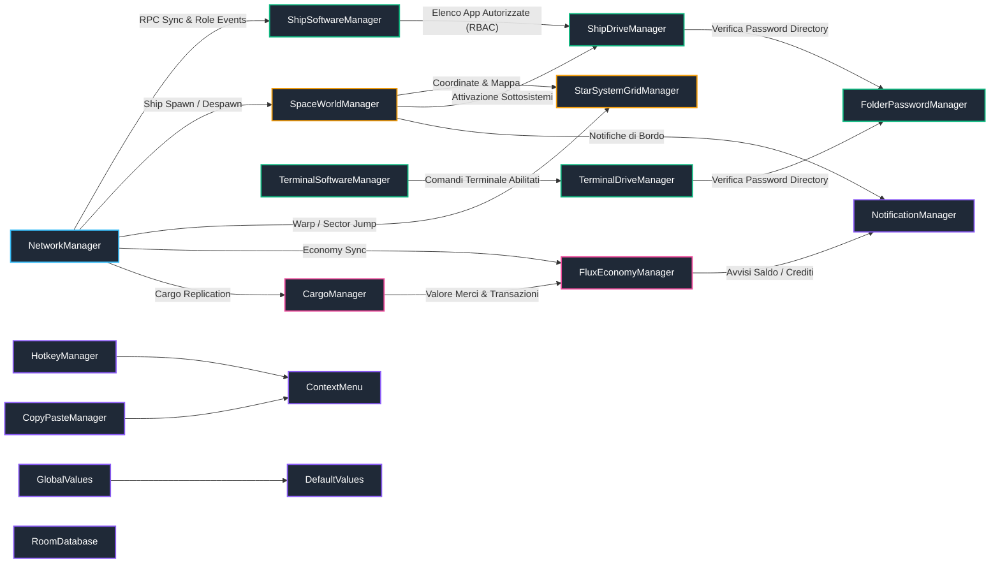

# 02. Autoload, Singleton e Bus di Comunicazione

In **Dark Nova: Rogue Squadron**, l'architettura si appoggia a un set di **Autoload (Singleton)** globali configurati in `project.godot`. Questi gestori mantengono lo stato globale, coordinano la sincronizzazione di rete Server-Authoritative ed emettono i segnali del bus di sistema per la GUI e i nodi 3D.

---

## 🛰️ Grafo di Interconnessione degli Autoload

Il seguente diagramma Mermaid illustra le relazioni e il flusso dati tra tutti i Singleton del motore:

---

## 📡 Bus di Segnali e Comunicazione Server-Authoritative

### 1. `NetworkManager` (`Scenes/Networking/network_manager.gd`)
- **Ruolo**: Gestore del trasporto ENet (Host / Client), matchmaking, sincronizzazione dello stato dei giocatori e autenticazione dei ruoli.
- **Segnali Chiave**:
  - `player_connected(peer_id, player_info)`
  - `player_disconnected(peer_id)`
  - `role_assigned(peer_id, role_name)`
  - `game_started()` / `game_ended()`
  - `server_synced_state(state_dict)`

### 2. `SpaceWorldManager` (`Outside/space_world_manager.gd`)
- **Ruolo**: Orchestratore del mondo 3D, instanziazione dinamica di asteroidi, stazioni, navi nemiche e relitti.
- **Segnali Chiave**:
  - `ship_spawned(ship_node)`
  - `sector_entities_cleared()`
  - `docking_state_changed(is_docked, station_data)`
  - `external_hazard_spawned(hazard_type, position)`

### 3. `StarSystemGridManager` (`Outside/StarSystemGrid/star_system_grid_manager.gd`)
- **Ruolo**: Gestore della mappa stellare, conversione di coordinate vettoriali in settori galattici, calcolo dei consumi di salto iper-spazio.
- **Segnali Chiave**:
  - `sector_entered(sector_coords, sector_data)`
  - `hyperspace_jump_initiated(destination_coords)`
  - `hyperspace_jump_completed()`

### 4. `CargoManager` & `FluxEconomyManager` (`Economy/`)
- **Ruolo**: Gestione della capacità della stiva e del flusso monetario di bordo.
- **Segnali Chiave**:
  - `cargo_updated(item_id, new_quantity, total_mass)`
  - `cargo_full()`
  - `flux_balance_changed(new_balance, delta_amount)`
  - `transaction_completed(transaction_id, success)`

### 5. `ShipDriveManager` & `ShipSoftwareManager` (`Scenes/Autoloads/`)
- **Ruolo**: Montaggio del drive virtuale di bordo (`ship://`) contenente i log e i file `.dat` di configurazione; autorizzazione e installazione programmi via Role-Based Access Control (RBAC).
- **Segnali Chiave**:
  - `software_installed(app_id)`
  - `role_permissions_updated(allowed_apps_array)`
  - `file_system_changed(path, action_type)`

### 6. `RoomDatabase` (`Scenes/Autoloads/RoomDatabase.gd`)
- **Ruolo**: Database statico e centralizzato delle definizioni delle stanze, metadati telecamere e configurazioni sublayer. Utilizza oggetti `Resource` tipizzati (`ShipRoomData`, `CameraMetadata`).
- **Funzioni Chiave**:
  - `get_room_data(id)`: Restituisce l'oggetto `ShipRoomData` per una stanza specifica.
  - Mantenimento dell'array `CAMERAS_METADATA`.
