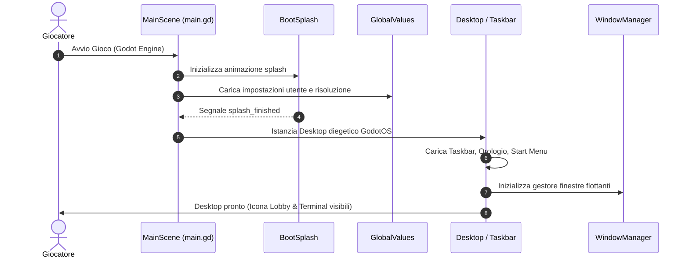
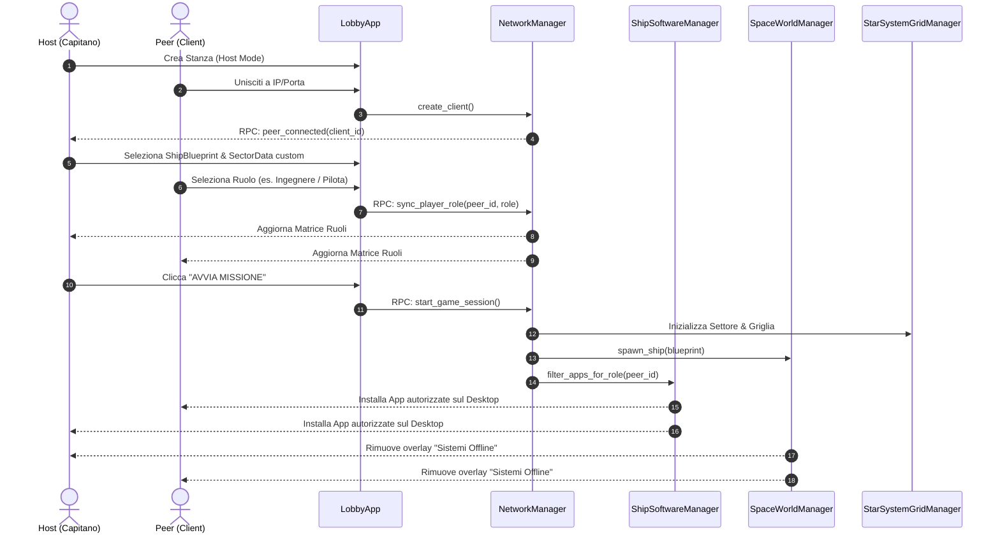
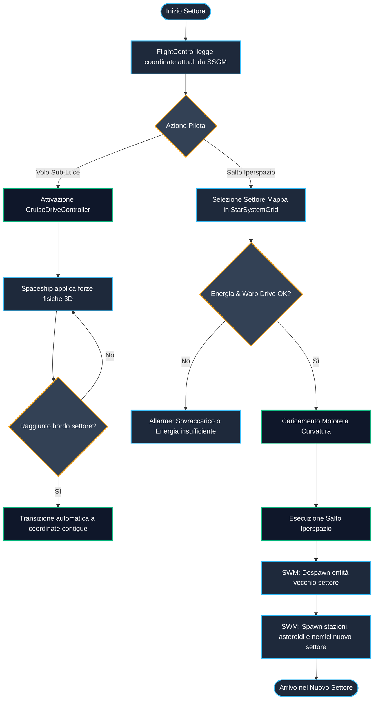
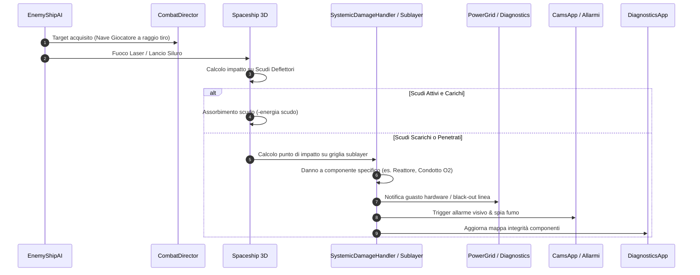
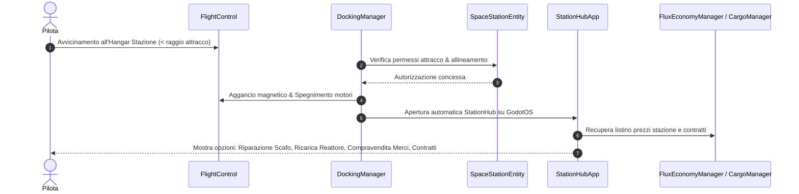

# 03. Flussi di Processo e Ciclo di Vita del Gioco

Questo documento descrive i principali **flussi di processo sequenziali e logici** di **Dark Nova: Rogue Squadron**, illustrando come gli eventi viaggiano attraverso la rete, la GUI di GodotOS e la simulazione spaziale 3D.

---

## 🚀 Flusso 1: Boot Splash, OS Init e Caricamento Desktop

---

## 👥 Flusso 2: Lobby, Matchmaking, Selezione Ruoli (RBAC) e Avvio Partita

---

## 🧭 Flusso 3: Ciclo di Navigazione, Settori e Griglia Stellare (`StarSystemGrid`)

---

## ⚔️ Flusso 4: Combattimento, Danno Sistemico e IA Nemica

---

## ⛏️ Flusso 5: Ciclo Minerario, Derelitti ed Economia Flux

```mermaid
flowchart LR
    classDef entity fill:#1e293b,stroke:#a855f7,stroke-width:2px,color:#fff;
    classDef process fill:#0f172a,stroke:#3b82f6,stroke-width:2px,color:#fff;
    classDef store fill:#1e293b,stroke:#ec4899,stroke-width:2px,color:#fff;

    Sensor[SensorsApp: Scan Settore]:::process --> Deposit[Giacimento Minerale / Relitto]:::entity
    Deposit --> DroneEVA[ServiceDrone: Lancio e Manovra EVA]:::process
    DroneEVA --> Extract[Laser di Taglio & Raccolta Frammenti]:::process
    Extract --> CargoTrans[Trasferimento Stiva: CargoManager]:::store
    CargoTrans --> Refinery[CargoBay: Raffinazione Grezzo -> Lingotti]:::process
    Refinery --> Station[Attracco a Stazione: StationHub]:::entity
    Station --> Sell[Vendita Merci: FluxEconomyManager]:::process
    Sell --> Gain[Guadagno Crediti Flux per l'Equipaggio]:::store
```

---

## ⚓ Flusso 6: Attracco e Hub Stazione Spaziale

