# 04. Architettura Applicazioni GodotOS e Sublayer Navale

In **Dark Nova: Rogue Squadron**, le applicazioni eseguite sul desktop virtuale (GodotOS) non sono semplici widget grafici isolati, ma interfacce diegetiche collegate direttamente al **Sublayer** della nave stellare (`ShipBlueprint`) e all'hardware simulato.

---

## 🖥️ Grafo Architetturale Applicazioni <-> Sublayer <-> Hardware 3D

```mermaid
graph TD
    classDef appNode fill:#1e293b,stroke:#38bdf8,stroke-width:2px,color:#fff;
    classDef subNode fill:#1e293b,stroke:#a855f7,stroke-width:2px,color:#fff;
    classDef hardNode fill:#1e293b,stroke:#f59e0b,stroke-width:2px,color:#fff;
    classDef fsNode fill:#1e293b,stroke:#10b981,stroke-width:2px,color:#fff;

    subgraph DESKTOP_APPS [Applicazioni GodotOS]
        FlightApp[FlightControl App]:::appNode
        PowerApp[PowerGrid App]:::appNode
        ShieldApp[ShieldMatrix App]:::appNode
        DuctApp[DuctDrone App]:::appNode
        ServApp[ServiceDrone App]:::appNode
        LifeApp[LifeSupport App]:::appNode
        DiagApp[Diagnostics App]:::appNode
        SensApp[Sensors App]:::appNode
        WeapApp[Weapons App]:::appNode
        CargoApp[CargoBay App]:::appNode
        TermApp[Terminal App & Scripts]:::appNode
    end

    subgraph SUBLAYER_CORE [Sublayer Interno della Nave - ShipBlueprint]
        PowerConduits[Maglia Condotti Energetici]:::subNode
        VentilationGrid[Rete di Ventilazione & O2/CO2]:::subNode
        ComponentNodes[Array Componenti Hardware: Reattore, Motori, Batterie]:::subNode
        DuctGrid[Griglia Condotti di Ispezione Droni]:::subNode
        DamageMatrix[Mappa Integrità & Punti di Rottura]:::subNode
    end

    subgraph HARDWARE_3D [Sistemi Fisici Esterni & 3D]
        SpaceshipEntity[Spaceship 3D Rigidbody]:::hardNode
        CruiseEngines[Propulsori & CruiseDrive]:::hardNode
        ShieldBubble[Generatore Bolla Scudi Deflettori]:::hardNode
        Turrets[Torrette Laser & Tubi Siluri]:::hardNode
        ExtDrone[Service Drone EVA Entity 3D]:::hardNode
        CargoHold[Stiva & Raffinatore Fisico]:::hardNode
    end

    subgraph VFS [Virtual File System - ShipDrive]
        DatConfigs[File Configurazione .dat in ship://]:::fsNode
        SystemLogs[Log di Diagnostica & Errori]:::fsNode
    end

    %% Relazioni App -> Sublayer
    PowerApp <--> PowerConduits
    LifeApp <--> VentilationGrid
    DiagApp <--> DamageMatrix
    DuctApp <--> DuctGrid
    FlightApp --> ComponentNodes
    
    %% Relazioni Sublayer -> Hardware 3D
    ComponentNodes --> SpaceshipEntity
    ComponentNodes --> CruiseEngines
    PowerConduits --> ShieldBubble
    PowerConduits --> Turrets
    DamageMatrix --> SpaceshipEntity
    
    %% Relazioni Dirette App -> Hardware
    ShieldApp <--> ShieldBubble
    WeapApp <--> Turrets
    ServApp <--> ExtDrone
    CargoApp <--> CargoHold
    FlightApp <--> CruiseEngines
    
    %% Relazioni VFS
    TermApp <--> DatConfigs
    TermApp <--> SystemLogs
    DiagApp --> SystemLogs
    DatConfigs -.-> ComponentNodes
```

---

## 🛡️ Matrice Ruoli RBAC (Role-Based Access Control)

Ogni giocatore a bordo assume un ruolo con autorizzazioni specifiche, gestite da `ShipSoftwareManager`. Le applicazioni vengono visualizzate o bloccate nel desktop a seconda della matrice:

| Applicazione / Strumento | Capitano | Pilota | Ingegnere | Soldato | Hacker |
|---|:---:|:---:|:---:|:---:|:---:|
| `Lobby / Matchmaking` | ✅ Host/Full | ✅ Join | ✅ Join | ✅ Join | ✅ Join |
| `FlightControl` (Volo/Warp) | 👁️ Sola lettura | ✅ Controllo Totale | ❌ | ❌ | ⚠️ Override Shell |
| `PowerGrid` (Energia) | 👁️ Sola lettura | ❌ | ✅ Controllo Totale | ❌ | ⚠️ Deviazione Rete |
| `ShieldMatrix` (Scudi) | 👁️ Sola lettura | ❌ | ✅ Calibrazione | ✅ Modulazione Angoli | ⚠️ Spoofing Frequenze |
| `Diagnostics` (Danni) | ✅ Pieno Accesso | ✅ Allarmi Volo | ✅ Mappa Hardware | ✅ Mappa Scafo | ✅ Dump Memoria |
| `DuctDrone` (Riparazioni Interne) | ❌ | ❌ | ✅ Pilota Drone | ❌ | ⚠️ Hacking Subroutine |
| `ServiceDrone` (EVA / Mining) | ❌ | ⚠️ Controllo Volo | ⚠️ Assistenza | ✅ Operatore Laser | ⚠️ Intercettazione |
| `LifeSupport` (Supporto Vitale) | ✅ Monitoraggio | ❌ | ✅ Regolazione Valvole | ❌ | ⚠️ Controllo Atmosfera |
| `Comms` (Comunicazioni / Spettro) | ✅ Canale Ufficiale | 👁️ Frequenze Volo | ❌ | ❌ | ✅ Decodifica Criptata |
| `Weapons` (Armi / Difesa) | ✅ Autorizzazione Fuoco | ❌ | ❌ | ✅ Controllo Torrette | ⚠️ Lock Puntamento |
| `CargoBay` (Stiva & Raffinazione) | ✅ Gestione Vendite | ❌ | ❌ | ❌ | ⚠️ Falsificazione Bolle |
| `Terminal` (Shell / Scripting) | ✅ Comandi Base | ✅ Comandi Nav | ✅ Comandi Eng | ✅ Comandi Sec | ✅ Comandi Root / Hack |

---

## 🤖 Architettura dei Sistemi Droni

### 1. `DuctDrone` (Drone per Condotti Interni)
- **Scopo**: Esplora e ripara la rete interna dei condotti di ventilazione e cavi elettrici della nave in 2D/Top-down.
- **Interfaccia**: `Applications/DuctDrone/duct_drone_app.gd`.
- **Target Sublayer**: Nodi rotti o circuiti interrotti in `ShipBlueprint`.

### 2. `ServiceDrone` (Drone di Servizio Esterno EVA)
- **Scopo**: Manovra nello spazio 3D esterno attorno allo scafo per saldare brecce esterne o eseguire estrazione laser su minerali/relitti.
- **Interfaccia**: `Applications/ServiceDrone/service_drone_app.gd`.
- **Target 3D**: `Outside/ServiceDrone/service_drone_entity.gd` e `Outside/Mining/mineral_deposit_entity.gd`.

---

## 📄 Modello Dati basato su Resource

Il sublayer e i sistemi core sono stati migrati da una struttura a dizionari (`Dictionary`) a un modello basato su classi `Resource`. Questo garantisce:
1. **Tipizzazione Forte**: Errori rilevati a tempo di compilazione/IDE.
2. **Integrazione Inspector**: Modifica diretta dei dati nell'editor di Godot.
3. **Serializzazione Pulita**: Metodi `to_dict()` e `from_dict()` uniformati per networking e salvataggi.

Le classi principali includono `ShipRoomData`, `ShipDuctData`, `ShipDeviceData`, `ShipDamageData` e `CargoItemData`.
