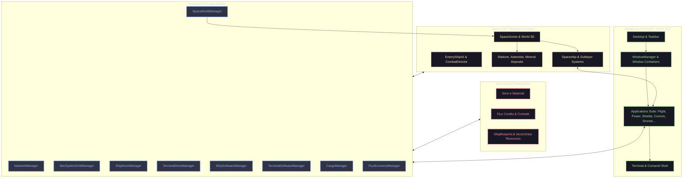

# Dark Nova: Rogue Squadron - Architettura, Grafici dei File, Dipendenze e Flussi

Benvenuto nella documentazione visiva e architetturale di **Dark Nova: Rogue Squadron** (GodotOS).
Questa cartella racchiude i grafici, i diagrammi di flusso di processo e le matrici delle dipendenze di tutti i componenti e file utilizzati nel progetto.

---

## 📑 Indice dei Documenti e dei Grafici

1. [**01. Mappa dei File e Grafo delle Dipendenze dei Moduli**](01_file_and_module_map.md)
   - Albero strutturale dei file e delle cartelle principali (`Applications/`, `Outside/`, `Scenes/`, `Economy/`, `Gameplay/`).
   - Grafo delle dipendenze architetturali tra i diversi package/moduli del gioco (Mermaid).
   - Tabella descrittiva per ciascun file sorgente e relativa responsabilità.

2. [**02. Autoload, Singleton e Bus di Comunicazione**](02_autoloads_and_system_bus.md)
   - Grafo di interconnessione degli Autoload (`project.godot`).
   - Flusso dei segnali, chiamate RPC (`NetworkManager`) e sincronizzazione Server-Authoritative.
   - Dipendenze tra Autoload e componenti periferici.

3. [**03. Flussi di Processo e Ciclo di Vita del Gioco (Process Flows)**](03_game_process_flows.md)
   - **Flusso 1: Boot Splash, OS Init e Caricamento Desktop**.
   - **Flusso 2: Lobby, Matchmaking, Selezione Ruoli (RBAC) e Avvio Partita**.
   - **Flusso 3: Ciclo di Navigazione, Settori e Griglia Stellare (`StarSystemGrid`)**.
   - **Flusso 4: Gestione Combattimento, Danno Sistemico e IA Nemica**.
   - **Flusso 5: Ciclo Minerario, Derelitti ed Economia Flux/Cargo**.
   - **Flusso 6: Flusso di Attracco e Hub Stazione Spaziale**.

4. [**04. Architettura Applicazioni GodotOS e Sublayer Navale**](04_applications_and_sublayer.md)
   - Grafo di integrazione tra Applicazioni Desktop e Sublayer della Nave.
   - Flusso Dati tra `ShipBlueprint`, Sistemi della Nave (`ShipSystems`), Droni (`DuctDrone`, `ServiceDrone`) e Terminale OS.
   - Matrice dei Ruoli (RBAC) e autorizzazioni di accesso alle applicazioni.

---

## 🧭 Panoramica di Alto Livello dell'Architettura

